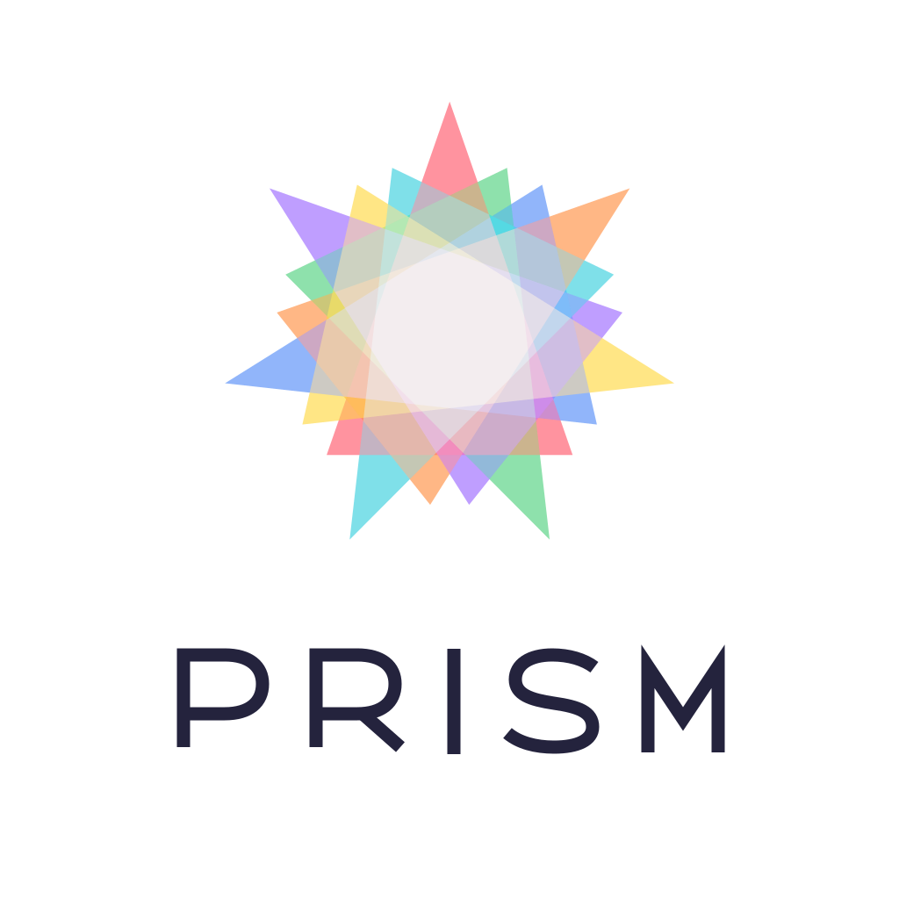

<p align="center">
  
</p>

# Prism

Prism is an open-source NLP toolkit for fast, local, privacy-friendly
linguistic analysis on end-user devices. It tags text with
part-of-speech (UPOS), morphological features, and lemmata — each
decision with a **calibrated confidence** — fully offline, optimized
for small bundles and native performance. The current model covers
Norwegian: Bokmål (`nb`) and Nynorsk (`nn`) in one set of weights.

**Highlights**

- **Built for devices, not servers:** the deployable model is a 45 MB
  artifact tagging ~3,200 tokens/s on a laptop CPU — no GPU, no
  network, no Python.
- **Native APIs for every major platform:** Swift, C++, C, and Java
  (Kotlin-compatible) over one shared model contract, plus the Python
  reference runtime.
- **Calibrated confidences:** every tag comes with a probability an
  application can actually act on (fitted temperatures, UPOS ECE
  0.0017).
- **Quality that competes:** beats UDPipe 2.17 on UPOS and lemmata on
  the official UD test splits at a twentieth of its size.

## How it works

```text
raw text ──► sentence segmentation ──► byte-level BPE subwords
                                             │
                              compact Transformer backbone
                              (NorBERT4-xsmall, distilled)
                                             │
                token representations + character-CNN features
                     │               │                │
                 UPOS head    morphology heads   lemma-rule head
                     └──── calibrated probabilities ────┘
```

The model is a compact Transformer student distilled from a larger
teacher and exported to [ExecuTorch](https://pytorch.org/executorch)
programs with fixed shapes; runtimes pick the smallest program each
batch fits into, so short sentences never pay long-sentence padding.
Decoding policy and calibration are baked into the exported graph —
integrations do argmax and one threshold, nothing more. The full design
is documented in [docs/ARCHITECTURE.md](docs/ARCHITECTURE.md).

## Quality and speed

Evaluated once on the untouched official UD test splits against UDPipe
2.17 (gold tokenization, official CoNLL definitions):

| Test F1 | Prism | UDPipe 2.17 |
| --- | ---: | ---: |
| Bokmål UPOS | **98.76%** | 98.57% |
| Bokmål Lemmas | **98.98%** | 98.87% |
| Bokmål UFeats | 97.20% | **97.59%** |
| Nynorsk UPOS | **98.77%** | 98.60% |
| Nynorsk Lemmas | **98.68%** | 98.56% |
| Nynorsk UFeats | 96.94% | **97.38%** |

**Strengths:** best-in-class UPOS and lemmata; runs locally at
~3,200 tokens/s (C++/Java) on an Apple M4 Max CPU — UDPipe's comparable
models sit behind a ~700 MB server deployment; calibrated confidences;
one model for both written standards, mixed input welcome.

**Weaknesses:** exact morphology bundles (UFeats — every feature of a
word must match) trail UDPipe by ~0.4 pp; no dependency parsing, named
entities, or raw-text sentence splitting beyond the shipped
segmentation policy; one language so far (the architecture and
artifact contract are language-independent by design).

Complete tables — including the fast-versus-fp32 quality gate and the
cross-binding runtime matrix — live in
[docs/benchmarks/prism-no-0.2.2.md](docs/benchmarks/prism-no-0.2.2.md).

## Get a model

Download from [Releases](https://github.com/dmlux/Prism/releases) and
unpack; each model version ships in two precisions, and an application
bundles exactly one:

| Artifact | Size | When to use |
| --- | ---: | --- |
| `prism-no-0.2.2-fast` | ≈ 45 MB | **Recommended.** int8, up to 2× faster, quality within 0.014 pp of fp32 |
| `prism-no-0.2.2` | ≈ 94 MB | Bit-exact fp32 reference behind the published benchmark |

```bash
curl -LO https://github.com/dmlux/Prism/releases/download/prism-no-0.2.2/prism-no-0.2.2-fast.tar.gz
tar -xzf prism-no-0.2.2-fast.tar.gz   # unpacks the prism-no-0.2.2-fast/ folder
```

Unpack it wherever suits your project — the folder's path is what you
hand to the tagger APIs below. Verify downloads against the release's
`SHA256SUMS`. The unpacked directory is everything the runtimes need;
its contents are documented in
[docs/INTEGRATION.md](docs/INTEGRATION.md).

## Quick start

All bindings share the same shape: point a tagger at an artifact
directory, put text in, get sentences of tokens with UPOS, morphology,
lemma, and confidences out. Sensible defaults (thread count, program
selection) are built in.

**The artifact argument is a local filesystem path, not a model ID.**
Unlike Hugging Face-style APIs, nothing is downloaded at runtime:
`"prism-no-0.2.2-fast"` in the snippets below means *the unpacked
folder from the release, addressed relative to your process's working
directory*. In practice you either pass an absolute path, or ship the
folder with your application and resolve it from there — as bundle
resources on macOS/iOS, next to the executable or in your resources
directory on Windows/Linux/JVM. The snippets note the idiomatic place
per platform.

### Swift

Add the package under `swift/` plus the ExecuTorch products
(`executorch`, `backend_xnnpack`, `kernels_optimized`,
`kernels_quantized`) to your app target — details in
[INTEGRATION.md](docs/INTEGRATION.md).

```swift
import PrismKit

// Ship the artifact folder as a bundle resource (drag it into Xcode as
// a folder reference) and resolve it from the bundle:
let artifactDirectory = Bundle.main.resourceURL!
    .appendingPathComponent("prism-no-0.2.2-fast")

let tagger = try PrismTagger(artifactURL: artifactDirectory, device: .cpu)
for sentence in try tagger.tag(text: "Hun kjøpte tre gamle bøker.") {
    for token in sentence.tokens {
        print(token.text, token.upos, token.lemma, token.uposConfidence)
    }
}
```

### C++

Build with CMake (`cmake -S cpp -B cpp/build -DCMAKE_BUILD_TYPE=Release`),
link the aggregate target: `target_link_libraries(app PRIVATE prism)`.

```cpp
#include <prism>

// The argument is a local directory path. A bare name like this is
// resolved relative to the working directory of your process — for
// anything beyond experiments, build an absolute path (for example
// from your executable's location or your app's data directory).
prism::tagger::Tagger tagger("prism-no-0.2.2-fast");
for (const auto& sentence : tagger.TagText("Hun kjøpte tre gamle bøker.")) {
    for (const auto& token : sentence.tokens) {
        std::cout << token.text << " " << token.upos << " " << token.lemma
                  << " " << token.upos_confidence << "\n";
    }
}
```

### C

For application cores that link plain C (or any foreign-function
interface). The C ABI is a complete surface over the same tagger:
opaque handles, create/destroy pairs, and accessors returning only C
strings and scalars. A minimal but complete program:

```c
#include <stdio.h>
#include <prism/prism_c.h>

int main(void) {
    /* Local directory path, resolved like any relative path in C —
     * against the process working directory. Prefer an absolute path. */
    prism_tagger* tagger = prism_tagger_create("prism-no-0.2.2-fast");
    if (tagger == NULL) {
        fprintf(stderr, "cannot load model: %s\n", prism_last_error());
        return 1;
    }

    prism_result* result =
        prism_tagger_tag_text(tagger, "Hun kjøpte tre gamle bøker. Katten sov.");
    if (result == NULL) {
        fprintf(stderr, "tagging failed: %s\n", prism_last_error());
        prism_tagger_destroy(tagger);
        return 1;
    }

    for (size_t s = 0; s < prism_result_sentence_count(result); ++s) {
        for (size_t t = 0; t < prism_result_token_count(result, s); ++t) {
            printf("%s\tUPOS=%s (%.3f)\tLemma=%s (%.3f)\tFeats=%s\n",
                prism_result_token_text(result, s, t),
                prism_result_token_upos(result, s, t),
                prism_result_token_upos_confidence(result, s, t),
                prism_result_token_lemma(result, s, t),
                prism_result_token_lemma_confidence(result, s, t),
                prism_result_token_features(result, s, t));
                /* CoNLL-U style, e.g. "Gender=Fem|Number=Plur"; empty
                 * when the token carries no features. Individual features
                 * with confidences: prism_result_token_feature_count/
                 * _name/_value/_confidence. */
        }
    }

    prism_result_destroy(result);   /* frees every string it handed out */
    prism_tagger_destroy(tagger);
    return 0;
}
```

Words already tokenized? `prism_tagger_tag_tokens(tagger, tokens,
token_count)` takes a `const char* const*` array for one sentence.
Results are plain data: every `const char*` stays valid until
`prism_result_destroy`, out-of-range indices return `NULL`/`0` instead
of crashing, and `prism_last_error()` is per-thread. Link exactly like
the C++ quick start (the `prism` CMake target exports the C ABI too).

### Java (and Kotlin)

Depend on `io.github.dmlux:prism` (or the CMake-built `prism.jar`) and
make the native library resolvable
(`-Djava.library.path=...` or `PrismTagger.loadNativeLibrary(...)`).
The C++ build above produces both files in one go — `prism.jar` plus
`libprism_jni` for your platform; the JNI mechanics are explained in
[INTEGRATION.md](docs/INTEGRATION.md).

```java
import io.github.dmlux.prism.PrismTagger;

// The Path must point to a real directory on disk. Ship the artifact
// in your application's resources/installation directory — note that
// a folder packed *inside* a JAR is not a filesystem path; extract it
// to a data directory on first run, then load from there.
Path artifact = Path.of("prism-no-0.2.2-fast");

try (PrismTagger tagger = PrismTagger.load(artifact)) {
    for (var sentence : tagger.tagText("Hun kjøpte tre gamle bøker.")) {
        for (var token : sentence.tokens()) {
            System.out.println(token.text() + " " + token.upos() + " "
                + token.lemma() + " " + token.uposConfidence());
        }
    }
}
```

### Python

The Python package is the research and reference runtime: it runs the
frozen *checkpoint* eagerly through PyTorch (a trained-weights file
under `runs/`, produced by training — not the released artifact), and
it is the implementation every native binding is parity-tested against.
Use it for research, evaluation, and training; use the native bindings
for applications.

**Recommended: Python 3.12** — it has the broadest compatibility with
the current PyTorch/ExecuTorch ecosystem. Set up an isolated virtual
environment inside the repository (a "venv" keeps Prism's dependencies
out of your system Python; the activate step is per terminal session):

```bash
git clone https://github.com/dmlux/Prism.git
cd Prism
python3.12 -m venv .venv          # create the environment once
source .venv/bin/activate         # activate it (Windows: .venv\Scripts\activate)
python -m pip install -e './python[dev]'
```

```python
from prism.languages.norwegian.tagger import NorwegianTagger

tagger = NorwegianTagger(
    checkpoint_path=checkpoint,     # e.g. runs/<run>/best-development-task-accuracy.pt
    calibration_path=calibration,   # the calibration.json fitted for it
)
for sentence in tagger.tag_text("Hun kjøpte tre gamle bøker."):
    for token in sentence.tokens:
        print(token.text, token.upos, token.lemma, token.upos_confidence)
```

Training your own checkpoint (or reproducing the released one) is
covered in [docs/TRAINING.md](docs/TRAINING.md).

Every binding also accepts pretokenized input (`tag(pretokenized:)`,
`TagPretokenized`, `tagPretokenized`, `prism_tagger_tag_tokens`) when
your application already has words.

## Bring your own language

Norwegian is the first language, not the last: the model, training,
export, and artifact contracts are language-independent, and every
runtime reads any conforming artifact without code changes. If you have
a [Universal Dependencies](https://universaldependencies.org/)-style
treebank (CoNLL-U with `FORM`, `LEMMA`, `UPOS`, `FEATS`) and a Hugging
Face encoder for your language, you can train and ship your own Prism
model: label schemas, morphology features, and lemma rules are derived
from your data automatically. The complete guide — data format and
placement, every pipeline stage from teacher to released artifact, and
the language-profile mechanism — is
[docs/TRAINING.md](docs/TRAINING.md).

## Training data and licenses

Prism source code is licensed under the
[Apache License 2.0](LICENSE.md). Model weights are released under
**CC BY-SA 4.0**: using or bundling the unmodified artifact — including
commercially, in closed-source applications — is fine (keep the
attribution); redistributed modified weights must stay open.

The Norwegian model exists thanks to openly licensed resources: the
[UD Norwegian-Bokmaal](https://github.com/UniversalDependencies/UD_Norwegian-Bokmaal)
and [UD Norwegian-Nynorsk](https://github.com/UniversalDependencies/UD_Norwegian-Nynorsk)
treebanks (Universal Dependencies contributors, based on the Norwegian
Dependency Treebank by the National Library of Norway, CC BY-SA 4.0),
Språkbanken's NBdigital and municipal-documents corpora (National
Library of Norway, CC0), the Nynorsk Wikipedia (CC BY-SA 4.0), and the
[`ltg/norbert4-xsmall`](https://huggingface.co/ltg/norbert4-xsmall)
backbone (Language Technology Group, University of Oslo, Apache 2.0).
Pinned revisions and checksums travel inside every artifact
(`manifest.json`, `LICENSES/`).

## Documentation

- [docs/INTEGRATION.md](docs/INTEGRATION.md) — the artifact contract
  and per-binding integration details
- [docs/ARCHITECTURE.md](docs/ARCHITECTURE.md) — how the model and the
  native inference stack are designed, explained from the ground up
- [docs/benchmarks/](docs/benchmarks/) — quality and runtime benchmarks
  per released artifact; [docs/benchmarks.md](docs/benchmarks.md) holds
  the model-development history
- [docs/TRAINING.md](docs/TRAINING.md) — training models and adding new
  languages, from data format to released artifact
- [docs/DEVELOPMENT.md](docs/DEVELOPMENT.md) — building and testing
  Prism itself
- [docs/PROJECT_STATUS.md](docs/PROJECT_STATUS.md) — every accepted
  decision and milestone, in order

## Roadmap

1. Close the exact-morphology gap (joint bundle consistency).
2. More languages over the same language-independent contracts.
3. Runtime follow-ups: newer ExecuTorch pin for the C++ build,
   GPU-lowered artifact variants, Hugging Face mirrors of the releases.
