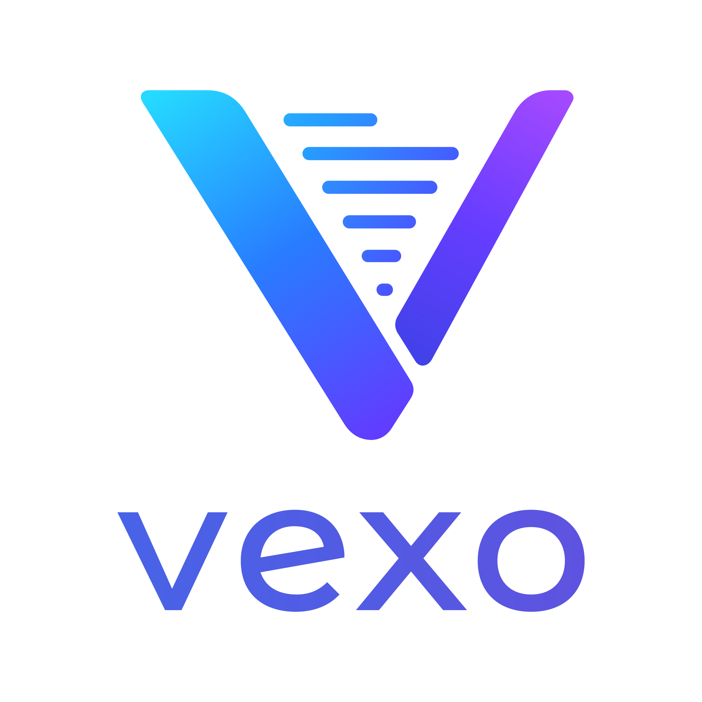

<p align="center">
  
</p>

# Vexo

Vexo is an experimental, modular NLP toolkit for fast, local, and
privacy-friendly linguistic analysis. The long-term goal is to provide
language-specific models through a unified API for tokenization, sentence
segmentation, part-of-speech tagging, lemmatization, and morphological
analysis across Python and Swift platforms.

The project currently focuses exclusively on **Norwegian Bokmål** and is being
built incrementally from small statistical baselines toward trainable neural
models.

## Current status

The current implementation can:

- read Universal Dependencies data in CoNLL-U format;
- build deterministic word, character, and POS vocabularies;
- train a word-only BiLSTM POS tagger;
- train a word-and-character BiLSTM POS tagger;
- evaluate saved checkpoints on the official development and test splits;
- predict POS tags for externally tokenized text;
- train on Apple Silicon through PyTorch MPS, with a CPU fallback.

The best current model combines word and character representations and
reaches **95.75% UPOS accuracy** on the Norwegian Bokmål test split with gold
tokenization. See [the benchmark notes](docs/benchmarks.md) for the full setup
and comparison.

Vexo does **not** yet provide its own tokenizer, sentence segmenter,
lemmatizer, morphological predictor, dependency parser, or Swift runtime.
Prediction commands therefore expect text that has already been split into
tokens.

## Model architecture

The current best POS model combines two representations for every token:

```text
Word ID -> word embedding -------------------+
                                              +-> sentence BiLSTM -> POS logits
Characters -> character embeddings -> BiLSTM +
```

The word branch learns lexical information for frequent words. Words seen
fewer than twice during training are mapped to `<UNK>`. The character branch
still sees their spelling, allowing it to learn useful patterns such as
capitalization and Norwegian inflectional endings. A bidirectional sentence
LSTM then uses both left and right context to predict one of the 17 Universal
POS tags for each token.

Two model variants are retained for comparison:

| Model | Development | Test |
| --- | ---: | ---: |
| Word-only BiLSTM | 91.91% | 91.22% |
| Word + character BiLSTM | 96.43% | 95.75% |

## Requirements

- macOS or another Python-compatible platform
- Python 3.12
- Git

Python 3.12 is used deliberately because it has broad compatibility with the
current PyTorch ecosystem. Python 3.14 is not currently the supported project
runtime.

## Setup

Clone the repository and enter it:

```bash
git clone git@github.com:dmlux/Vexo.git
cd Vexo
```

Create and activate a virtual environment:

```bash
python3.12 -m venv .venv
source .venv/bin/activate
```

Install Vexo in editable mode with its development dependencies:

```bash
python -m pip install -e './python[dev]'
```

Editable installation makes the `vexo` package importable while ensuring that
source changes are used immediately without reinstalling the package.

## Training data

The current experiments use the official
[UD Norwegian Bokmål](https://github.com/UniversalDependencies/UD_Norwegian-Bokmaal)
treebank. Download the dataset into the ignored local data directory:

```bash
git clone https://github.com/UniversalDependencies/UD_Norwegian-Bokmaal.git \
  data/raw/UD_Norwegian-Bokmaal
git -C data/raw/UD_Norwegian-Bokmaal checkout \
  396d11f0c2bd290a2a2711015c04ac25bc3dcc06
```

The pinned commit is the version used for the documented benchmarks. The
dataset contains the original training, development, and test splits with
tokens, lemmas, UPOS tags, morphological features, and dependency annotations.

Training data is intentionally not committed to this repository.

## Training

Train the word-only baseline neural model:

```bash
python -m vexo.train_pos
```

Train the word-and-character model:

```bash
python -m vexo.train_character_pos
```

Both commands automatically use Apple MPS when available and otherwise fall
back to the CPU. Each command trains for five epochs, evaluates against the
development split after every epoch, and keeps the checkpoint with the best
development accuracy.

Generated checkpoints are stored locally under:

```text
models/norwegian-bokmaal/
├── pos_bilstm.pt
└── pos_character_bilstm.pt
```

The `models/` directory and common model formats are ignored by Git. Model
artifacts should be released separately with their training-data provenance,
configuration, benchmark results, and applicable license information.

## Evaluation

Evaluate the word-only model on the development split:

```bash
python -m vexo.evaluate_pos
```

Evaluate the character model on the development split:

```bash
python -m vexo.evaluate_character_pos
```

Both commands accept `--split test` for a final evaluation of a fixed model:

```bash
python -m vexo.evaluate_character_pos --split test
```

Use the development split for model selection and tuning. The test split
should only be used to report results for an already fixed model version.

## POS prediction

The prediction interface currently expects pre-tokenized input. Run the
word-and-character model with one shell argument per token:

```bash
python -m vexo.predict_character_pos Jeg leser en bok .
```

Example output:

```text
Jeg     PRON
leser   VERB
en      DET
bok     NOUN
.       PUNCT
```

The word-only comparison model remains available through:

```bash
python -m vexo.predict_pos Jeg leser en bok .
```

In the future, Vexo is intended to offer both a high-level raw-text API and a
lower-level API for applications, such as LexKeep, that already own their
tokenization and source offsets.

## Tests

Run the complete test suite from the repository root:

```bash
python -m pytest python/tests
```

The current tests cover CoNLL-U parsing, vocabulary and character encoding,
two-level batch padding, and the neural model tensor shapes.

## Repository layout

```text
Vexo/
├── docs/
│   └── benchmarks.md
├── logos/
├── python/
│   ├── pyproject.toml
│   ├── src/vexo/
│   │   ├── baseline.py
│   │   ├── conllu.py
│   │   ├── dataset.py
│   │   ├── inference.py
│   │   ├── model.py
│   │   ├── training.py
│   │   └── ...
│   └── tests/
└── README.md
```

Local datasets, checkpoints, virtual environments, caches, and generated
training artifacts are excluded through `.gitignore`.

## Roadmap

Planned milestones include:

- deeper analysis of known and unknown POS-tagging errors;
- joint prediction of POS tags and morphological features;
- lemmatization using a lexicon and learned edit rules;
- language-aware tokenization and sentence segmentation;
- model export and a native Swift inference runtime;
- modular Swift packages such as `VexoKit`, `VexoCore`, and
  `VexoNorwegian`;
- additional language modules after the Norwegian pipeline is stable.

Phrase, named-entity, and multiword-expression recognition are considered
separate span-level tasks and are not part of the current POS model.

## Licensing

The Vexo source code is licensed under the
[Apache License 2.0](LICENSE.md). This software license applies to Vexo's own
source code and does not relicense external datasets or model artifacts.

The UD Norwegian Bokmål data used by the current experiments is distributed
under **CC BY-SA 4.0**. Its attribution and share-alike requirements must be
reviewed and documented when redistributing trained model artifacts. Dataset
files are not included in this repository. Model releases must carry their own
provenance, attribution, and applicable license information.

## Project direction

Vexo aims to become a modular, open-source NLP toolkit for tokenization,
sentence segmentation, POS tagging, lemmatization, and morphological analysis.
It is designed around local inference, explicit language modules, reproducible
training, and a unified API that can eventually be consumed from both Python
and Swift applications.
