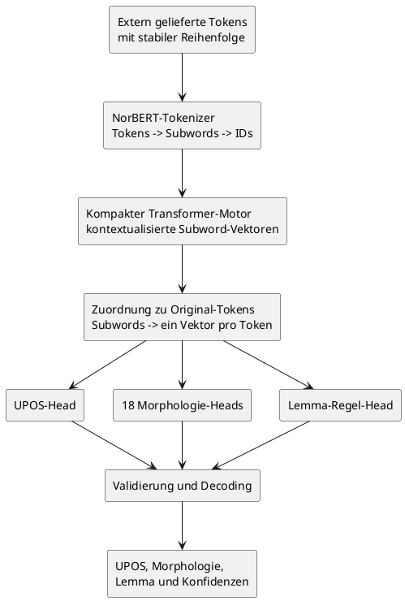
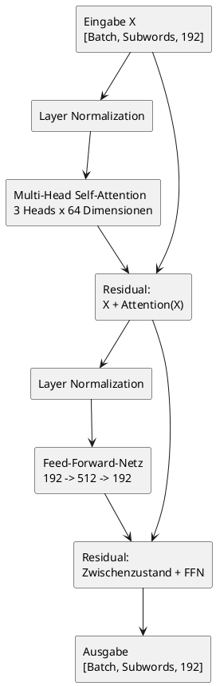
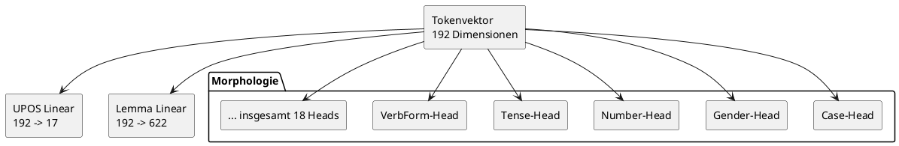
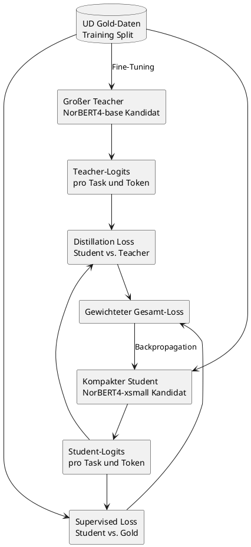
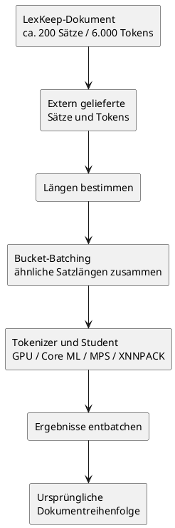

# Prism-Architektur

Dieses Dokument erklärt die geplante nächste Modellgeneration von Prism im
Detail. Es ist zugleich technische Referenz und Lerntext: Es beschreibt nicht
nur, aus welchen Modulen das Modell besteht, sondern auch, wie sich die Daten
vom extern gelieferten Token bis zur fertigen Vorhersage verändern.

Die hier beschriebene Transformer-Architektur ist der Zielpfad für die erste
Produktionsgeneration. Die vorhandenen BiLSTM-Modelle bleiben als
reproduzierbare Baselines erhalten, bis ein neues Modell die dokumentierten
Qualitäts-, Export- und Laufzeitgrenzen nachweislich erfüllt.

## Das wichtigste mentale Modell

Die vollständige Pipeline lässt sich auf vier Verantwortlichkeiten reduzieren:

```text
Tokenizer:
Text-Tokens -> Subword-IDs

Motor:
Subword-IDs -> kontextabhängige Sprachvektoren

Task-Heads:
Sprachvektoren -> konkrete Klassen und Logits

Decoder:
Klassen-IDs -> UPOS, Morphologie und Lemmas
```

Als Analogie:

```text
Motor = sehr gut ausgebildeter Sprachwissenschaftler
Heads = getrennte Prüfungsbögen mit konkreten Fragen
```

Der Motor besitzt allgemeines norwegisches Sprachwissen. Der UPOS-Head fragt
nach der Wortart, die Morphologie-Heads nach grammatischen Eigenschaften und
der Lemma-Head nach der Regel, die aus der Wortform das Lemma erzeugt.



## Was ist der Motor?

Der Motor ist ein vortrainierter Transformer-Encoder. Er liefert noch keine
UPOS-Tags, Morphologie-Werte oder Lemmas. Seine Aufgabe besteht darin, jedes
Subword in einen Zahlenvektor zu verwandeln, der möglichst viel Information
über die Bedeutung und grammatische Funktion dieses Subwords im konkreten Satz
enthält.

Der große Mehrwert ist der Kontext. Betrachten wir das norwegische Wort `så`:

```text
Jeg så filmen.      -> VERB, Tense=Past, Lemma=se
Det var så fint.    -> ADV, Lemma=så
```

Eine reine Wörterbuchsuche sieht zweimal dieselbe Zeichenfolge. Der
Transformer erzeugt dagegen zwei verschiedene Repräsentationen, weil `så` in
beiden Sätzen mit unterschiedlichen Nachbartokens und Satzstrukturen
interagiert.

Der Motor komprimiert also eine Aussage wie:

```text
"Das ist meine kontextabhängige Beschreibung dessen,
was dieses Token in diesem Satz wahrscheinlich bedeutet."
```

Die Task-Heads lernen anschließend, bestimmte Informationen aus dieser
Beschreibung herauszulesen.

## Warum wird der Motor nicht von null trainiert?

Der gepinnte UD-Trainingssplit enthält rund 244.000 Tokens. Das ist eine gute
Größe, um konkrete Aufgaben wie UPOS, Morphologie und Lemmas zu lernen. Es ist
aber viel zu wenig, um allgemeines norwegisches Sprachverständnis vollständig
von null aufzubauen.

Ein vortrainierter norwegischer Encoder hat bereits auf sehr großen Textmengen
Muster gelernt, zum Beispiel:

- welche Wörter häufig als Subjekt oder Objekt auftreten;
- welche Flexionsendungen typisch für Plural, Definitheit oder Verbformen sind;
- welche Wörter nach Präpositionen oder Hilfsverben vorkommen;
- wie norwegische Komposita und Wortbestandteile aufgebaut sind;
- welche Wortformen semantisch oder grammatisch verwandt sind;
- wie Satzreihenfolge und lokale Abhängigkeiten funktionieren.

Prism konstruiert daher das vollständige Aufgabenmodell selbst, verwendet aber
einen vortrainierten Encoder als sprachlichen Motor. Das ist kein
unverändertes Fremdmodell: Prism ergänzt die Token-Zuordnung, die
Multi-Task-Heads, die Loss-Funktionen, Distillation, Konfidenzkalibrierung,
Quantisierung, Decoding und den nativen Laufzeitvertrag.

## Teacher- und Student-Rollen

Die Teacher-Student-Architektur verwendet zwei Modelle für unterschiedliche
Ziele:

- Der Teacher ist groß und auf Qualität optimiert. Er wird nur beim Training
  und bei Experimenten verwendet.
- Der Student ist kompakt und auf lokale Inferenz, Exportierbarkeit und
  Dokumentdurchsatz optimiert. Nur er wird ausgeliefert.

Aktuelle Kandidaten sind:

- `ltg/norbert4-base` als erster Teacher;
- `ltg/norbert4-large` als späterer Teacher-Vergleich, falls der zusätzliche
  Aufwand einen messbaren Development-Gewinn bringt;
- `ltg/norbert4-xsmall` als erster Student-Kandidat.

NorBERT4-xsmall ist nur der vortrainierte Student-Backbone, nicht das fertige
Prism-Modell. Prism baut seine eigenen Eingabe-, Alignment- und
Ausgabeschichten darum.

Die aktuelle xsmall-Konfiguration besitzt unter anderem:

- Hidden Size: 192;
- 16 Transformer-Layer;
- 3 Attention-Heads;
- Intermediate Size: 512;
- Vokabulargröße: 51.200.

NorBERT4 verwendet eigenen Modellcode und moderne Attention-Mechanismen.
Deshalb ist xsmall zunächst ein Kandidat. Prism führt früh einen Export-Spike
durch. Falls der Backbone nicht zuverlässig nach ExecuTorch exportierbar ist,
bleibt NorBERT4 Teacher und das Wissen wird in einen eigenen,
exportfreundlichen Standard-Transformer destilliert.

## Schritt 1: Externe Tokens

LexKeep besitzt bereits Tokenisierung und Quelltext-Offsets. Prism muss diese
Tokens deshalb akzeptieren können, ohne sie erneut auf Wortebene zu
segmentieren.

Beispiel:

```text
["Jeg", "så", "filmen", "."]
```

Die Reihenfolge und Anzahl dieser Original-Tokens bilden den öffentlichen
Vertrag. Prism muss später exakt ein Ergebnis pro Original-Token liefern.

## Schritt 2: Subword-Tokenisierung

Transformer arbeiten gewöhnlich nicht direkt mit vollständigen Wörtern. Ihr
Vokabular enthält häufige Wörter und Wortbestandteile, sogenannte Subwords.

Eine illustrative Zerlegung könnte so aussehen:

```text
Original-Tokens:
["Jeg", "så", "filmen", "."]

Subwords:
["<s>", "Jeg", "så", "film", "en", ".", "</s>"]
```

Die tatsächliche Zerlegung hängt vom konkreten Tokenizer ab. `filmen` kann als
ein einzelnes Vokabularelement existieren oder in mehrere Bestandteile
zerfallen.

Prism speichert die Zuordnung zwischen Subwords und Original-Tokens:

| Subword | Original-Token |
| --- | ---: |
| `<s>` | keines |
| `Jeg` | 0 |
| `så` | 1 |
| `film` | 2 |
| `en` | 2 |
| `.` | 3 |
| `</s>` | keines |

Diese Zuordnung ist nötig, weil der Transformer Subword-Vektoren erzeugt, die
öffentliche API aber Token-Ergebnisse zurückgeben muss.

## Schritt 3: IDs und Batch-Tensoren

Der Tokenizer ersetzt jedes Subword durch eine Vokabular-ID:

```text
["<s>", "Jeg", "så", "film", "en", ".", "</s>"]

-> illustrativ:

[1, 1842, 731, 9204, 318, 27, 2]
```

Ab diesem Punkt arbeitet das neuronale Netz nicht mehr mit Zeichenketten,
sondern mit Tensoren.

Für einen einzelnen Satz mit sieben Subwords:

```text
input_ids.shape = [1, 7]
```

Für einen Batch aus acht Sätzen mit höchstens 30 Subwords:

```text
input_ids.shape = [8, 30]
attention_mask.shape = [8, 30]
```

Kürzere Sätze werden mit Padding aufgefüllt. Die Attention-Maske markiert echte
Subwords mit `1` und Padding mit `0`, damit der Motor Padding nicht als
sprachlichen Inhalt behandelt.

Der zukünftige typisierte Batch-Vertrag wird mindestens enthalten:

- `input_ids`;
- `attention_mask`;
- die Zuordnung von Subwords zu Original-Tokens;
- die Anzahl echter Tokens pro Satz;
- UPOS-Ziele;
- Morphologie-Ziele;
- Lemma-Regel-Ziele;
- Masken für fehlende oder nicht repräsentierbare Annotationen.

## Schritt 4: Embeddings

Eine ID wie `731` ist nur eine Zahl. Der Motor besitzt deshalb eine große
Embedding-Tabelle. Jede Vokabular-ID wählt daraus einen Vektor aus.

Bei Hidden Size 192:

```text
Vokabular-ID
    -> Embedding-Tabelle
    -> Vektor mit 192 Fließkommazahlen
```

Illustrativ:

```text
[0.17, -0.42, 0.08, ..., 0.31]
```

Für einen Batch entsteht:

```text
embeddings.shape = [batch_size, subword_count, 192]
```

Diese anfänglichen Vektoren enthalten bereits vortrainierte lexikalische
Information. Ihre konkrete Satzfunktion entsteht jedoch erst durch die
Transformer-Layer.

## Schritt 5: Der Transformer-Block

Der xsmall-Kandidat verarbeitet die Repräsentationen in 16 aufeinanderfolgenden
Transformer-Blöcken. Jeder Block besteht vereinfacht aus:

1. Normalisierung;
2. Self-Attention;
3. Residual-Verbindung;
4. Feed-Forward-Netzwerk;
5. einer weiteren Residual-Verbindung und Normalisierung.



### Self-Attention

Self-Attention erlaubt jeder Position, Informationen aus anderen Positionen
des Satzes aufzunehmen.

Für jeden aktuellen Subword-Vektor `X` berechnet der Transformer drei gelernte
Transformationen:

```text
Q = X * Wq
K = X * Wk
V = X * Wv
```

- Query: Nach welcher Information sucht diese Position?
- Key: Welche Information bietet diese Position an?
- Value: Welche Information wird bei Aufmerksamkeit übertragen?

Die Query einer Position wird mit den Keys anderer Positionen verglichen.
Vereinfacht:

```text
score(i, j) = Query(i) · Key(j) / sqrt(head_dimension)
```

Eine Softmax-Funktion macht daraus normalisierte Attention-Gewichte. Für das
Token `så` in `Jeg så filmen` könnte eine illustrative Verteilung sein:

```text
Jeg        0,12
så         0,18
film       0,31
en         0,21
.          0,08
Spezialtokens 0,10
```

Die tatsächlichen Werte werden gelernt. Entscheidend ist, dass der Vektor von
`så` Information von `Jeg` und `filmen` aufnehmen kann. Im Satz `Det var så
fint` entstehen andere Gewichte und damit eine andere Repräsentation.

### Interne Attention-Heads

NorBERT4-xsmall besitzt drei interne Attention-Heads. Bei Hidden Size 192
arbeitet jeder Head mit 64 Dimensionen:

```text
192 / 3 = 64
```

Die drei Heads betrachten dieselbe Sequenz parallel, können aber verschiedene
Beziehungsmuster lernen. Ein Head kann beispielsweise stärker auf lokale
Wortbestandteile reagieren, ein anderer auf Satzstruktur und ein weiterer auf
weiter entfernte Beziehungen. Diese Rollen werden nicht programmiert, sondern
entstehen beim Vortraining und Fine-Tuning.

Die Head-Ausgaben werden wieder zusammengeführt:

```text
3 x 64 -> 192 Dimensionen
```

Diese Attention-Heads sind interne Bestandteile des Motors. Sie sind nicht
dasselbe wie die späteren UPOS-, Morphologie- und Lemma-Task-Heads.

### Positionsinformation

Ohne Positionen wären `Hund beißt Mann` und `Mann beißt Hund` für einen
Transformer schwer zu unterscheiden. NorBERT4 verwendet RoPE, Rotary Position
Embeddings. Positionen beeinflussen dabei die Query- und Key-Repräsentationen
der Attention.

Der Motor kann dadurch berücksichtigen:

- welches Token vorher oder nachher steht;
- wie weit zwei Positionen auseinanderliegen;
- welche Satzreihenfolge vorliegt.

### Feed-Forward-Netzwerk

Nach der Attention verarbeitet ein kleines neuronales Netz jede Position
separat:

```text
192 -> 512 -> 192
```

Die Attention sammelt Kontext aus der Sequenz. Das Feed-Forward-Netz kombiniert
und transformiert die gesammelte Information pro Position nichtlinear.

### Residual-Verbindungen

Ein Transformer-Block ersetzt den alten Zustand nicht vollständig. Er addiert
die berechnete Veränderung:

```text
neuer Zustand = alter Zustand + gelernte Veränderung
```

Residual-Verbindungen helfen tiefen Modellen, Information zu bewahren und
stabil trainierbar zu bleiben.

### Mehrere Layer

Die Repräsentationen durchlaufen den Block wiederholt. Als nützliches, aber
nicht strikt festgelegtes Denkmodell:

```text
frühe Layer:
Subwords, Zeichenmuster und lokale Beziehungen

mittlere Layer:
Wortformen, Flexion und Satzstruktur

späte Layer:
grammatische Rollen, Bedeutung und komplexer Kontext
```

Nach dem letzten Layer bleibt die Form erhalten:

```text
encoder_output.shape = [batch_size, subword_count, 192]
```

Der Inhalt der Vektoren ist nun kontextualisiert.

## Schritt 6: Subwords zurück zu Original-Tokens

Wenn `filmen` in `film` und `en` zerlegt wurde, liegen zwei Vektoren vor.
Prism benötigt einen Tokenvektor.

### Erster Subword-Vektor

```text
Tokenvektor("filmen") = Vektor("film")
```

Vorteile:

- geringer Aufwand;
- effizienter Gather-Operator;
- einfacher Export;
- etablierte Methode;
- der erste Vektor kann durch Self-Attention trotzdem die Endung sehen.

### Mittelwert der Subwords

```text
Tokenvektor("filmen")
    = Mittelwert(Vektor("film"), Vektor("en"))
```

Das kann Endungen direkter einbeziehen, benötigt aber zusätzliche
Aggregation. Prism startet voraussichtlich mit dem ersten Subword und
vergleicht Mean-Pooling als Development-Ablation.

Danach entsteht:

```text
token_vectors.shape = [batch_size, original_token_count, 192]
```

Jedes Original-Token besitzt nun genau einen kontextualisierten Vektor.

## Schritt 7: Task-Heads

Ein Task-Head ist eine kleine spezialisierte Ausgabeschicht. Der Motor liefert
allgemeine Sprachinformation, der Head beantwortet eine konkrete Frage.

Ein einfacher Head ist eine lineare Transformation:

```text
logits = token_vector * W + b
```

Die Rohwerte heißen Logits. Sie werden erst danach durch Softmax oder Sigmoid
in Wahrscheinlichkeiten umgewandelt.



### UPOS-Head

Der UPOS-Head erhält 192 Werte und erzeugt 17 Logits:

```text
Linear(192 -> 17)
upos_logits.shape = [batch, tokens, 17]
```

Illustrativ:

```text
ADJ     -2,1
ADV      0,7
NOUN    -3,0
VERB     4,8
...
```

Softmax:

```text
VERB  0,94
ADV   0,04
ADJ   0,01
Rest  0,01
```

Der Head besitzt ungefähr:

```text
192 * 17 + 17 = 3.281 Parameter
```

### Lemma-Regel-Head

Das aktuelle Trainingsschema enthält 622 normalisierte Lemma-Regeln:

```text
Linear(192 -> 622)
lemma_logits.shape = [batch, tokens, 622]
```

Der Head erzeugt nicht direkt Zeichen. Er bewertet Regeln, die Präfix- und
Suffixteile entfernen oder ergänzen. Der Decoder wendet die gewählte Regel auf
das Original-Token an.

Die lineare Schicht besitzt ungefähr:

```text
192 * 622 + 622 = 120.046 Parameter
```

Eine Gold-Regel, die nicht im Trainingsschema vorkommt, wird als
`nicht repräsentierbar` markiert. Das Development-Set enthält aktuell 33 solche
Token. Sie dürfen nicht mit wirklich fehlenden Lemma-Annotationen verwechselt
werden.

### Morphologie-Heads

Prism verwendet einen separaten Head pro Feature:

```text
Abbr, Animacy, Case, Definite, Degree, Foreign,
Gender, Mood, NumType, Number, Person, Polarity,
Poss, PronType, Reflex, Tense, VerbForm, Voice
```

Jeder Head enthält ein explizites `<NONE>`-Label. Beispiel Number:

```text
<NONE>
Plur
Sing
```

Für `filmen`:

```text
<NONE>  0,01
Plur    0,02
Sing    0,97
```

Für ein Token ohne Tense:

```text
<NONE>  0,99
Past    0,005
Pres    0,005
```

Einwertige Features verwenden eine Softmax-Klassifikation. Features mit
genuinen Mehrfachwerten verwenden unabhängige Sigmoid-Entscheidungen für ihre
atomaren Werte. Der Decoder validiert dabei unter anderem:

- mindestens ein aktives Label;
- `<NONE>` nie zusammen mit echten Werten;
- keine Mehrfachwerte bei einwertigen Features;
- korrekte Label-Anzahl pro Feature.

## Konfidenz und Kalibrierung

Die erste Architektur benötigt wahrscheinlich keinen separaten
Konfidenz-Head. Die Konfidenz entsteht aus den Logits der jeweiligen Aufgabe.

Unkalibrierte neuronale Wahrscheinlichkeiten sind häufig zu selbstsicher.
Prism passt deshalb nach dem Training auf dem Development-Split
Kalibrierungsparameter an, beispielsweise eine Temperatur pro Task-Head.

```text
Logits
    -> Temperaturkalibrierung
    -> Wahrscheinlichkeiten
    -> Konfidenz oder Abstention
```

Ein Schwellenwert kann später bewirken, dass Prism eine Vorhersage als
unsicher markiert, statt sie in Lernsoftware als zuverlässig darzustellen.

## Multi-Task-Training

Alle Task-Heads lesen denselben Tokenvektor. Dadurch formen mehrere Aufgaben
den gemeinsamen Motor:

```text
Gesamt-Loss =
    Gewicht_UPOS * UPOS-Loss
  + Gewicht_Morphologie * Morphologie-Loss
  + Gewicht_Lemma * Lemma-Loss
```

UPOS kann beispielsweise helfen, Morphologie zu strukturieren:

- Verben tragen eher `Tense`, `Mood`, `VerbForm` oder `Voice`.
- Nomen und Adjektive tragen eher `Gender`, `Number`, `Definite` oder `Case`.
- Satzzeichen tragen meist `<NONE>`.

Die Aufgaben werden dennoch nicht hart voneinander abhängig gemacht. Jeder
Head liest die gemeinsame Repräsentation und trägt über seinen Loss zur
Optimierung bei.

Der vortrainierte Motor wird beim Fine-Tuning vorsichtig mitangepasst:

- kleinere Lernrate für den vortrainierten Encoder;
- größere Lernrate für neu initialisierte Task-Heads;
- Development-Auswahl statt wiederholter Testoptimierung;
- reproduzierbare Seeds und vollständige Checkpoint-Metadaten.

## Distillation vom Teacher zum Student

Teacher und Student besitzen denselben öffentlichen Aufgabenvertrag:

```text
UPOS
18 Morphologie-Features
Lemma-Regeln
```

Der Teacher wird zunächst auf Gold-Daten spezialisiert. Danach erzeugt er für
jedes Token Logits oder Wahrscheinlichkeitsverteilungen.

Gold:

```text
VERB
```

Teacher:

```text
VERB  0,86
ADV   0,12
Rest  0,02
```

Die Gold-Annotation sagt nur, welche Klasse richtig ist. Die
Teacher-Verteilung zeigt zusätzlich, welche Alternativen sprachlich ähnlich
oder plausibel waren.



Vereinfacht:

```text
Student-Loss =
    Gold-Loss
  + alpha * Distillation-Loss
```

Der Teacher überträgt keine Gewichte direkt. Er liefert zusätzliche
Trainingssignale. Der Student wird gegen dieselbe Architektur ohne
Distillation verglichen. Nur dadurch lässt sich zeigen, dass der Teacher den
ausgelieferten Student tatsächlich verbessert.

Spätere Ablationen können zusätzlich prüfen:

- reine Logit-Distillation;
- Hidden-State-Distillation mit Projektionsschicht;
- unterschiedliche Temperaturen;
- unterschiedliche Loss-Gewichte;
- Teacher base gegen Teacher large.

## Dokument-Inferenz für LexKeep

Ein Dokument mit 6.000 Tokens wird nicht als eine einzige globale
6.000-Token-Sequenz behandelt. LexKeep liefert bereits Sätze und Tokens.

Prism:

1. übernimmt die externen Tokens;
2. gruppiert Sätze nach ähnlicher Länge;
3. bildet effiziente Batches;
4. führt den Student auf GPU oder einem geeigneten Backend aus;
5. stellt die ursprüngliche Dokumentreihenfolge wieder her.



Bucket-Batching reduziert unnötiges Padding. Viele Sätze können parallel
verarbeitet werden, ohne die quadratischen Kosten einer einzigen riesigen
globalen Attention-Sequenz zu bezahlen.

Die dokumentierten ersten Release-Grenzen sind:

- höchstens 1,0 Sekunde mediane warme Inferenz;
- höchstens 1,5 Sekunden p95 warme Inferenz;
- höchstens 3,0 Sekunden kalter Load plus Inferenz;
- höchstens 250 MiB zusätzlicher Peak-Speicher;
- höchstens 100 MiB für das quantisierte norwegische Paket.

## Export und native Laufzeit

Training bleibt in Python und PyTorch. Das ausgelieferte Sprachpaket enthält
keine Python-Umgebung und keinen rohen Trainingscheckpoint.

Zielstruktur:

```text
prism-no-bokmaal-<version>/
├── model.pte
├── manifest.json
├── vocabulary.json
├── labels.json
└── LICENSES/
```

`model.pte` ist das anfängliche ExecuTorch-Ziel. Das Manifest dokumentiert:

- Modell- und Schema-Version;
- Sprache und Aufgaben;
- Tensorformen und Padding-Vertrag;
- Tokenizer und Normalisierung;
- maximale unterstützte Formen;
- Quantisierung;
- Trainingsdaten-Provenienz;
- Modell- und Datenlizenzen;
- Benchmark-Identität.

Der öffentliche Swift-, Java/Kotlin- oder C++-Vertrag darf keine
ExecuTorch-Typen offenlegen. Native Bibliotheken übersetzen stabile
Prism-Typen in die jeweilige Runtime.

NorBERT4 verwendet eigenen Modellcode. Deshalb findet ein früher
Exportierbarkeits-Spike vor teurem Fine-Tuning statt:

```text
NorBERT4-xsmall exportierbar?

Ja:
    als Student-Kandidat weiter benchmarken

Nein:
    NorBERT4 als Teacher behalten
    und in exportfreundlichen Prism-Student destillieren
```

## Trainingsphasen

Der geplante Entwicklungsablauf ist:

1. Daten- und Output-Vertrag stabilisieren.
2. Tokenizer-Alignment und Batch-Tensoren implementieren.
3. NorBERT4-xsmall laden und einen Forward-Pass beweisen.
4. Früh die Exportierbarkeit untersuchen.
5. Prism-Task-Heads und Loss-Funktionen implementieren.
6. Einen Student nur auf Gold-Daten trainieren.
7. Den Teacher auf denselben Aufgaben fine-tunen.
8. Den Student mit Distillation trainieren.
9. Student mit und ohne Distillation vergleichen.
10. Konfidenzen kalibrieren.
11. Quantisieren und PyTorch-zu-ExecuTorch-Parität prüfen.
12. Dokument-Inferenz messen.

## Was bereits implementiert ist

Der nächste Datenvertrag enthält aktuell:

- ein versioniertes UPOS-Schema;
- ein versioniertes Schema für 18 Morphologie-Features;
- atomare Multi-Value-Repräsentation;
- validierte Morphologie-Kodierung und -Dekodierung;
- 622 normalisierte Lemma-Regeln;
- stabile Klassen-IDs;
- Unterscheidung zwischen fehlendem Lemma und unbekannter Lemma-Regel;
- ein gebündeltes `TokenTaskSchema`;
- modellunabhängige Sätze und Corpora;
- Development-Abdeckungsmetriken.

Der echte Development-Split lässt sich vollständig mit dem Trainingsschema
kodieren:

- 2.409 Sätze;
- 36.369 Tokens;
- keine unbekannten UPOS- oder Morphologie-Werte;
- 33 unbekannte Lemma-Regeln;
- keine fehlenden Lemma-Annotationen.

## Was als Nächstes fehlt

Vor dem ersten trainierbaren Student fehlen:

1. der typisierte `TokenizedBatch`;
2. die Subword-zu-Token-Zuordnung;
3. ein reproduzierbar gepinnter Backbone;
4. der Forward-Pass des Motors;
5. die Task-Heads;
6. die Loss-Funktionen;
7. Training und Development-Evaluation.

Der nächste konkrete Implementierungsschritt ist der Batch-Vertrag zwischen
dem modellunabhängigen Corpus und dem Transformer-Motor.

## Quellen

- [NorBERT4-small model card](https://huggingface.co/ltg/norbert4-small)
- [NorBERT4-xsmall configuration](https://huggingface.co/ltg/norbert4-xsmall/blob/bdc490daead4c56832375e211a75b5cc419254bb/config.json)
- [Prism model strategy](model-strategy.md)
- [Confirmed project status](PROJECT_STATUS.md)
- [Benchmarks](benchmarks.md)
