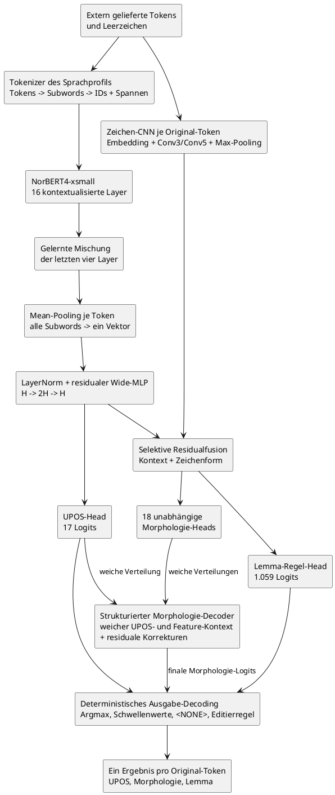
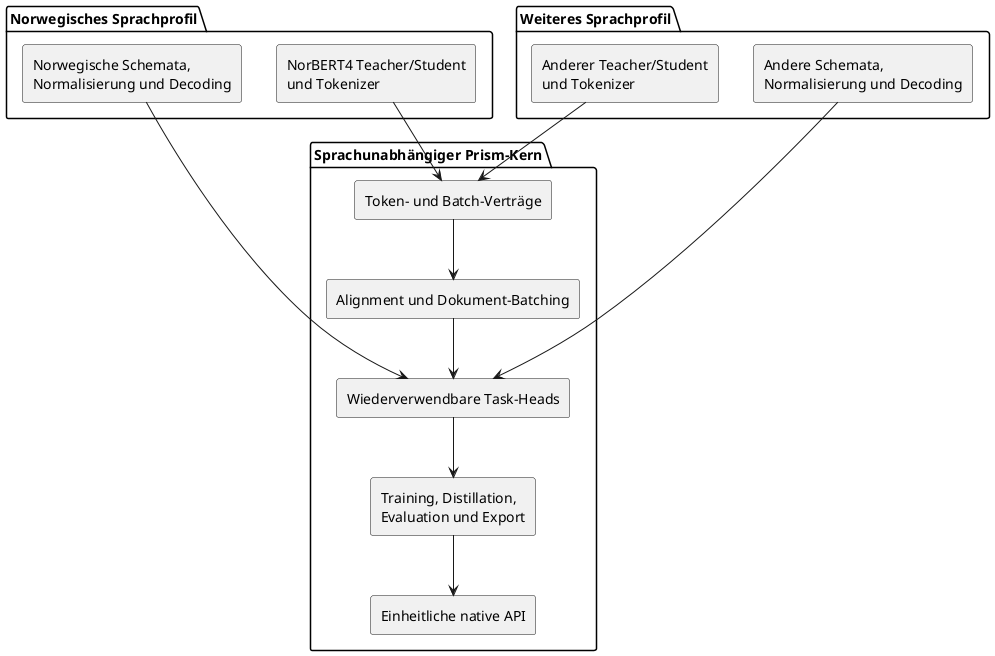
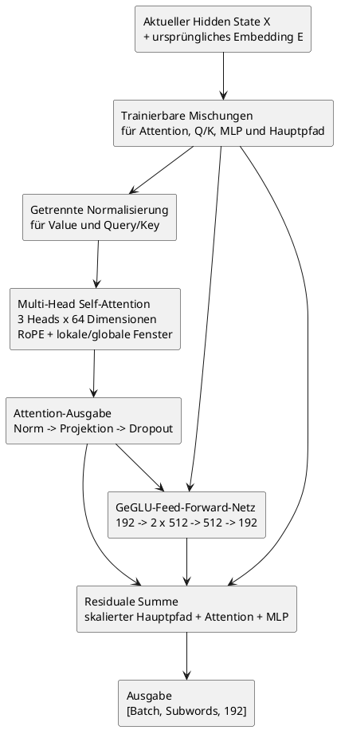
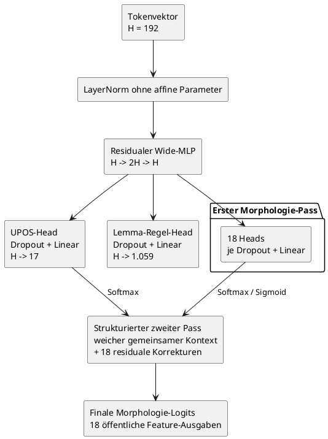
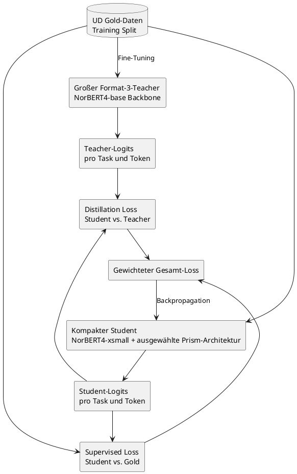
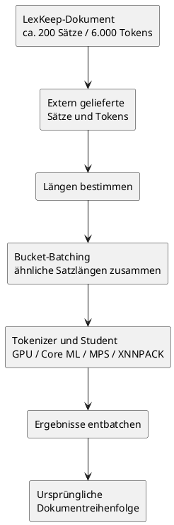

# Prism-Architektur

Dieses Dokument erklärt die aktuell ausgewählte Prism-Modellarchitektur im
Detail. Es ist zugleich technische Referenz und Lerntext: Es beschreibt nicht
nur, aus welchen Modulen das Modell besteht, sondern auch, wie sich die Daten
vom extern gelieferten Token bis zur fertigen Vorhersage verändern.

Die hier beschriebene Transformer-Architektur ist der implementierte Kernpfad
für die erste Produktionsgeneration. Der trainierte Gold-only-Student bildet
die reproduzierbare Referenz für spätere Teacher-Distillation; historische
rekurrente Experimente gehören nicht mehr zur aktiven Architektur.

## Das wichtigste mentale Modell

Der ausgewählte Student ist nicht nur „NorBERT4 plus lineare Heads“. Zwischen
Tokenizer und Ausgabe liegen mehrere trainierte Verarbeitungsschritte, die in
kontrollierten Ablationen ausgewählt wurden:

```text
extern gelieferte Tokens und Leerzeicheninformation
    -> sprachspezifische Subword-Tokenisierung
    -> NorBERT4-xsmall mit 16 Transformer-Layern
    -> gelernte Mischung der letzten vier Layer
    -> Mean-Pooling aller Subwords eines Original-Tokens
    -> nicht-affine LayerNorm
    -> gemeinsamer residualer Wide-MLP (H -> 2H -> H)
    -> Zeichen-CNN über die vollständige ursprüngliche Tokenform
    -> selektive Residualfusion für Morphologie und Lemma
    -> erster Pass der schemaabhängigen Task-Heads
    -> strukturierte, weiche Verfeinerung der Morphologie-Logits
    -> deterministisches Decoding zu UPOS, Morphologie und Lemma
```

Als Analogie:

```text
Backbone-Motor = ein vorgebildeter Sprachwissenschaftler
Layer-Mischung = Auswahl der nützlichsten Verarbeitungstiefen
Mean-Pooling = Zusammenführen aller Wortteile zu einem Wortbild
Wide-MLP = gemeinsamer Aufgaben-Vorbereiter
Zeichen-CNN = kompakter Leser für Präfixe, Endungen und Schreibmuster
Task-Heads = getrennte Prüfungsbögen mit konkreten Fragen
strukturierter Morphologie-Decoder = Plausibilitätsabgleich der Grammatikfragen
Ausgabe-Decoder = Übersetzung der finalen Zahlen in öffentliche Prism-Werte
```

Der Motor besitzt allgemeines norwegisches Sprachwissen. Der UPOS-Head fragt
nach der Wortart, die 18 Morphologie-Heads nach grammatischen Eigenschaften
und der Lemma-Head nach der Editierregel, die aus der Wortform das Lemma
erzeugt. Ein kompakter Zeichen-CNN-Zweig liest zusätzlich die vollständige
Tokenform und reichert nur Morphologie und Lemma an; UPOS bleibt am reinen
Kontextpfad. Der strukturierte Morphologie-Decoder betrachtet anschließend die
weichen Wahrscheinlichkeiten aller Morphologie-Fragen zusammen mit UPOS und
korrigiert nur die Morphologie-Logits. UPOS und Lemma werden von diesem zweiten
Pass nicht verändert.

Der Begriff „Decoder“ bezeichnet in diesem Dokument deshalb zwei verschiedene
Ebenen:

1. Der **strukturierte Morphologie-Decoder** ist ein trainierbarer Teil des
   neuronalen Netzes und verfeinert Logits.
2. Das **Ausgabe-Decoding** ist deterministische Nachverarbeitung: Argmax,
   Schwellenwerte, `<NONE>`-Ableitung und Anwendung einer Lemma-Editierregel.

Norwegisch ist die erste konkrete Konfiguration. Der generische Prism-Kern
setzt weder NorBERT4 noch die norwegischen Labelzahlen fest.



### Ausgewählte norwegische Konfiguration

| Teil | Aktuell ausgewählte Entscheidung |
| --- | --- |
| Eingabe | Extern segmentierte Sätze mit stabilen Tokens und `has_space_before` |
| Student-Backbone | `ltg/norbert4-xsmall`, gepinnte Revision `7483327d...` |
| Backbone-Ausgabe | Gelernte skalierte Mischung der letzten vier Hidden States |
| Subword-Aggregation | Mean-Pooling über die vollständige Subword-Spanne jedes Tokens |
| Gemeinsame Projektion | Nicht-affine LayerNorm und residualer `H -> 2H -> H`-MLP |
| Zeichenpfad | Trainingsabgeleitetes Vokabular, Conv3/Conv5 und selektive Fusion für Morphologie/Lemma |
| UPOS | Ein schemaabhängiger kategorialer Head, in Norwegisch 17 Klassen |
| Morphologie | 18 schemaabhängige Heads mit hybridem kategorialem/Multi-Label-Vertrag |
| Morphologie-Struktur | Paralleler zweiter Pass mit weichem UPOS- und Feature-Kontext |
| Lemma | Kategorialer Head über 1.059 aus Trainingsdaten abgeleitete Editierregeln |
| Trainingsdauer | 12 Epochen; bester Checkpoint nach kombiniertem Development-Loss |
| Training | Batchgröße 16, Prism-Head-Dropout 0,1, Morphologie-Gewichtskappe 10,0 |
| Checkpoint | Format 3, 69.862.812 Bytes, gemeinsames Modell für Bokmål und Nynorsk |
| Auslieferung | Nur der kompakte Student; der Teacher bleibt Trainingswerkzeug |

Die ausgewählte Architektur heißt im Code
`wide-shared-mlp-structured-morphology-character-cnn`. Ihre einzelnen Bausteine bleiben
sprachunabhängig; Hidden Size, Featurezahl und Labelräume kommen aus Backbone
und Sprachschema.

### Zuordnung zur Implementierung

Die Architektur ist nicht nur ein Diagramm, sondern auf klar getrennte Module
abgebildet:

| Verantwortung | Implementierte Quelle |
| --- | --- |
| Vollständiger Forward-Pfad | [`TokenTagger`](../python/src/prism/modeling/taggers.py) |
| Backbone-Ausführung | [`contextualize_subwords`](../python/src/prism/modeling/encoders.py) |
| Letzte Schicht oder gelernte Layer-Mischung | [`BackboneLayerAggregation`](../python/src/prism/modeling/layer_aggregation.py) |
| First-/Mean-Pooling | [`align_subwords_to_tokens`](../python/src/prism/modeling/alignment.py) |
| LayerNorm, Wide-MLP und Task-Heads | [`TokenTaskHeads`](../python/src/prism/modeling/heads.py) |
| Strukturierter zweiter Morphologie-Pass | [`StructuredMorphologyDecoder`](../python/src/prism/modeling/structured_morphology.py) |
| Überwachte Losses | [`compute_token_task_loss`](../python/src/prism/training/losses.py) |
| Distillation | [`compute_token_task_distillation_loss`](../python/src/prism/training/distillation.py) |
| Morphologie-Ausgabekorrektur | [`apply_morphology_logit_correction`](../python/src/prism/modeling/decoding.py) |
| Deterministisches Ausgabe-Decoding | [`decode_token_task_logits`](../python/src/prism/modeling/decoding.py) |
| Architektur-Metadaten und Fallbacks | [`checkpoints.py`](../python/src/prism/training/checkpoints.py) |
| Norwegische Backbone-/Datenwahl | [`profile.py`](../python/src/prism/languages/norwegian/profile.py) |

Diese Zuordnung ist die Wartungsregel für das Dokument: Ändert sich einer
dieser Verträge, müssen Gesamtfluss und Detailabschnitt gemeinsam aktualisiert
werden.

## Sprachunabhängiger Kern und austauschbare Sprachprofile

Prism soll langfristig viele Sprachen unter derselben API bedienen. Deshalb
darf NorBERT4 nicht zum fest eingebauten Motor der gesamten Bibliothek werden.
NorBERT4 ist lediglich die erste norwegische Backbone-Konfiguration.

Die Architektur trennt zwei Ebenen:

### Sprachunabhängiger Prism-Kern

Der Kern kennt keine konkrete Sprache und kein konkretes vortrainiertes
Modell. Er stellt wiederverwendbare Mechanismen bereit:

- typisierte Token-, Batch-, Vorhersage- und Artefaktverträge;
- Subword-zu-Token-Alignment und Dokument-Batching;
- UPOS-, Morphologie- und Lemma-Head-Familien sowie gemeinsame Mechanismen
  für spätere Konfidenzkalibrierung;
- Loss-Funktionen und Distillation sowie der spätere Kalibrierungsvertrag;
- Evaluation, Export und native Runtime-Anbindung;
- einheitliche API-Semantik für Python, Swift, Java/Kotlin und C++.

### Sprachprofil

Ein Sprachprofil konfiguriert alle Entscheidungen, die zwischen Sprachen
ausgetauscht werden müssen:

- Sprach- und Locale-Kennung;
- Teacher- und Student-Backbone;
- Tokenizer, Leerzeichenbehandlung und Normalisierung;
- Dataset-Adapter und unterstützte Annotationsschemata;
- UPOS-, Morphologie- und Lemma-Regel-Inventare;
- sprachspezifisches Decoding, Provenienz, Lizenzen und Benchmarks.

Die Arten der Task-Heads bleiben gleich. Ihre konkrete Größe ist jedoch Teil
des Sprachschemas. Der Morphologie-Code kann beispielsweise für jede Sprache
einen Klassifikator pro Feature aufbauen, ohne die 18 norwegischen Features
fest einzuprogrammieren. Ebenso darf ein gemeinsamer Lemma-Head nicht an die
aktuell 1.059 norwegischen Editierregeln gekoppelt sein.



Die Abhängigkeitsrichtung ist entscheidend: Ein Sprachprofil verwendet den
Prism-Kern. Der Prism-Kern importiert niemals ein konkretes Sprachprofil. So
kann später ein anderes Modell ausgewählt werden, ohne Batching, Heads,
Training, Export oder native Bibliotheken zu duplizieren.

## Was ist der Motor?

Der Motor ist ein vortrainierter Transformer-Encoder. Er liefert noch keine
UPOS-Tags, Morphologie-Werte oder Lemmas. Seine Aufgabe besteht darin, jedes
Subword in einen Zahlenvektor zu verwandeln, der möglichst viel Information
über die Bedeutung und grammatische Funktion dieses Subwords im konkreten Satz
enthält.

Der große Mehrwert ist der Kontext. Betrachten wir das norwegische Wort `så`:

```text
Jeg så filmen.      -> VERB, Tense=Past, Lemma=se
Det var så fint.    -> ADV, Lemma=så
```

Eine reine Wörterbuchsuche sieht zweimal dieselbe Zeichenfolge. Der
Transformer erzeugt dagegen zwei verschiedene Repräsentationen, weil `så` in
beiden Sätzen mit unterschiedlichen Nachbartokens und Satzstrukturen
interagiert.

Der Motor komprimiert also eine Aussage wie:

```text
"Das ist meine kontextabhängige Beschreibung dessen,
was dieses Token in diesem Satz wahrscheinlich bedeutet."
```

Die Task-Heads lernen anschließend, bestimmte Informationen aus dieser
Beschreibung herauszulesen.

## Warum wird der Motor nicht von null trainiert?

Der gepinnte UD-Trainingssplit enthält rund 244.000 Tokens. Das ist eine gute
Größe, um konkrete Aufgaben wie UPOS, Morphologie und Lemmas zu lernen. Es ist
aber viel zu wenig, um allgemeines norwegisches Sprachverständnis vollständig
von null aufzubauen.

Ein vortrainierter norwegischer Encoder hat bereits auf sehr großen Textmengen
Muster gelernt, zum Beispiel:

- welche Wörter häufig als Subjekt oder Objekt auftreten;
- welche Flexionsendungen typisch für Plural, Definitheit oder Verbformen sind;
- welche Wörter nach Präpositionen oder Hilfsverben vorkommen;
- wie norwegische Komposita und Wortbestandteile aufgebaut sind;
- welche Wortformen semantisch oder grammatisch verwandt sind;
- wie Satzreihenfolge und lokale Abhängigkeiten funktionieren.

Prism konstruiert daher das vollständige Aufgabenmodell selbst, verwendet aber
einen vortrainierten Encoder als sprachlichen Motor. Das ist kein
unverändertes Fremdmodell: Bereits implementiert sind Token-Zuordnung,
Layer-Mischung, Pooling, Multi-Task-Heads, Loss-Funktionen, Distillation und
Decoding. Kalibrierung, Quantisierung und der produktive native
Laufzeitvertrag sind nachgelagerte Release-Schritte.

## Teacher- und Student-Rollen

Die Teacher-Student-Architektur verwendet zwei Modelle für unterschiedliche
Ziele:

- Der Teacher ist groß und auf Qualität optimiert. Er wird nur beim Training
  und bei Experimenten verwendet.
- Der Student ist kompakt und auf lokale Inferenz, Exportierbarkeit und
  Dokumentdurchsatz optimiert. Nur er wird ausgeliefert.

Die aktuelle Rollenverteilung ist:

- `ltg/norbert4-xsmall` ist der ausgewählte Backbone des kompakten Students;
- `ltg/norbert4-base` ist der akzeptierte Format-3-Teacher-Backbone; sein
  zeichenbewusster Checkpoint verwendet dasselbe Schema und dieselbe
  Aufgabenarchitektur wie der Student und übertrifft ihn auf beiden
  Schriftstandards einschließlich Rare/OOV;
- der frühere Base-Teacher gehört zum historischen Format-2-Vertrag und bleibt
  ein inkompatibler Vergleichswert;
- `ltg/norbert4-large` bleibt ein späterer Teacher-Vergleich, falls Base den
  finalen Student nicht ausreichend verbessert.

NorBERT4-xsmall ist nur der vortrainierte Student-Backbone des norwegischen
Sprachprofils, nicht das fertige Prism-Modell. Prism ergänzt Layer-Mischung,
Token-Pooling, gemeinsamen Wide-MLP, Task-Heads, strukturierten
Morphologie-Decoder und deterministisches Ausgabe-Decoding.

Die aktuelle xsmall-Konfiguration besitzt unter anderem:

- Hidden Size: 192;
- 16 Transformer-Layer;
- 3 Attention-Heads;
- Intermediate Size: 512;
- Vokabulargröße: 51.200.

NorBERT4 verwendet eigenen Modellcode und moderne Attention-Mechanismen. Der
frühe Export-Spike war erfolgreich: Der vollständige unabhängige
Layer-Mix-/Mean-Pooling-/Wide-MLP-Kontrolltagger wurde zu ExecuTorch abgesenkt
und ausgeführt. Auch der danach ausgewählte strukturierte Morphologie-Decoder
besteht den strikten `torch.export`-Paritätstest. Dynamische Formen,
produktionsspezifische Backend-Parität und Dokumentleistung sind trotzdem noch
offene Release-Grenzen.

## Schritt 1: Externe Tokens

LexKeep besitzt bereits Tokenisierung und Quelltext-Offsets. Prism muss diese
Tokens deshalb akzeptieren können, ohne sie erneut auf Wortebene zu
segmentieren.

Beispiel:

```text
["Jeg", "så", "filmen", "."]
```

Die Reihenfolge und Anzahl dieser Original-Tokens bilden den öffentlichen
Vertrag. Prism muss später exakt ein Ergebnis pro Original-Token liefern.

## Schritt 2: Subword-Tokenisierung

Transformer arbeiten gewöhnlich nicht direkt mit vollständigen Wörtern. Ihr
Vokabular enthält häufige Wörter und Wortbestandteile, sogenannte Subwords.

Eine illustrative Zerlegung könnte so aussehen:

```text
Original-Tokens:
["Jeg", "så", "filmen", "."]

Subwords:
["<s>", "Jeg", "så", "film", "en", ".", "</s>"]
```

Die tatsächliche Zerlegung hängt vom konkreten Tokenizer ab. `filmen` kann als
ein einzelnes Vokabularelement existieren oder in mehrere Bestandteile
zerfallen.

Prism speichert die Zuordnung zwischen Subwords und Original-Tokens:

| Subword | Original-Token |
| --- | ---: |
| `<s>` | keines |
| `Jeg` | 0 |
| `så` | 1 |
| `film` | 2 |
| `en` | 2 |
| `.` | 3 |
| `</s>` | keines |

Diese Zuordnung ist nötig, weil der Transformer Subword-Vektoren erzeugt, die
öffentliche API aber Token-Ergebnisse zurückgeben muss.

## Schritt 3: IDs und Batch-Tensoren

Der Tokenizer ersetzt jedes Subword durch eine Vokabular-ID:

```text
["<s>", "Jeg", "så", "film", "en", ".", "</s>"]

-> illustrativ:

[1, 1842, 731, 9204, 318, 27, 2]
```

Ab diesem Punkt arbeitet das neuronale Netz nicht mehr mit Zeichenketten,
sondern mit Tensoren.

Für einen einzelnen Satz mit sieben Subwords:

```text
input_ids.shape = [1, 7]
```

Für einen Batch aus acht Sätzen mit höchstens 30 Subwords:

```text
input_ids.shape = [8, 30]
attention_mask.shape = [8, 30]
```

Kürzere Sätze werden mit Padding aufgefüllt. Die Attention-Maske markiert echte
Subwords mit `1` und Padding mit `0`, damit der Motor Padding nicht als
sprachlichen Inhalt behandelt.

Der implementierte typisierte Batch-Vertrag enthält:

- `input_ids`;
- `attention_mask`;
- Start- und exklusive Endindizes der Subword-Spanne jedes Original-Tokens;
- eine Tokenmaske für echte Tokens gegenüber Padding;
- UPOS-Ziele;
- Morphologie-Ziele;
- Lemma-Regel-Ziele;
- Masken für fehlende oder nicht repräsentierbare Annotationen.

## Schritt 4: Embeddings

Eine ID wie `731` ist nur eine Zahl. Der Motor besitzt deshalb eine große
Embedding-Tabelle. Jede Vokabular-ID wählt daraus einen Vektor aus.

Bei Hidden Size 192:

```text
Vokabular-ID
    -> Embedding-Tabelle
    -> Vektor mit 192 Fließkommazahlen
```

Illustrativ:

```text
[0.17, -0.42, 0.08, ..., 0.31]
```

Für einen Batch entsteht:

```text
embeddings.shape = [batch_size, subword_count, 192]
```

NorBERT4 normalisiert jeden gewählten Wortvektor ohne affine
LayerNorm-Parameter, multipliziert seine 192 Dimensionen mit einem lernbaren
Skalenvektor und wendet beim Training Embedding-Dropout von 0,1 an. Diese
anfänglichen Vektoren enthalten bereits vortrainierte lexikalische Information.
Ihre konkrete Satzfunktion entsteht jedoch erst durch die Transformer-Layer.

## Schritt 5: Der Transformer-Block

Der ausgewählte xsmall-Backbone verarbeitet die Repräsentationen in 16
aufeinanderfolgenden Transformer-Blöcken. NorBERT4 verwendet dabei keinen
vollkommen klassischen „Attention, dann MLP“-Block. Jeder Block bildet mehrere
trainierbar gewichtete Mischungen aus dem aktuellen Hidden State und dem
ursprünglichen Token-Embedding. Diese Mischungen dienen getrennt als
Attention-Eingabe, Query-/Key-Eingabe, MLP-Eingabe und residualer Hauptpfad.

Der tatsächliche Block lässt sich vereinfacht, aber strukturell korrekt so
lesen:

1. getrennte nicht-affine Normalisierung der Value- und Query-/Key-Eingaben;
2. Self-Attention mit drei Heads, RoPE und lokaler beziehungsweise globaler
   Attention;
3. normalisierte und projizierte Attention-Ausgabe;
4. GeGLU-Feed-Forward-Netz auf einer residual erweiterten MLP-Eingabe;
5. Addition aus skaliertem Hauptpfad, Attention-Ausgabe und MLP-Ausgabe.



Die Mischungskoeffizienten sind lernbare Parameter des NorBERT4-Backbones.
Zusätzlich kann die Attention die Value-Vektoren der ersten Schicht als
residuale Referenz in spätere Schichten einmischen. Das sind interne
NorBERT4-Entscheidungen; Prism setzt sie nicht in seinem generischen
Backbone-Vertrag voraus.

### Self-Attention

Self-Attention erlaubt jeder Position, Informationen aus anderen Positionen
des Satzes aufzunehmen.

Konzeptionell berechnet Attention für jede Position drei gelernte
Transformationen. Im konkreten NorBERT4-Code stammen Query und Key aus einer
separat normalisierten, trainierbaren Hidden-State-/Embedding-Mischung; Value
besitzt ebenfalls einen eigenen normalisierten Eingang:

```text
Q = X * Wq
K = X * Wk
V = X * Wv
```

- Query: Nach welcher Information sucht diese Position?
- Key: Welche Information bietet diese Position an?
- Value: Welche Information wird bei Aufmerksamkeit übertragen?

Die Query einer Position wird mit den Keys anderer Positionen verglichen.
Vereinfacht:

```text
score(i, j) = Query(i) · Key(j) / sqrt(head_dimension)
```

Eine Softmax-Funktion macht daraus normalisierte Attention-Gewichte. Für das
Token `så` in `Jeg så filmen` könnte eine illustrative Verteilung sein:

```text
Jeg        0,12
så         0,18
film       0,31
en         0,21
.          0,08
Spezialtokens 0,10
```

Die tatsächlichen Werte werden gelernt. Entscheidend ist, dass der Vektor von
`så` Information von `Jeg` und `filmen` aufnehmen kann. Im Satz `Det var så
fint` entstehen andere Gewichte und damit eine andere Repräsentation.

### Interne Attention-Heads

NorBERT4-xsmall besitzt drei interne Attention-Heads. Bei Hidden Size 192
arbeitet jeder Head mit 64 Dimensionen:

```text
192 / 3 = 64
```

Die drei Heads betrachten dieselbe Sequenz parallel, können aber verschiedene
Beziehungsmuster lernen. Ein Head kann beispielsweise stärker auf lokale
Wortbestandteile reagieren, ein anderer auf Satzstruktur und ein weiterer auf
weiter entfernte Beziehungen. Diese Rollen werden nicht programmiert, sondern
entstehen beim Vortraining und Fine-Tuning.

Die Head-Ausgaben werden wieder zusammengeführt:

```text
3 x 64 -> 192 Dimensionen
```

Diese Attention-Heads sind interne Bestandteile des Motors. Sie sind nicht
dasselbe wie die späteren UPOS-, Morphologie- und Lemma-Task-Heads.

### Positionsinformation und Attention-Fenster

Ohne Positionen wären `Hund beißt Mann` und `Mann beißt Hund` für einen
Transformer schwer zu unterscheiden. NorBERT4 verwendet RoPE, Rotary Position
Embeddings. Positionen beeinflussen dabei die Query- und Key-Repräsentationen
der Attention.

Der Motor kann dadurch berücksichtigen:

- welches Token vorher oder nachher steht;
- wie weit zwei Positionen auseinanderliegen;
- welche Satzreihenfolge vorliegt.

NorBERT4-xsmall kombiniert außerdem lokale und globale Attention. Drei von
vier Layern verwenden ein Fenster von 256 Positionen; jeder vierte Layer ein
Fenster von 8.192 Positionen. Die lokalen Layer verwenden für RoPE die Basis
10.000, die globalen Layer 160.000. So bleiben die meisten Layer effizient,
während regelmäßig weitreichender Satzkontext einfließen kann. Prisms
Produktionsgrenzen dürfen trotzdem nicht einfach aus der theoretischen
Backbone-Grenze von 16.384 Positionen abgeleitet werden: Speicher,
Exportbackend und Batching müssen separat vermessen werden.

### Feed-Forward-Netzwerk

Nach der Attention verarbeitet ein Feed-Forward-Netz jede Position separat.
NorBERT4 projiziert von 192 auf zwei 512-dimensionale Hälften. GeGLU verwendet
eine Hälfte als Inhalt und die andere als nichtlineares Gate; anschließend
folgen Normalisierung und Rückprojektion:

```text
192 -> 1.024 -> zwei Hälften zu je 512
    -> GeGLU ergibt 512
    -> Normalisierung -> 192
```

Die Attention sammelt Kontext aus der Sequenz. Das Feed-Forward-Netz kombiniert
und transformiert die gesammelte Information pro Position nichtlinear.

### Residual-Verbindungen

Ein Transformer-Block ersetzt den alten Zustand nicht vollständig. Das
allgemeine Residualprinzip lautet:

```text
neuer Zustand = alter Zustand + gelernte Veränderung
```

Residual-Verbindungen helfen tiefen Modellen, Information zu bewahren und
stabil trainierbar zu bleiben. In NorBERT4 ist diese Addition erweitert: Der
Hauptpfad kann skaliert und mit dem ursprünglichen Embedding gemischt werden;
Attention- und MLP-Ausgabe werden anschließend addiert.

### Mehrere Layer

Die Repräsentationen durchlaufen den Block wiederholt. Als nützliches, aber
nicht strikt festgelegtes Denkmodell:

```text
frühe Layer:
Subwords, Zeichenmuster und lokale Beziehungen

mittlere Layer:
Wortformen, Flexion und Satzstruktur

späte Layer:
grammatische Rollen, Bedeutung und komplexer Kontext
```

Nach dem letzten Layer bleibt die Form erhalten:

```text
encoder_output.shape = [batch_size, subword_count, 192]
```

Der Inhalt der Vektoren ist nun kontextualisiert.

### Lernbare Mischung der Backbone-Schichten

Der frühere Kontrollpfad verwendet ausschließlich die letzte Backbone-Schicht.
Die ausgewählte checkpoint-kompatible Strategie ist `learned-last-four`:

```text
gewichte = Softmax(vier trainierbare Logits)
gemischt = skalierung * Summe(gewichte[i] * Layer[-4 + i])
```

Die Gewichte starten gleichverteilt und der Skalierungsfaktor bei `1.0`. Die
Strategie fügt damit nur fünf Parameter hinzu. Die Mischung findet vor dem
Subword-zu-Token-Pooling statt, sodass jedes Subword zunächst Informationen
aus mehreren Kontextualisierungstiefen erhält. Der generische Vertrag fordert
lediglich eine Folge gleich geformter Hidden States und enthält keine
NorBERT-Verzweigung.

`BackboneLayerAggregationStrategy` unterscheidet `last` und
`learned-last-four`. Training wählt die Strategie über
`--backbone-layer-aggregation`; Checkpoints speichern sie und Evaluation sowie
Distillation stellen sie wieder her. Bestehende Checkpoints ohne das Feld
bleiben eindeutig `last`. Der gemessene Checkpoint gewichtet die Schichten von
`-4` bis `-1` mit ungefähr `21,05 %`, `16,31 %`, `23,38 %` und `39,25 %`; die
drei früheren Schichten liefern zusammen also den größeren Anteil.

Ein strenger `torch.export`-Lauf und die Absenkung des damaligen vollständigen
**unabhängigen Head-Kontrolltaggers** zu einem ausführbaren
XNNPACK-ExecuTorch-`.pte` waren erfolgreich. Der gemessene Graph umfasst
Backbone, Layer-Mischung, Mean-Pooling, Wide-MLP und alle 20 Logit-Ausgaben.
Auf dem geprüften Eingabetensor betrugen die maximale Abweichung zur
PyTorch-Ausgabe rund `1,91e-5` und die größte mittlere Abweichung einer Ausgabe
rund `7,95e-6`. Der danach ausgewählte strukturierte Morphologie-Decoder ist
separat durch strikte `torch.export`-Ausgabeparität abgedeckt, wurde aber noch
nicht als vollständiges `.pte` durch einen Produktionsbackend-Benchmark
gemessen. Beide Nachweise verwenden bisher feste Formen und ersetzen nicht die
später erforderlichen dynamischen Produktionsformen, Backend-Parität,
Peak-Speicher- und Dokumentlaufzeitmessungen.

## Schritt 6: Subwords zurück zu Original-Tokens

Wenn `filmen` in `film` und `en` zerlegt wurde, liegen zwei Vektoren vor.
Prism benötigt einen Tokenvektor.

### Erster Subword-Vektor

```text
Tokenvektor("filmen") = Vektor("film")
```

Vorteile:

- geringer Aufwand;
- effizienter Gather-Operator;
- einfacher Export;
- etablierte Methode;
- der erste Vektor kann durch Self-Attention trotzdem die Endung sehen.

### Mittelwert der Subwords

```text
Tokenvektor("filmen")
    = Mittelwert(Vektor("film"), Vektor("en"))
```

Das kann Endungen direkter einbeziehen, benötigt aber zusätzliche
Aggregation.

Prism implementiert beide Varianten als typisierte
`TokenPoolingStrategy`. Der Tokenizer speichert für jedes Original-Token den
Startindex und den exklusiven Endindex seines zusammenhängenden
Subwordbereichs. First-Pooling sammelt den Startvektor ein. Mean-Pooling bildet
mit Präfixsummen den Mittelwert des gesamten Bereichs, ohne eine Python-Schleife
pro Token zu benötigen.

```plantuml
@startuml token-pooling
skinparam backgroundColor transparent
skinparam shadowing false

rectangle "Original-Token\nfilmen" as Token
rectangle "Subword-Spanne\n[film, en]" as Span
diamond "Checkpoint-Policy" as Policy
rectangle "first\nVektor(film)" as First
rectangle "mean\n(Vektor(film) + Vektor(en)) / 2" as Mean
rectangle "ein Tokenvektor\n192 Dimensionen" as Result

Token --> Span
Span --> Policy
Policy --> First : first
Policy --> Mean : mean
First --> Result
Mean --> Result
@enduml
```

Die Strategie wird im Checkpoint gespeichert und bei der Evaluation
automatisch wiederhergestellt. Format-3-Checkpoints ohne dieses neue Feld
werden aus Kompatibilitätsgründen eindeutig als `first` interpretiert. Die
kontrollierte Ablation hat Mean-Pooling als neuen Standard für norwegische
Student-Trainings ausgewählt: Es senkt den Development-Loss und verbessert
Lemma-Accuracy sowie Morphologie-Micro-F1 auf Bokmål und Nynorsk. First-Pooling
bleibt als explizite Vergleichs- und Kompatibilitätsstrategie verfügbar.

Danach entsteht:

```text
token_vectors.shape = [batch_size, original_token_count, 192]
```

Jedes Original-Token besitzt nun genau einen kontextualisierten Vektor.

### Ausgewählter zeichenbewusster Zusatzpfad

Der ausgewählte Student ergänzt den kontextualisierten Tokenvektor um
eine kleine Darstellung der **vollständigen ursprünglichen Wortform**. Er
ersetzt weder NorBERT4 noch dessen Subword-Tokenizer. Der Satzkontext bleibt
der Hauptpfad; der Zeichenzweig liefert eine gezielte Zusatzinformation für
seltene und im Training ungesehene Schreibformen.

Das Zeichenvokabular wird ausschließlich aus dem jeweiligen Trainingskorpus
gebaut, verwendet Unicode NFC und bewahrt Groß-/Kleinschreibung. Fünf feste
IDs stehen vor den literal gespeicherten Unicode-Codepoints:

```text
0  Padding
1  unbekanntes Zeichen
2  Wortanfang
3  Wortende
4  gekürzte Wortmitte
5+ Zeichen aus dem Trainingskorpus
```

Ein Token besitzt höchstens 32 Zeichenpositionen einschließlich Grenzen. Bei
längeren Formen bleiben Präfix und Suffix erhalten; die entfernte Mitte wird
durch das explizite Kürzungszeichen markiert. Das ist für Morphologie und
Lemma günstiger als eine reine Rechtskürzung, weil sowohl Wortanfänge als auch
Flexionsendungen relevant sein können.

Der exportfreundliche Encoder arbeitet vollständig parallel:

```text
Zeichen-IDs
    -> Embedding mit 32 Dimensionen
    -> parallele Conv1d-Fenster der Breite 3 und 5
    -> je 96 Kanäle + GELU
    -> maskiertes Maximum über die Zeichenpositionen
    -> Zeichenvektor mit 192 Dimensionen
```

Der Zeichenvektor wird nicht an alle Heads verteilt. Nach dem bestehenden
Wide-MLP wird er normalisiert, mit dem 192-dimensionalen Kontextvektor
konkateniert und residual zurück auf 192 Dimensionen projiziert:

```text
x_char_task = x_shared
    + Dropout(GELU(Linear([x_shared ; LayerNorm(x_char)])))
```

Nur Morphologie und Lemma lesen `x_char_task`. UPOS liest weiterhin direkt
`x_shared`; verschiedene Zeichenvektoren können dessen Logits daher nicht
verändern. Der strukturierte Morphologie-Decoder kombiniert anschließend den
zeichenbewussten ersten Morphologie-Pass mit dem unveränderten weichen
UPOS-Kontext.

Für das gemeinsame Bokmål-/Nynorsk-Training enthält das abgeleitete
Vokabular 120 literale Zeichen beziehungsweise 125 IDs inklusive der fünf
Spezialwerte. Encoder und Fusion ergänzen bei `H = 192` insgesamt 102.688
Parameter oder 410.752 rohe FP32-Bytes. Checkpoints speichern Vokabular und
Maximallänge; ältere Checkpoints ohne Zeichenzweig bleiben unverändert
ladbar. Ein eigener flacher Exportadapter nimmt zusätzlich Zeichen-IDs und
Zeichenmaske entgegen. Strikte `torch.export`-Parität ist getestet.

Die kontrollierte Auswertung wählt diesen Pfad. Gegen die unveränderte
strukturierte Kontrolle steigt Rare-Lemma end-to-end um 2,6667/2,4238
Prozentpunkte und Rare-Morphologie-Micro-F1 um 1,7586/1,5048 Punkte auf
Bokmål/Nynorsk. Auch OOV-Lemma, OOV-Morphologie und OOV-UPOS verbessern sich
auf beiden Standards. Die kleinen Gesamt-UPOS-Rückgänge von 0,0302/0,0576
Punkten bleiben als gemessener Tradeoff dokumentiert.

## Schritt 7: Task-Heads

Ein Task-Head ist eine kleine spezialisierte Ausgabeschicht. Der Motor liefert
allgemeine Sprachinformation, der Head beantwortet eine konkrete Frage. Im
ausgewählten Student gelangen die 192-dimensionalen Tokenvektoren jedoch nicht
direkt zu diesen linearen Ausgängen. Zuerst verarbeitet ein gemeinsamer
residualer Wide-MLP jedes Token:

```text
x_norm = LayerNorm(x)                         # ohne lernbares affine Gewicht
x_wide = GELU(Linear(H -> 2H)(x_norm))
x_shared = x_norm + Linear(2H -> H)(Dropout(x_wide))
```

Für NorBERT4-xsmall ist `H = 192`, also `192 -> 384 -> 192`. Erst
`x_shared` geht in die einzelnen Task-Heads. Jeder Head wendet während des
Trainings noch sein eigenes Dropout an und projiziert dann linear in seinen
schemaabhängigen Labelraum:

```text
task_logits = Linear(H -> label_count)(Dropout(x_shared))
```

Die Rohwerte heißen Logits. Sie werden für Loss, strukturelle Verfeinerung,
Evaluation oder Ausgabe durch Softmax beziehungsweise Sigmoid interpretiert.
Der gemeinsame MLP ersetzt die Heads nicht: Er bereitet eine reichere
gemeinsame Repräsentation vor; die linearen Heads lesen daraus weiterhin die
konkreten Aufgaben aus.



Der ausgewählte Wide-MLP enthält bei `H = 192` 148.032 Parameter. Der
strukturierte zweite Morphologie-Pass fügt 23.476 Parameter hinzu. Beide
Bausteine sind klein gegenüber dem 16,9-Millionen-Parameter-Backbone, aber sie
sind trainierte, feste Bestandteile des ausgewählten Prism-Students.

### UPOS-Head

Der UPOS-Head erhält 192 Werte und erzeugt 17 Logits:

```text
Linear(192 -> 17)
upos_logits.shape = [batch, tokens, 17]
```

Illustrativ:

```text
ADJ     -2,1
ADV      0,7
NOUN    -3,0
VERB     4,8
...
```

Softmax:

```text
VERB  0,94
ADV   0,04
ADJ   0,01
Rest  0,01
```

Der Head besitzt ungefähr:

```text
192 * 17 + 17 = 3.281 Parameter
```

### Lemma-Regel-Head

Das aktuelle gemeinsame norwegische Trainingsschema enthält 1.059
normalisierte Lemma-Regeln:

```text
Linear(192 -> 1.059)
lemma_logits.shape = [batch, tokens, 1.059]
```

Der Head erzeugt nicht direkt Zeichen. Er bewertet Regeln, die Präfix- und
Suffixteile entfernen oder ergänzen. Der Decoder wendet die gewählte Regel auf
das Original-Token an.

Die lineare Schicht besitzt ungefähr:

```text
192 * 1.059 + 1.059 = 204.387 Parameter
```

Eine Gold-Regel, die nicht im Trainingsschema vorkommt, wird als
`nicht repräsentierbar` markiert. Die Development-Splits enthalten aktuell 28
solche Bokmål- und 26 solche Nynorsk-Tokens. Sie dürfen nicht mit wirklich
fehlenden Lemma-Annotationen verwechselt werden.

### Morphologie-Heads: ein hybrider Vertrag

Prism verwendet einen separaten Head pro Feature:

```text
Abbr, Animacy, Case, Definite, Degree, Foreign,
Gender, Mood, NumType, Number, Person, Polarity,
Poss, PronType, Reflex, Tense, VerbForm, Voice
```

Nicht jedes morphologische Feature stellt dieselbe Art von Frage. Deshalb
verwendet Prism ab Checkpoint-Format 3 zwei Klassifikationsverträge. Das
Sprachschema entscheidet pro Feature, welcher Vertrag gilt; die generischen
Heads kennen keine fest einprogrammierten norwegischen Sonderfälle.

#### Exklusive Features: Softmax und Cross-Entropy

Bei einem exklusiven Feature ist genau eine Antwort richtig. `<NONE>` ist hier
eine echte Klasse neben den annotierten Werten. Beispiel `Tense`:

```text
<NONE>
Past
Pres
```

Der lineare Head erzeugt einen Logit pro vollständigem Label:

```text
Linear(192 -> 3)
    -> Softmax
    -> genau eine Vorhersage per Argmax
```

Für ein Token ohne Tense:

```text
<NONE>  0,99
Past    0,005
Pres    0,005
```

Trainiert wird dieser Head mit kategorialer Cross-Entropy. Optionale
Klassengewichte wirken auf die jeweilige Gold-Klasse. Damit konkurrieren
`<NONE>`, `Past` und `Pres` direkt miteinander, statt als voneinander
unabhängige Ja/Nein-Fragen behandelt zu werden.

#### Mehrwertige Features: Sigmoid und Binary Cross-Entropy

Bei einem genuin mehrwertigen Feature können mehrere reale Werte gleichzeitig
gelten. Beispiel `Case` mit `Acc,Dat`. Der Head erzeugt deshalb nur für die
realen Werte unabhängige Logits:

```text
Linear(192 -> Anzahl reale Werte)
    -> Sigmoid pro Wert
    -> alle Werte oberhalb des Schwellenwerts
```

`<NONE>` besitzt hier keinen eigenen trainierbaren Logit. Es wird exakt dann
abgeleitet, wenn kein realer Wert aktiv ist. Seine Wahrscheinlichkeit für
Evaluation und spätere Kalibrierung ergibt sich aus:

```text
P(<NONE>) = Produkt(1 - P(realer Wert))
```

Trainiert wird mit Binary Cross-Entropy pro realem Wert. Positive
Klassengewichte werden ebenfalls nur auf reale positive Ziele angewendet.
Dadurch kann das sehr häufige Fehlen eines Features keinen künstlichen
`<NONE>`-Ausgang dominieren.

Das aktuelle gemeinsame norwegische Schema erkennt aus den gepinnten
Trainingsdaten:

- 12 exklusive Features: `Abbr`, `Animacy`, `Degree`, `Foreign`, `Mood`,
  `NumType`, `Person`, `Polarity`, `Poss`, `Reflex`, `Tense`, `Voice`;
- 6 mehrwertige Features: `Case`, `Definite`, `Gender`, `Number`, `PronType`,
  `VerbForm`.

Die gespeicherten Targets und die öffentliche Ausgabe behalten für beide
Varianten den vollständigen Labelraum inklusive `<NONE>`. Nur der interne
Logit-Vertrag unterscheidet sich. Der Decoder validiert dabei unter anderem:

- mindestens ein aktives Label;
- `<NONE>` nie zusammen mit echten Werten;
- keine Mehrfachwerte bei einwertigen Features;
- korrekte Label-Anzahl pro Feature.

```plantuml
@startuml hybrid-morphology-heads
skinparam backgroundColor transparent
skinparam shadowing false

rectangle "Morphologie-Feature\naus dem Sprachschema" as Feature
diamond "Mehrfachwerte\nerlaubt?" as Multi

rectangle "Linearer Head\n<NONE> + reale Werte" as CategoricalHead
rectangle "Cross-Entropy\nSoftmax / Argmax" as CategoricalDecision

rectangle "Linearer Head\nnur reale Werte" as MultiHead
rectangle "Binary Cross-Entropy\nSigmoid / Schwellenwert" as MultiDecision
rectangle "<NONE> ableiten\nwenn kein Wert aktiv" as DerivedNone

Feature --> Multi
Multi --> CategoricalHead : nein
CategoricalHead --> CategoricalDecision
Multi --> MultiHead : ja
MultiHead --> MultiDecision
MultiDecision --> DerivedNone
@enduml
```

### Architekturvarianten und Auswahlhistorie

`TokenTaskHeadArchitecture` kennt sechs explizite, checkpoint-kompatible
Varianten:

| Wert | Bedeutung | Status |
| --- | --- | --- |
| `linear` | LayerNorm, danach direkte lineare Task-Heads | alter Format-3-Kontrollpfad |
| `shared-mlp` | residualer `H -> H`-MLP vor allen Heads | gemessene Zwischenstufe |
| `wide-shared-mlp` | residualer `H -> 2H -> H`-MLP | ausgewählte unabhängige Kontrolle |
| `wide-shared-mlp-task-adapters` | Wide-MLP plus drei Task-Familien-Adapter | gemessen und verworfen |
| `wide-shared-mlp-structured-morphology` | Wide-MLP plus strukturierter Morphologie-Pass | kontrollierte Vorgängerarchitektur |
| `wide-shared-mlp-structured-morphology-character-cnn` | strukturierter Vorgänger plus Zeichen-CNN für Morphologie und Lemma | aktueller Standard |

Die schmale `shared-mlp`-Variante verwendet
`x + Dropout(GELU(Linear(H -> H)(x)))` und fügt bei `H = 192` 37.056
Parameter hinzu. Sie verbesserte im ersten kontrollierten Vergleich alle
Hauptmetriken gegenüber `linear`. Die breitere Variante ergänzt eine zweite
Projektion, enthält 148.032 Parameter und verbesserte insbesondere Lemma sowie
Morphologie-Micro-F1 und Average Precision auf beiden Schriftstandards. Sie
wurde deshalb zur Kontrolle für die nachfolgenden Strukturversuche.

Die Residualverbindung bewahrt in beiden Fällen den direkten normierten
Informationspfad. Ein einziges gemeinsames MLP vermeidet außerdem einen großen
separaten Block pro Aufgabe. `H` kommt immer aus dem Backbone-Vertrag; bei
einem späteren Backbone mit anderer Hidden Size skaliert die Projektion ohne
norwegische Sonderbehandlung mit.

Die Training-CLI wählt die Variante mit `--task-head-architecture`.
Checkpoints speichern sie; Evaluation und Teacher-Laden rekonstruieren sie.
Format-3-Checkpoints ohne dieses Feld werden zur Kompatibilität eindeutig als
`linear` interpretiert und niemals stillschweigend als neue Architektur
geladen.

### Task-Familien-Adapter als kontrollierter Kandidat

Die Architekturvariante `wide-shared-mlp-task-adapters` behält den
ausgewählten breiten gemeinsamen MLP unverändert bei und verzweigt erst danach
in drei kleine residuale Adapter:

```text
NorBERT4 + gelernte Mischung der letzten vier Layer
    -> Mean-Pooling pro Token
    -> LayerNorm
    -> gemeinsamer Wide MLP (H -> 2H -> H)
       |-> UPOS-Adapter        (H -> H/2 -> H) -> UPOS-Head
       |-> Morphologie-Adapter (H -> H/2 -> H) -> alle Morphologie-Heads
       `-> Lemma-Adapter       (H -> H/2 -> H) -> Lemma-Regel-Head
```

Ein Adapter berechnet
`x + Linear(H/2 -> H)(Dropout(GELU(Linear(H -> H/2)(x))))`. Seine letzte
Projektion beginnt mit Nullgewichten. Dadurch ist der neue Pfad zu Beginn des
Trainings exakt die Identität und kann die bereits bewährte gemeinsame
Repräsentation nicht durch eine zufällige Transformation beschädigen. Danach
lernt jede Task-Familie ihre eigene kleine Spezialisierung.

Für NorBERT4-xsmall verwendet jeder Adapter `192 -> 96 -> 192` und enthält
37.152 Parameter. Alle drei Adapter zusammen fügen 111.456 Parameter oder
ungefähr 446 KB in FP32 hinzu. Die 18 Morphologie-Features teilen bewusst einen
Morphologie-Adapter; einzelne Adapter pro Feature würden Größe und
Überanpassungsrisiko unnötig erhöhen. Output-Labelräume, Losses, Decoder und
öffentliche Vorhersageverträge ändern sich nicht.

Die Variante verwendet weiterhin nur Linear, GELU, Dropout und Addition und
bleibt damit im bestehenden `torch.export`-/ExecuTorch-Pfad darstellbar. Sie
ist implementiert und exportierbar, wurde nach dem direkten
Bokmål-/Nynorsk-Vergleich jedoch verworfen. Sie verbessert Nynorsk-Loss,
Morphologie-Micro-F1 und -Average-Precision, verschlechtert dort aber UPOS,
Lemma und Macro-F1. Auf Bokmål verschlechtern sich Loss, UPOS, Lemma,
Precision, Micro-F1 und Macro-F1 gegenüber dem ausgewählten Modell. Der
robustere Kontrollpfad bleibt daher `wide-shared-mlp` ohne Task-Adapter; die
Variante bleibt nur als reproduzierbare Ablation erhalten. Der anschließend
ausgewählte strukturierte Decoder baut auf genau diesem Kontrollpfad auf.

### Ausgewählter strukturierter Morphologie-Decoder

Die Variante `wide-shared-mlp-structured-morphology` setzt auf dem ausgewählten
Modell ohne Task-Adapter auf. Sie behält die bisherigen unabhängigen
Morphologie-Heads als ersten Pass und verfeinert ihre Logits in einem zweiten,
parallelen Pass:

```text
gemeinsamer Tokenvektor
    |-> UPOS-Head -----------------------> weiche UPOS-Verteilung
    `-> unabhängige Morphologie-Heads ---> weiche Feature-Verteilungen
                                                |
              alle Verteilungen konkatenieren -+
                       -> LayerNorm
                       -> Linear(Kontext -> H)
                       -> GELU + Dropout
                       -> pro Feature: Linear(H -> Logit-Anzahl)
                       -> residual auf die ursprünglichen Feature-Logits
```

Formal berechnet der zweite Pass für ein Token:

```text
p_upos = Softmax(upos_logits)

p_feature = Softmax(feature_logits)       für exklusive Features
p_feature = Sigmoid(feature_logits)       für mehrwertige Features

decision_context = concat(p_upos, p_feature_1, ..., p_feature_18)
context_normalized = LayerNorm(decision_context, elementwise_affine=False)
refinement = Dropout(GELU(Linear(69 -> H)(context_normalized)))

final_feature_logits_i =
    base_feature_logits_i + Linear_i(H -> logit_count_i)(refinement)
```

Exklusive Features liefern Softmax-Verteilungen inklusive `<NONE>`;
mehrwertige Features liefern unabhängige Sigmoid-Wahrscheinlichkeiten für ihre
realen Werte. Der Decoder sieht dadurch beispielsweise gleichzeitig, wie
wahrscheinlich `NOUN`, `VerbForm=Fin`, `Tense=Past` und `Number=Sing` sind. Er
kennt keine hart vorhergesagte Klasse und verwendet keine feste
Feature-Reihenfolge. Ein falsches UPOS zwingt deshalb nicht automatisch alle
Morphologie-Entscheidungen in dieselbe falsche Richtung.

„Strukturiert“ bedeutet hier eine Struktur **zwischen den 18
Morphologie-Features und UPOS desselben Tokens**. Der Decoder ist weder ein CRF
über benachbarte Tokens noch ein autoregressives Netz. Alle 18 Korrekturen
werden parallel berechnet; dadurch bleibt der Pfad klein, deterministisch
batchbar und exportfreundlich. Der Lemma-Head nimmt nicht am
Entscheidungskontext teil.

Die Verfeinerung bleibt residual. Alle feature-spezifischen
Korrekturprojektionen starten mit Nullgewichten, sodass der neue Decoder zu
Beginn exakt dieselben Logits wie das ausgewählte unabhängige Modell ausgibt.
Training kann anschließend nur die tatsächlich nützlichen Abhängigkeiten
lernen. Losses, Targetrepräsentation, Schwellenwerte, Decoder-Ausgabe und
öffentliches Vorhersageformat ändern sich nicht.

Der Morphologie-Loss wird ausschließlich aus den **finalen**, verfeinerten
Logits berechnet. Weil Softmax, Sigmoid und Konkatenation differenzierbar sind,
fließt sein Gradient sowohl durch die Korrektur-Heads als auch durch den
weichen UPOS- und Basis-Morphologie-Kontext. Der UPOS-Head erhält zusätzlich
weiterhin seinen eigenen überwachten UPOS-Loss. Es wird keine harte
UPOS-Klassen-ID in den Lernpfad eingesetzt.

Das gemeinsame norwegische Schema hat 17 UPOS-Klassen und insgesamt 52
Morphologie-Logits. Die Kontextprojektion liest daher 69 Werte. Bei `H = 192`
fügen Kontextprojektion und Korrektur-Heads zusammen 23.476 Parameter oder
ungefähr 94 KB reine FP32-Gewichte hinzu. Der gemessene Checkpoint wächst
einschließlich Serialisierungsstruktur um 105.666 Bytes. Softmax, Sigmoid,
LayerNorm, Linear, GELU, Dropout und Addition bestehen den strikten
`torch.export`-Pfad. Die Variante ist nach dem kontrollierten
Bokmål-/Nynorsk-Vergleich der neue Standard.

Gegenüber den unabhängigen Morphologie-Heads verbessert sie auf beiden
Schriftstandards Loss, Lemma, Morphologie-Präzision, Recall, Micro-F1 und
Average Precision. Der Morphologie-Micro-F1 steigt von 95,83% auf 95,98% für
Bokmål und von 92,57% auf 92,89% für Nynorsk. Bokmål-UPOS bleibt unverändert;
Nynorsk-UPOS und -Macro-F1 sinken geringfügig um 0,0256 und 0,0470
Prozentpunkte. Der Checkpoint wächst nur um 105.666 Bytes auf rund 69,4 MB.
Damit ist der kleine strukturierte Gewinn über beide Standards robuster als
der zuvor verworfene Task-Adapter.

## Konfidenz und Kalibrierung

Die ausgewählte Architektur besitzt keinen separaten Konfidenz-Head. Ihre
Rohkonfidenz entsteht aus den finalen Logits der jeweiligen Aufgabe.

Unkalibrierte neuronale Wahrscheinlichkeiten sind häufig zu selbstsicher.
Prism soll deshalb nach Abschluss der Architekturwahl auf dem Development-Split
Kalibrierungsparameter anpassen, beispielsweise eine Temperatur pro
Task-Familie. Dieser Schritt ist geplant, aber noch nicht implementiert oder
als Benchmark belegt.

```text
Logits
    -> Temperaturkalibrierung
    -> Wahrscheinlichkeiten
    -> Konfidenz oder Abstention
```

Ein Schwellenwert kann später bewirken, dass Prism eine Vorhersage als
unsicher markiert, statt sie in Lernsoftware als zuverlässig darzustellen.

### Abschaltbare Klassengewichts-Logit-Korrektur

Die Morphologie-Klassengewichte verbessern seltene Klassen, verschieben bei
gewichteter Cross-Entropy beziehungsweise Binary Cross-Entropy aber zugleich
die optimalen Rohlogits. Die erste UFeats-Ablation entfernt vor dem
deterministischen Morphologie-Decoding einen kontrollierten Anteil dieser
Verschiebung:

```text
korrigierter Logit = Rohlogit - Stärke * log(Trainingsklassengewicht)
```

Die Gewichte stammen ausschließlich aus dem Trainingssplit und sind bereits
im Checkpoint gespeichert. `Stärke = 0` deaktiviert den Pfad vollständig und
ist der Standard. UPOS- und Lemma-Logits, Development-Loss, Modellparameter
und Forward-Pass bleiben unverändert. Für die diskreten Metriken und die
Average-Precision-Auswertung wird dagegen derselbe korrigierte
Morphologie-Logit-Tensor verwendet, damit eine Analyse genau eine konsistente
Ausgabepolitik misst.

Diese Korrektur ist noch keine allgemeine Konfidenzkalibrierung. Sie prüft
gezielt, ob die UFeats-Lücke teilweise eine bekannte Folge des gewichteten
Trainings statt fehlender Encoder-Kapazität ist. Erst ein auf beiden
Schriftstandards gemessener Gewinner darf als versionierte Ausgabeentscheidung
in ein Modellartefakt übernommen werden.

Der aktuelle strukturierte zweite Pass bleibt davon getrennt: Er verfeinert
die Feature-Logits trainierbar mit weichem UPOS- und Feature-Kontext, während
das abschließende Decoding jedes Feature weiterhin separat auswählt. Falls
Logit-Korrektur und dokumentierte Treebank-Ausgabepolitiken die Lücke nicht
schließen, folgt als eigene Ablation ein kompakter Reranker für vollständige,
UPOS-kompatible Morphologie-Bündel.

## Multi-Task-Training

UPOS, der erste Morphologie-Pass und Lemma lesen denselben vom Wide-MLP
vorbereiteten Tokenvektor. Der strukturierte zweite Pass koppelt anschließend
nur UPOS und Morphologie weich. Dadurch formen mehrere Aufgaben den
gemeinsamen Motor und die gemeinsame Projektion:

```text
Gesamt-Loss =
    UPOS-Cross-Entropy
  + Mittelwert der 18 Morphologie-Feature-Losses
  + Lemma-Regel-Cross-Entropy
```

Aktuell besitzen die drei Task-Familien keine zusätzlichen frei einstellbaren
Top-Level-Gewichte. Die Morphologie-Klassengewichte wirken innerhalb der
jeweiligen Feature-Losses und werden ausschließlich aus dem Trainingssplit
abgeleitet. Der dokumentierte Standard begrenzt sie auf 10,0. Development-Loss
und Evaluation bleiben ungewichtet und dadurch zwischen kontrollierten Läufen
vergleichbar.

UPOS kann beispielsweise helfen, Morphologie zu strukturieren:

- Verben tragen eher `Tense`, `Mood`, `VerbForm` oder `Voice`.
- Nomen und Adjektive tragen eher `Gender`, `Number`, `Definite` oder `Case`.
- Satzzeichen tragen meist `<NONE>`.

Die Aufgaben werden nicht durch harte Entscheidungen verkettet. Ein falsches
UPOS-Argmax blockiert also keine Morphologieklasse. Der Morphologie-Loss kann
aber über den differenzierbaren strukturierten Kontext auch den UPOS-Head
beeinflussen. Lemma bleibt außer über Backbone und Wide-MLP unabhängig von
dieser direkten Kopplung. Alle drei Task-Familien tragen über ihren eigenen
überwachten Loss zur Optimierung bei.

Der vortrainierte Motor wird beim Fine-Tuning vorsichtig mitangepasst:

- AdamW mit Lernrate `2e-5` für den vortrainierten Encoder;
- Lernrate `5e-4` für Layer-Mischung, Wide-MLP, Task-Heads und strukturierten
  Decoder;
- Weight Decay `0,01`, Gradient Clipping bei Norm `1,0` und lineares Warmup
  über die ersten 10 % der Optimierungsschritte;
- Batchgröße 16, Seed 42 und Dropout 0,1 in den Prism-Komponenten;
- Development-Auswahl statt wiederholter Testoptimierung;
- reproduzierbare Seeds und vollständige Checkpoint-Metadaten.

## Distillation vom Teacher zum Student

Teacher und Student besitzen denselben öffentlichen Aufgabenvertrag:

```text
UPOS
18 Morphologie-Features
Lemma-Regeln
```

Der Teacher wird zunächst auf Gold-Daten spezialisiert. Danach erzeugt er für
jedes Token Logits oder Wahrscheinlichkeitsverteilungen. Die Distillation
spiegelt denselben hybriden Vertrag: exklusive Morphologie-Features verwenden
wahlweise klassische kategoriale KL-Divergenz oder DKD, mehrwertige Features
binäre KL-Divergenz nur über die realen Werte.

Teacher und Student laufen auf denselben typisierten Token-Batches. Der
Teacher steht im Evaluationsmodus, seine Parameter sind eingefroren und sein
Forward-Pass läuft ohne Gradienten. Der Student erhält weiterhin den normalen
Gold-Loss. Zusätzlich werden seine **finalen** UPOS-, verfeinerten
Morphologie- und Lemma-Logits mit den entsprechenden finalen Teacher-Logits
verglichen. Eine typisierte `TokenTaskDistillationPolicy` besitzt getrennte
Temperaturen für UPOS, Morphologie und Lemma. Die jeweilige Temperatur skaliert
Teacher- und Student-Verteilung; der zugehörige Distillation-Loss wird wie
üblich mit `Temperatur²` zurückskaliert.

Gold:

```text
VERB
```

Teacher:

```text
VERB  0,86
ADV   0,12
Rest  0,02
```

Die Gold-Annotation sagt nur, welche Klasse richtig ist. Die
Teacher-Verteilung zeigt zusätzlich, welche Alternativen sprachlich ähnlich
oder plausibel waren.



Vereinfacht:

```text
Student-Loss =
    Gold-Loss
  + alpha_upos  * Distillation-Loss_upos
  + alpha_morph * Distillation-Loss_morph
  + alpha_lemma * Distillation-Loss_lemma
```

Die drei Temperaturen und drei Gewichte werden validiert, im Checkpoint als
`distillation_policy` gespeichert und beim Start eines Trainingslaufs
ausgegeben. Die bisherigen globalen CLI-Optionen bleiben als Kurzform erhalten
und setzen alle drei Tasks gleich. Task-spezifische Optionen überschreiben nur
den jeweiligen Wert. Die Policy verändert ausschließlich das Training: Modell,
Checkpoint-Größe und Inferenzpfad des ausgelieferten Students bleiben gleich.

Für kategoriale Ausgaben kann die Policy `dkd` statt `kl` wählen. DKD nutzt die
Gold-Ziel-ID und zerlegt den weichen Teacher-Loss in:

```text
DKD = beta_target * TCKD + beta_non_target * NCKD
```

- TCKD vergleicht die binäre Verteilung „Gold-Zielklasse gegen alle übrigen
  Klassen";
- NCKD entfernt die Zielklasse und vergleicht die renormalisierte Verteilung
  über alle Nicht-Zielklassen.

Beide Komponenten werden separat gewichtet und gemeinsam mit `Temperatur²`
skaliert. Das gilt für UPOS, Lemma-Regeln und exklusive Morphologie-Features.
Mehrwertige Morphologie besitzt mehrere gleichzeitig richtige Werte und damit
keine einzelne Zielklasse; sie bleibt deshalb beim bestehenden binären
KL-Vertrag. Diese Grenze ist schema-getrieben und nicht norwegisch
hardcodiert.

Der ausgewählte NorBERT4-Base-Teacher verwendet denselben zeichenbewussten
Format-3-Aufgabenvertrag wie der Student. Historische Format-2-Teacher bleiben
inkompatible Vergleichswerte und dürfen nicht in diesen Pfad geladen werden.

Der Teacher überträgt keine Gewichte direkt. Er liefert zusätzliche
Trainingssignale. Der Student wird gegen dieselbe Architektur ohne
Distillation verglichen. Nur dadurch lässt sich zeigen, dass der Teacher den
ausgelieferten Student tatsächlich verbessert.

Die DKD-Implementierung ist eine optionale Trainingsstrategie und der
kontrollierte Kandidat mit Temperatur 1,0, äußerem Task-Gewicht 0,1 sowie
TCKD/NCKD-Gewichten 1,0/1,0 ist der ausgewählte Student-Standard. Gegenüber
der uniformen KL-Referenz sinken gemeinsamer, Bokmål- und Nynorsk-Loss; zudem
steigen Gesamt-UPOS, Lemma sowie Rare/OOV-Lemma und -Morphologie auf beiden
Schriftstandards. Die kleineren Rare/OOV-UPOS-Rückgänge bleiben dokumentierte
Tradeoffs. Der uniforme KL-Student bleibt unverändert rekonstruierbar. Spätere
Ablationen können zusätzlich prüfen:

- reine Logit-Distillation;
- Hidden-State-Distillation mit Projektionsschicht;
- dynamische statt fixer Temperaturen;
- Teacher base gegen Teacher large.

## Dokument-Inferenz für LexKeep

Ein Dokument mit 6.000 Tokens soll nicht als eine einzige globale
6.000-Token-Sequenz behandelt werden. LexKeep liefert bereits Sätze und Tokens.

Der geplante Produktionspfad:

1. übernimmt die externen Tokens;
2. gruppiert Sätze nach ähnlicher Länge;
3. bildet effiziente Batches;
4. führt den Student auf GPU oder einem geeigneten Backend aus;
5. stellt die ursprüngliche Dokumentreihenfolge wieder her.



Bucket-Batching reduziert unnötiges Padding. Viele Sätze können parallel
verarbeitet werden, ohne die quadratischen Kosten einer einzigen riesigen
globalen Attention-Sequenz zu bezahlen.

Die dokumentierten ersten Release-Grenzen sind:

- höchstens 1,0 Sekunde mediane warme Inferenz;
- höchstens 1,5 Sekunden p95 warme Inferenz;
- höchstens 3,0 Sekunden kalter Load plus Inferenz;
- höchstens 250 MiB zusätzlicher Peak-Speicher;
- höchstens 100 MiB für das quantisierte norwegische Paket.

## Export und native Laufzeit

Training bleibt in Python und PyTorch. Das ausgelieferte Sprachpaket enthält
keine Python-Umgebung und keinen rohen Trainingscheckpoint.

Geplante Zielstruktur mit backend-spezifischen Artefakten:

```text
prism-no-<version>/
├── model-coreml.pte
├── model-xnnpack.pte
├── manifest.json
├── vocabulary.json
├── labels.json
└── LICENSES/
```

ExecuTorch `.pte` ist die anfängliche portable Artefaktfamilie, aber Lowering
und Delegation bleiben backend-spezifisch. Eine Veröffentlichung kann deshalb
mehrere lokal mitgelieferte Dateien enthalten. Das Manifest dokumentiert:

- Modell- und Schema-Version;
- Sprache und Aufgaben;
- Tensorformen und Padding-Vertrag;
- Tokenizer und Normalisierung;
- maximale unterstützte Formen;
- Quantisierung;
- Trainingsdaten-Provenienz;
- Modell- und Datenlizenzen;
- Benchmark-Identität.

Zur ausgewählten norwegischen Ausgabepolitik gehört außerdem eine feste
Morphologie-Logit-Korrektur. Das Modell selbst liefert weiterhin rohe Logits.
Vor dem Decoding zieht die Laufzeit je Feature den aus den Trainingsgewichten
abgeleiteten Vektor `log(class_weight)` vollständig ab; die ausgewählte Stärke
ist also `1,0`. Diese Konstanten sind keine neu gelernten Modellparameter, aber
sie sind ein verpflichtender Bestandteil des versionierten Artefakts. Das
Manifest verknüpft Stärke, Offset-Vektoren, Schema und Provenienz, damit Python,
Swift und C++ dieselben korrigierten Logits und Labels erzeugen. Der rohe
Trainingscheckpoint allein ist daher noch kein vollständiges
Produktionsartefakt.

Technisch registrieren `TokenTaggerExportAdapter` und
`CharacterAwareTokenTaggerExportAdapter` die fertig aufgelösten Vektoren
`strength * log(class_weight)` als feste Buffer und subtrahieren sie innerhalb
des exportierten Graphen. Die native Laufzeit erhält deshalb bereits
korrigierte Morphologie-Logits; sie implementiert weder den Faktor noch die
Gewichtsformel erneut. Ein strikter Export-Paritätstest deckt diesen Pfad für
die ausgewählte zeichenbewusste Architektur ab.

Der öffentliche Swift-, Java/Kotlin- oder C++-Vertrag darf keine
ExecuTorch-Typen offenlegen. Native Bibliotheken übersetzen stabile
Prism-Typen in die jeweilige Runtime.

Der Exportstatus muss genau getrennt werden:

- Der vollständige unabhängige Kontrolltagger mit NorBERT4-xsmall,
  gelernter Layer-Mischung, Mean-Pooling, Wide-MLP und 20 Logit-Ausgaben wurde
  erfolgreich strikt exportiert, nach XNNPACK abgesenkt und als
  86.641.292-Byte-`.pte` ausgeführt.
- Seine maximale gemessene absolute Abweichung zu PyTorch betrug `1,91e-5`.
- Die ausgewählte strukturierte Morphologie-Variante besteht ebenfalls den
  strikten `torch.export`-Paritätstest.
- Die ausgewählte feste Morphologie-Logit-Korrektur wird als Buffer und
  Subtraktion in den Exportgraphen eingebettet und besitzt ebenfalls strikte
  Eager-/Export-Parität auf dem Character-CNN-Pfad.
- Für sie stehen vollständiges Backend-Lowering, portable Runtime-Ausführung,
  dynamische Formen, Quantisierung und der 6.000-Token-Benchmark noch aus.

Exportierbarkeit ist damit kein grundsätzliches NorBERT4-Ausschlusskriterium
mehr. Sie bleibt dennoch eine Release-Eigenschaft des **gesamten** Taggers,
nicht nur des Backbones.

## Trainingsphasen

Der Entwicklungsablauf trennt abgeschlossene Architekturentscheidungen klar
von offenen Arbeiten:

| Phase | Status |
| --- | --- |
| Daten-, Schema-, Sprachprofil- und Batch-Verträge | abgeschlossen |
| NorBERT4-xsmall-Forward-Pass und Subword-Alignment | abgeschlossen |
| Hybridvertrag für kategoriale und mehrwertige Morphologie | abgeschlossen, Checkpoint-Format 3 |
| Gemeinsames Bokmål-/Nynorsk-Gold-only-Training | abgeschlossen |
| Mean-Pooling statt First-Pooling | ausgewählt |
| Zwölf statt fünf, acht oder zehn Epochen | ausgewählt; weiteres Epoch-Tuning geschlossen |
| Breiter gemeinsamer Residual-MLP | ausgewählt |
| Gelernte Mischung der letzten vier Backbone-Layer | ausgewählt |
| Task-Familien-Adapter | kontrolliert gemessen und verworfen |
| Strukturierter Morphologie-Decoder | kontrolliert gemessen und ausgewählt |
| Kompakter zeichenbewusster Morphologie-/Lemma-Zweig | kontrolliert gemessen und ausgewählt |
| Neuer Format-3-Teacher mit finaler Aufgabenarchitektur | trainiert, auf Bokmål/Nynorsk bestätigt und akzeptiert |
| Distillation gegen gleich großen Gold-only-Student | kontrolliert gemessen und ausgewählt |
| Task-spezifische Distillationstemperaturen und -gewichte | implementiert; erster kontrollierter Kandidat verworfen |
| Kategoriale DKD mit TCKD/NCKD | kontrolliert gemessen und als neuer Student-Standard ausgewählt |
| Gold-tokenisierter UDPipe-2.17-Vergleich | UPOS/UFeats/Lemmas implementiert und auf Development ausgeführt |
| Abschaltbare Klassengewichts-Logit-Korrektur | implementiert; Development-Ablation offen |
| Konfidenzkalibrierung und feste Ausgabeentscheidung | offen |
| Dynamischer Export, Quantisierung und Runtime-Parität | offen |
| 6.000-Token-Dokumentbenchmark | offen |
| Einmalige Evaluation der eingefrorenen Konfiguration auf Test | zuletzt |

Der bereits trainierte Format-2-Teacher und die frühen
Format-2-Distillationsläufe sind wertvolle historische Nachweise, überspringen
aber keine dieser offenen Format-3-Phasen.

## Was bereits implementiert ist

Der implementierte Daten- und Modellvertrag enthält aktuell:

- ein versioniertes UPOS-Schema;
- ein versioniertes Schema für 18 Morphologie-Features;
- atomare Multi-Value-Repräsentation;
- validierte Morphologie-Kodierung und -Dekodierung;
- 1.059 normalisierte Lemma-Regeln im gemeinsamen norwegischen Schema;
- stabile Klassen-IDs;
- Unterscheidung zwischen fehlendem Lemma und unbekannter Lemma-Regel;
- ein gebündeltes `TokenTaskSchema`;
- modellunabhängige Sätze und Corpora;
- Development-Abdeckungsmetriken;
- einen typisierten `TokenizedBatch`;
- einen gepinnten, typisierten Backbone-Vertrag mit NorBERT4-xsmall als erster
  norwegischer Konfiguration;
- einen generischen `LanguageProfileSpec` und ein separates
  `prism.languages.norwegian`-Paket, das die konkrete NorBERT4-Konfiguration
  besitzt;
- einen Fast-Tokenizer-Loader, der nur vom Backbone-Vertrag abhängt;
- Erhalt originaler Tokenabstände aus CoNLL-U `SpaceAfter=No`;
- Subword-zu-Token-Alignment und gepaddete Tokenmasken;
- einen sprachunabhängigen Adapter von `PretokenizedSentence` zum
  `TokenizedBatch`, der mit dem echten gepinnten NorBERT4-Tokenizer verifiziert
  wurde;
- NorBERT4-xsmall und NorBERT4-base als austauschbare Student- und
  Teacher-Backbones des norwegischen Sprachprofils;
- eine trainierbare, skalierte Mischung der letzten vier Backbone-Layer;
- First- und ausgewähltes Mean-Pooling über vollständige Subword-Spannen;
- nicht-affine gemeinsame Normalisierung und den ausgewählten residualen
  `H -> 2H -> H`-Wide-MLP;
- trainierbare, schemaabhängige UPOS-, Morphologie- und Lemma-Regel-Heads;
- den ausgewählten strukturierten zweiten Morphologie-Pass mit weichem UPOS-
  und Feature-Kontext und residualen parallelen Korrektur-Heads;
- weiterhin verfügbare lineare, schmale MLP- und verworfene
  Task-Adapter-Ablationspfade;
- Gold-only-Training, Distillation und getrennte Development-Evaluation für
  Bokmål und Nynorsk;
- offizielle UD-kompatible Gold-Token-Metriken für UPOS, das vollständige
  UFeats-Bündel und Lemmas einschließlich Counts, Precision, Recall, F1 und
  aligned Accuracy;
- den hybriden Morphologievertrag aus kategorialen exklusiven Features und
  binären mehrwertigen Features;
- Checkpoint-Format 3 als explizite Grenze für die geänderten
  Morphologie-Tensorformen;
- Checkpoint-Metadaten für Pooling, Head-Architektur und Layer-Aggregation;
- strikte `torch.export`-Parität für die ausgewählte strukturierte Architektur
  sowie einen ausführbaren XNNPACK-`.pte`-Spike für ihren unmittelbaren
  unabhängigen Kontrollpfad.

### Externer UD-Vergleichsvertrag

`prism.evaluation.universal_dependencies` ist die sprachunabhängige Grenze für
offizielle Gold-Token-Metriken. Ein Referenzbatch hält Tokenform, rohe
Treebank-Lemma, UPOS und die kanonisch sortierten universellen Features. Der
Evaluator dekodiert dieselben Modellvorhersagen, die auch die internen Metriken
sehen; es findet kein zweiter Forward-Pass statt. Er vergleicht pro
ausgerichtetem Wort:

- exakt ein UPOS-Label;
- das vollständige UFeats-Bündel nach Filterung auf die offizielle universelle
  Feature-Liste;
- die vollständig angewendete Lemma-Editierregel.

Die interne norwegische Lemma-Normalisierung entfernt beim Training den
Treebank-Marker `$`. Ein enger norwegischer Decoder stellt diesen Marker für
die im Trainingssplit belegten Tokenformen vor der offiziellen Lemma-Metrik
wieder her. Ungültige globale Editierregeln auf zu kurzen Token werden als
falsche Vorhersage gezählt und brechen die Evaluation nicht ab.

`prism.languages.norwegian.benchmark_udpipe` sendet Gold-CoNLL-U nur an den
versionierten UDPipe-Tagger, speichert dessen CoNLL-U unter `runs/` und wertet
es mit derselben lokalen Metrik aus. Gespeicherte Vorhersagen lassen sich mit
`--reuse-prediction` vollständig offline erneut auswerten. Die
Treebank-Auswahl `current` oder `2.17` ist ein expliziter CLI- und
Checkpoint-Vertrag; Datenrelease und konkrete Revisionen dürfen nicht still
gemischt werden.

## Aktuelle Modellgrenze

Der aktuelle Referenzpunkt ist ein gemeinsamer norwegischer
**Gold-only-Student**. Er ist der beste bisher gemessene Student, aber noch kein
eingefrorenes Produktionsmodell.

- Checkpoint:
  `runs/no-student-hybrid-last4-mean-wide-shared-mlp-structured-morphology-e12-weighted/best.pt`
- Checkpoint-Format: 3
- Student-Backbone: NorBERT4-xsmall
- Training: gemeinsamer Bokmål-/Nynorsk-Trainingssplit, 12 Epochen
- Auswahl: niedrigster kombinierter Bokmål-/Nynorsk-Development-Loss,
  ausgewählt in Epoche 12
- Checkpoint-Größe: 69.434.687 Bytes
- Test-Splits: weiterhin unberührt

Sein vollständiger ausgewählter Pfad lautet:

```text
NorBERT4-xsmall
    -> gelernte Mischung der letzten vier Layer
    -> Mean-Pooling je Original-Token
    -> nicht-affine LayerNorm
    -> residualer Wide-MLP (192 -> 384 -> 192)
    -> UPOS-, 18 Basis-Morphologie- und Lemma-Regel-Heads
    -> strukturierter weicher Morphologie-Pass
    -> finale Logits und deterministisches Ausgabe-Decoding
```

| Development-Metrik | Bokmål | Nynorsk |
| --- | ---: | ---: |
| Joint Loss | 0,100505 | 0,165460 |
| UPOS Accuracy | 98,98% | 98,62% |
| Lemma-Regel-Accuracy | 98,48% | 98,31% |
| Morphologie Micro Precision | 93,73% | 89,29% |
| Morphologie Micro Recall | 98,34% | 96,80% |
| Morphologie Micro F1 | 95,98% | 92,89% |
| Morphologie Macro F1 | 95,28% | 89,50% |
| Morphologie Macro Average Precision | 98,11% | 93,03% |

Der strukturierte Decoder verbessert gegenüber der ansonsten identischen
unabhängigen Kontrolle auf beiden Schriftstandards Loss, Lemma,
Morphologie-Präzision, Recall, Micro-F1 und Average Precision. Bokmål-UPOS
bleibt gleich. Auf Nynorsk kostet die Auswahl 0,0256 Prozentpunkte UPOS und
0,0470 Punkte Macro-F1, gewinnt aber 0,3254 Punkte Morphologie-Micro-F1. Der
Checkpoint wächst gegenüber der Kontrolle nur um 105.666 Bytes.

Checkpoint-Format 3 ist absichtlich nicht gewichtskompatibel mit Format 2:
Bei exklusiven Features ändern sich Loss, Interpretation und teilweise die
Anzahl der Head-Ausgänge. Der alte Teacher und alte Student-State-Dicts dürfen
daher nicht stillschweigend in das ausgewählte Modell geladen werden. Fehlende
neuere Metadaten innerhalb von Format 3 besitzen dagegen explizite historische
Fallbacks: `first` für Pooling, `last` für Layer-Aggregation und `linear` für
die Head-Architektur.

Die noch offenen Modellgrenzen sind konkret:

- Die Rare/OOV-Evaluationsscheiben, Kontrollwerte und Ergebnisse des
  ausgewählten Zeichenzweigs sind für Bokmål und Nynorsk festgehalten.
- Die festen Morphologie-Entscheidungen und Wahrscheinlichkeiten sind noch
  nicht kalibriert; gute Accuracy ist kein Nachweis zuverlässiger Konfidenz.
- Der kompatible zeichenbewusste Format-3-Teacher ist trainiert; getrennte
  Bokmål-/Nynorsk- und Rare/OOV-Auswertungen bestätigen seine höhere Qualität
  gegenüber dem Student. Der kompakte destillierte Student gewinnt insgesamt
  genug für die Auswahl, übernimmt die zusätzliche Teacher-Qualität aber nur
  teilweise und lässt deutlichen Spielraum ungenutzt.
- Der zeichenbewusste strukturierte Student ist strikt exportierbar, aber noch
  nicht als dynamisches, quantisiertes Produktionsartefakt mit Backend-Parität
  vermessen.
- Dokumentlaufzeit und Peak-Speicher auf der 6.000-Token-Referenz fehlen.
- Die offiziellen Bokmål- und Nynorsk-Test-Splits bleiben bis zum Einfrieren
  von Architektur, Training, Kalibrierung und Export unangetastet.

Die Gold-only-Architektur ist damit ausgewählt und der kompatible Format-3-
Teacher trainiert und auf Bokmål/Nynorsk einschließlich Rare/OOV bestätigt.
Der frische kompakte Student ist mit Temperatur 1,0 und Gewicht 0,1
destilliert und getrennt auf Bokmål/Nynorsk einschließlich Rare/OOV verglichen.
Er ist als neuer kompakter Referenzcheckpoint ausgewählt; die kleinen
Bokmål-Rare-Tradeoffs bleiben dokumentiert.

## Quellen

- [NorBERT4-xsmall model card](https://huggingface.co/ltg/norbert4-xsmall)
- [NorBERT4-xsmall configuration](https://huggingface.co/ltg/norbert4-xsmall/blob/7483327d36a2daa5dbe936c68aa277149c6f9632/config.json)
- [NorBERT4-base model card](https://huggingface.co/ltg/norbert4-base)
- [Prism model strategy](model-strategy.md)
- [Confirmed project status](PROJECT_STATUS.md)
- [Benchmarks](benchmarks.md)
