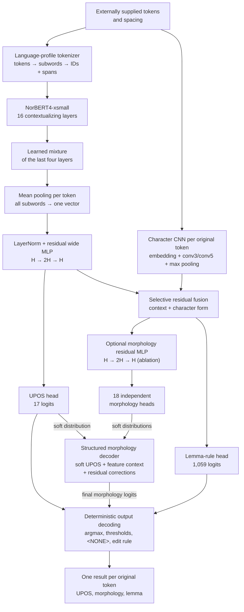
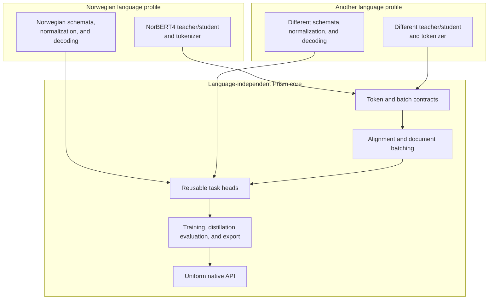
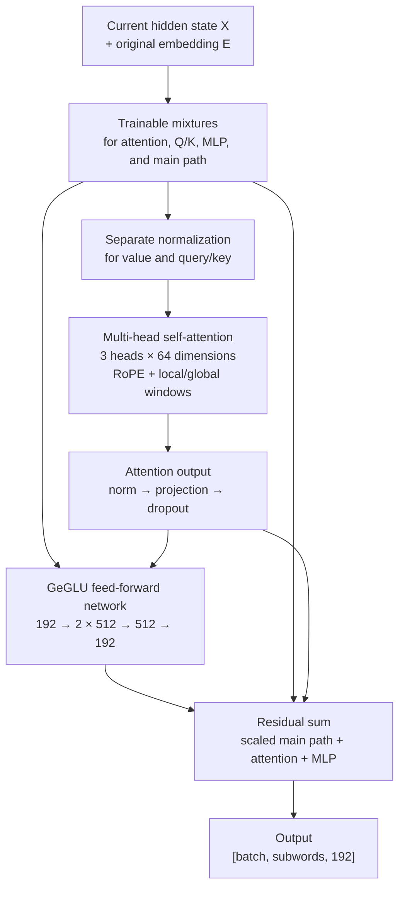
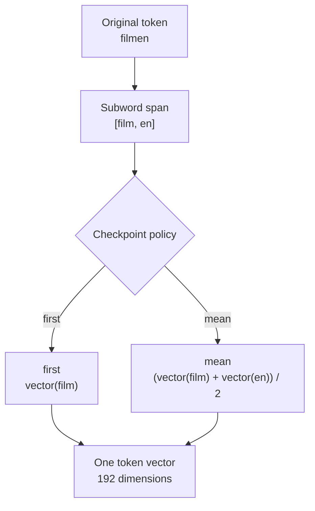
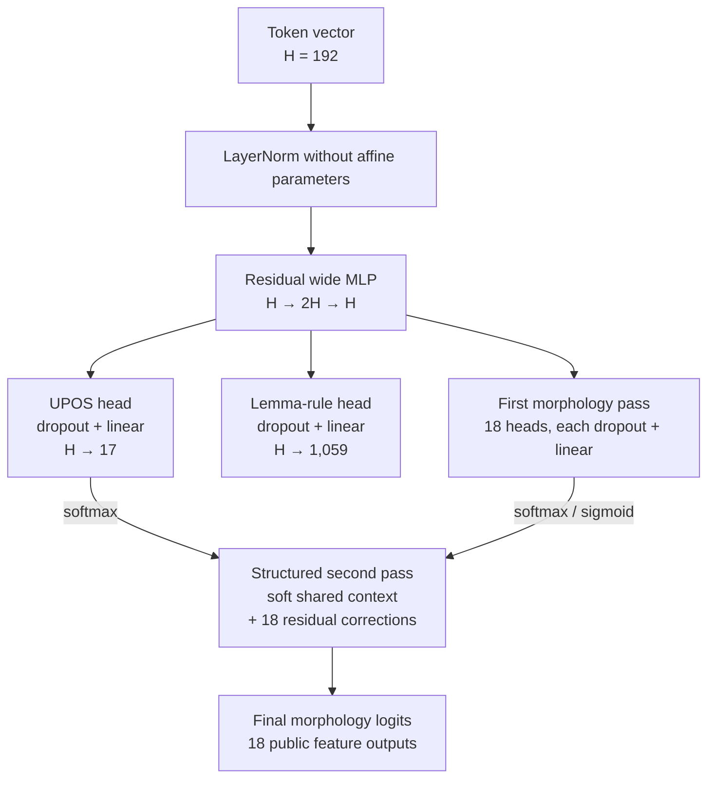
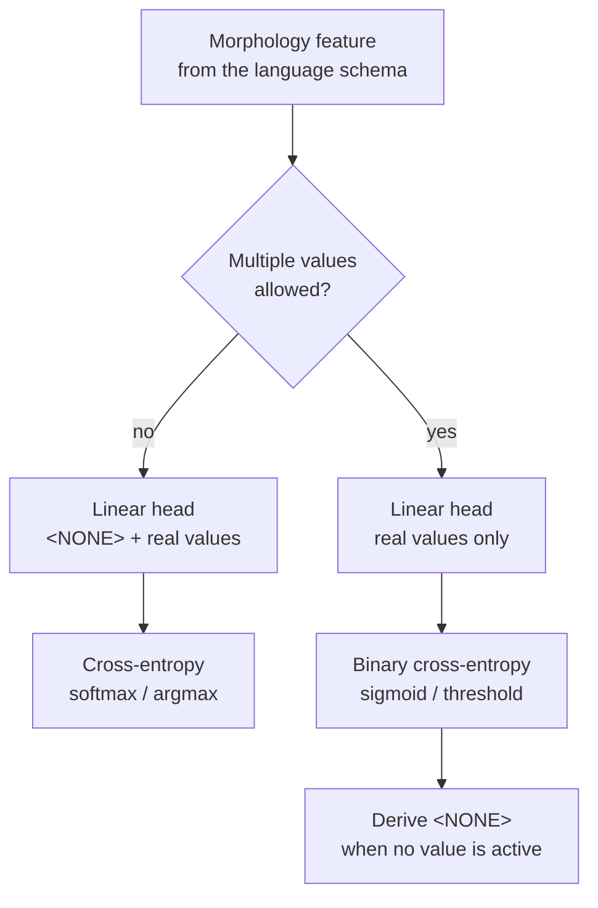
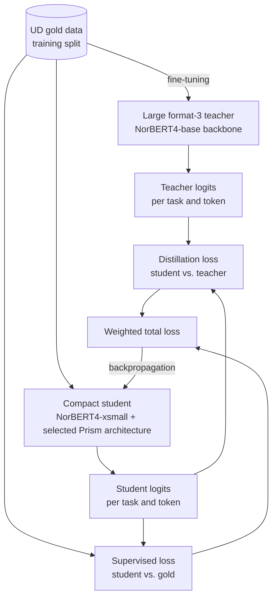
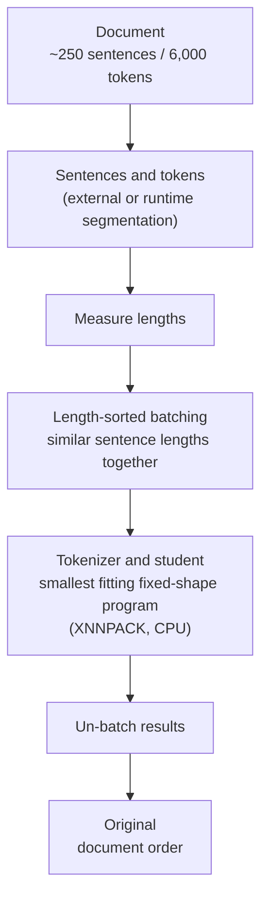

# Prism Architecture

This document explains the currently selected Prism model architecture in
detail. It is both a technical reference and a learning text: it describes
not only which modules the model consists of, but also how the data changes
on its way from an externally supplied token to the finished prediction.

The Transformer architecture described here is the implemented core path of
the first production generation. The trained gold-only student is the
reproducible reference for teacher distillation; historical recurrent
experiments are no longer part of the active architecture.

## The most important mental model

The selected student is not just "NorBERT4 plus linear heads". Between the
tokenizer and the output sit several trained processing steps, each selected
through controlled ablations:

```text
externally supplied tokens and spacing information
    -> language-specific subword tokenization
    -> NorBERT4-xsmall with 16 Transformer layers
    -> learned mixture of the last four layers
    -> mean pooling over all subwords of an original token
    -> non-affine LayerNorm
    -> shared residual wide MLP (H -> 2H -> H)
    -> character CNN over the complete original token form
    -> selective residual fusion for morphology and lemma
    -> first pass of the schema-driven task heads
    -> structured, soft refinement of the morphology logits
    -> deterministic decoding to UPOS, morphology, and lemma
```

As an analogy:

```text
backbone engine      = a pre-educated linguist
layer mixture        = choosing the most useful processing depths
mean pooling         = merging all word pieces into one word picture
wide MLP             = a shared task preparer
character CNN        = a compact reader for prefixes, endings, spelling patterns
task heads           = separate exam sheets with concrete questions
structured decoder   = plausibility cross-check of the grammar questions
output decoding      = translating the final numbers into public Prism values
```

The engine holds general Norwegian language knowledge. The UPOS head asks for
the part of speech, the 18 morphology heads ask for grammatical properties,
and the lemma head asks for the edit rule that produces the lemma from the
word form. A compact character-CNN branch additionally reads the complete
token form and enriches only morphology and lemma; UPOS stays on the pure
context path. The structured morphology decoder then looks at the soft
probabilities of all morphology questions together with UPOS and corrects
only the morphology logits. UPOS and lemma are not changed by this second
pass.

The term "decoder" therefore denotes two different levels in this document:

1. The **structured morphology decoder** is a trainable part of the neural
   network and refines logits.
2. **Output decoding** is deterministic post-processing: argmax, thresholds,
   `<NONE>` derivation, and application of a lemma edit rule.

Norwegian is the first concrete configuration. The generic Prism core fixes
neither NorBERT4 nor the Norwegian label counts.



### Selected Norwegian configuration

| Part | Currently selected decision |
| --- | --- |
| Input | Externally segmented sentences with stable tokens and `has_space_before` |
| Student backbone | `ltg/norbert4-xsmall`, pinned revision `7483327d...` |
| Backbone output | Learned scaled mixture of the last four hidden states |
| Subword aggregation | Mean pooling over each token's complete subword span |
| Shared projection | Non-affine LayerNorm and residual `H -> 2H -> H` MLP |
| Character path | Training-derived vocabulary, conv3/conv5, selective fusion for morphology/lemma |
| UPOS | One schema-driven categorical head, 17 classes for Norwegian |
| Morphology pre-projection | Selected shared post-fusion `H -> 2H -> H` residual MLP; `identity` remains the legacy fallback and explicit control |
| Morphology | 18 schema-driven heads with a hybrid categorical/multi-label contract |
| Morphology structure | Parallel second pass with soft UPOS and feature context |
| Lemma | Categorical head over 1,059 edit rules derived from training data |
| Training duration | Configurable maximum; early stopping after four fully unsuccessful epochs by default |
| Training | Batch size 16, Prism head dropout 0.1, morphology weight cap 10.0; optional direct bundle loss |
| Checkpoint | Format 3, 70,661,786 bytes, one shared model for Bokmål and Nynorsk |
| Deployment | Only the compact student ships; the teacher remains a training tool |

The selected architecture is called
`wide-shared-mlp-structured-morphology-character-cnn` in the code. Its
individual building blocks stay language-independent; hidden size, feature
count, and label spaces come from the backbone and the language schema.

### Mapping to the implementation

The architecture is not just a diagram; it maps to clearly separated modules:

| Responsibility | Implemented source |
| --- | --- |
| Complete forward path | [`TokenTagger`](../python/src/prism/modeling/taggers.py) |
| Backbone execution | [`contextualize_subwords`](../python/src/prism/modeling/encoders.py) |
| Last layer or learned layer mixture | [`BackboneLayerAggregation`](../python/src/prism/modeling/layer_aggregation.py) |
| First/mean pooling | [`align_subwords_to_tokens`](../python/src/prism/modeling/alignment.py) |
| LayerNorm, wide MLP, and task heads | [`TokenTaskHeads`](../python/src/prism/modeling/heads.py) |
| Optional post-fusion morphology pre-projection | [`MorphologyPreHeadArchitecture`](../python/src/prism/modeling/heads.py) |
| Structured second morphology pass | [`StructuredMorphologyDecoder`](../python/src/prism/modeling/structured_morphology.py) |
| Optional complete bundle reranker | [`MorphologyBundleReranker`](../python/src/prism/modeling/morphology_bundle_reranker.py) |
| Aligned feature system comparison | [`MorphologyFeatureComparisonAccumulator`](../python/src/prism/evaluation/morphology_feature_comparison.py) |
| Rare/OOV feature-error attribution | [`TokenTaskEvaluationAccumulator`](../python/src/prism/evaluation/metrics.py) and [`format_morphology_error_attribution_rows`](../python/src/prism/evaluation/reporting.py) |
| Supervised losses | [`compute_token_task_loss`](../python/src/prism/training/losses.py) |
| Distillation | [`compute_token_task_distillation_loss`](../python/src/prism/training/distillation.py) |
| Morphology output correction | [`apply_morphology_logit_correction`](../python/src/prism/modeling/decoding.py) |
| External UD annotation convention | [`NorwegianUdMorphologyDecoder`](../python/src/prism/data/norwegian.py) |
| Deterministic output decoding | [`decode_token_task_logits`](../python/src/prism/modeling/decoding.py) |
| Architecture metadata and fallbacks | [`checkpoints.py`](../python/src/prism/training/checkpoints.py) |
| Norwegian backbone/data choice | [`profile.py`](../python/src/prism/languages/norwegian/profile.py) |

This mapping is the document's maintenance rule: if one of these contracts
changes, the overall flow and the detail section must be updated together.

The Rare/OOV evaluation no longer discards the internal integer counters
after computing the feature accuracies. It serializes, per slice and feature,
the exact number of correct decisions and derives a descending error
attribution from them. The reported share refers to the sum of all wrong
feature decisions in the respective slice. This is deliberately not a
decomposition of the complete `UFeats` bundle errors: a token with a
simultaneously wrong `Gender` and `Number` counts twice here, but as exactly
one wrong bundle in the official `UFeats` measure.

### Switchable post-fusion morphology MLP

The probe winner is implemented as its own language- and schema-independent
contract. It does not extend the already combinatorial
`TokenTaskHeadArchitecture`; it is selected orthogonally through
`MorphologyPreHeadArchitecture`:

| Value | Behaviour |
| --- | --- |
| `identity` | No additional block; the exact previous forward path and the fallback for old checkpoints |
| `shared-mlp` | One shared residual `H -> 2H -> H` MLP after character fusion |

The complete candidate path is:

```text
shared token representation
    |-> UPOS
    |-> character fusion -> lemma
    `-> character fusion
          -> shared morphology residual MLP
          -> all schema-driven feature heads
          -> structured decoder
          -> bundle reranker
```

Mathematically, the block uses the same exportable wide projection as the
successful probe:

```text
x_morph = x_task + Linear(2H -> H)(
    Dropout(GELU(Linear(H -> 2H)(x_task)))
)
```

At `H = 192` it adds 148,032 parameters, roughly 0.57 MiB of raw fp32
weights. All feature heads share this one block; there is no Norwegian
special branch and no head just for `Gender`. New Norwegian training runs
enable `shared-mlp` by default; `--morphology-pre-head-architecture identity`
reproduces the previous control. The resolved value is stored in the
checkpoint and reconstructed automatically by evaluation and teacher
loading. Checkpoints without the field load as `identity`.

UPOS and lemma do not read the new block in the forward path. That their
metrics do not degrade is nevertheless not a mathematical guarantee: during
joint full training, the ordinary morphology loss flows through the residual
MLP onward into character fusion, the shared projection, and the backbone,
and can change their shared representation. The restricted direct bundle
loss with scope `morphology`, by contrast, trains the new block without
opening the protected backbone, UPOS, or lemma paths. Separate
Bokmål/Nynorsk, Rare/OOV, UPOS, and lemma gates therefore remain binding for
selection.

### Optional top-32 bundle reranker

The bundle reranker is implemented as a switchable component and is part of
the selected Norwegian student architecture. Its inventory is built
exclusively from the joint Bokmål/Nynorsk training splits. For every UPOS
class, at most the 32 most frequent complete morphology bundles are kept;
development or test labels never enter the candidate contract. Inventory,
frequencies, and the candidate limit are stored in the checkpoint. For the
current joint Norwegian training schema, 185 UPOS-bundle candidates remain
after the top-32 restriction. At hidden size 192, the original linear
reranker adds 35,723 trainable parameters — only about 143 KB of raw fp32
parameter values before export or quantization.

The forward path uses no gold UPOS. For all candidates jointly it computes a
score from:

- the model's soft UPOS distribution,
- the joint log-probability of all independent feature logits,
- and a small trainable projection of the morphology token vector onto the
  candidates.

The residual scorer has two explicit, checkpoint-stored architecture
variants:

| Value | Additional candidate score |
| --- | --- |
| `linear` | Direct projection `Linear(H -> candidates)`; the previous control path and the fallback for old checkpoints |
| `compositional-mlp` | Non-linear token query against candidate vectors composed from UPOS and feature label embeddings |

The compositional path is schema-driven but not hard-coded to Norwegian. For
every candidate it adds a learned UPOS embedding and the averaged embeddings
of its active labels per feature. A `LayerNorm` normalizes the composed
vector. In parallel, `LayerNorm -> Linear(H,H) -> GELU -> Linear(H,H)`
produces a query from the morphology token vector; a scaled dot product
yields the residual score for all candidates. The final query projection
starts with zero weights and zero bias, so at the beginning of training the
new path does not change any existing candidate score and can learn from the
established evidence base in a controlled way.

With 185 candidates and `H = 192`, this variant comprises 89,298 parameters
including gates — 53,575 more than the linear reranker, roughly 209 KiB of
raw fp32 weights. The CLI selects it with
`--morphology-bundle-scorer-architecture compositional-mlp`. The Bokmål
ablation rejects this variant as the complete output path: it improves the
internal candidate ranking but loses that gain again through the downstream
static fusion. `linear` therefore remains the selected default. The
compositional path temporarily remains available as a diagnostic input for
the planned adaptive fusion probe. Both paths pass strict `torch.export`.

The candidate distribution is marginalized back into probabilities per
morphology label. Learned gates mix this bundle evidence residually into the
existing feature logits. The inventory is therefore not a hard output list:
the independent decoder stays in the compute path and can still express new
combinations. In particular, this prevents a hard error-cascade contract
from predicted UPOS to morphology. `--disable-morphology-bundle-reranker`
switches the residual pass off completely during evaluation, enabling a
control run of the same checkpoint. The whole path has strict
`torch.export` parity.

#### Rejected adaptive bundle-fusion probe

The current reranker uses one learned gate value per feature that is
constant across tokens, and adds the marginalized bundle evidence residually
to the feature logits. The completed scorer audit shows that this contract
can squander a better candidate ranking: the compositional scorer reduces
Bokmål ranking errors from 930 to 871 but raises refinement errors from 221
to 277.

The controlled architecture probe did not immediately replace this static
logit addition in the full model. With the checkpoint completely frozen, it
trained only a small adaptive fusion that mixes feature and bundle
probability depending on token and feature:

```text
p_final = (1 - g) * p_feature + g * p_bundle
```

`g` is formed exclusively from model-internal signals available at
inference: the morphology token representation, a learned feature identity,
normalized entropy and margin of both paths, and their mean probability
deviation. Gold labels, development results, and UDPipe outputs are not gate
inputs. The probe trains only on the training split. The selected full logit
correction is applied to both paths before the fusion so the comparison has
the same output contract as the canonical evaluation.

The measurement implementation used no second approximated model path; it
accessed independent feature logits, marginalized bundle probabilities, and
the morphology token representation directly at the production boundary.
After the rejection, this temporary access, the probe module, its CLI, and
its tests were removed again. Only the result and the rejection reason
remain as selection history.

This fusion is **not part of the selected model**. The recorded probe is
explicitly diagnostic. The completed Bokmål/Nynorsk run rejects the variant:
compared with the static fusion it loses 0.9733/0.3488 points of exact
UFeats, 3.4920/0.6686 points on Rare, and 3.2063/1.4196 points on OOV. The
gates converge close to one for almost all features, treating the bundle
path as a near-exclusive expert. That does not generalize beyond the
training split and in particular loses 281/138 correct gender decisions on
Bokmål/Nynorsk. Checkpoint metadata and export are not extended; the static
fusion remains the normative inference contract.

#### Historical candidate-coverage audit

The temporarily extended, training-free bundle oracle separated three cases
for top-32, top-64, top-128, and the complete training inventory: the gold
bundle is included, it was seen in training but removed by top-K, or it was
never seen in the joint training split. Measured is the actual union of all
UPOS-specific candidate groups of the reranker. Gold-UPOS coverage remains
as an additional diagnostic; complete, annotated, Rare, and OOV are reported
separately.

The joint inventory contains 298 UPOS-bundle pairs and 256 distinct bundles.
Top-32 keeps 185 pairs and reaches 99.2934%/96.9664% coverage on
Bokmål/Nynorsk. Top-64 keeps 288 pairs and already reaches the same coverage
as the full inventory at 99.9973%/99.5200%. The remaining one and 150 tokens
respectively carry never-seen bundles. The controlled top-64 ablation has
since been completed and rejected: despite runtime coverage of 99.7767%
instead of 98.2180%, it loses 0.0413 points of UFeats on Bokmål plus
0.2857/0.1069 points on Rare/OOV. On Nynorsk it gains 0.0832 points of
UFeats and 0.1972 points on OOV but loses 0.0192 points of UPOS. Only eleven
additional complete UFeats bundles across both standards justify neither the
Bokmål regression nor the larger candidate space. Top-32 therefore remains
the normative architecture contract; open candidate generation remains
unjustified for now. The temporary top-64 CLI and the extended coverage
output were removed after the result was documented. The production contract
offers only `0` and `32`.

A switchable evaluation audit measures whether more candidates, a better
scorer, or downstream refinement is needed. It assigns every finally wrong
gold bundle to exactly one cause:

- **Coverage:** the gold bundle is missing from the top-32 inventory.
- **Ranking:** the gold bundle is present but not placed at rank 1.
- **Refinement:** the candidate scorer puts gold at rank 1, yet the
  residually marginalized feature output is still wrong.

The audit additionally reports gold ranks and margins, lemma-rule ranks by
training frequency, Rare/OOV and UPOS, and pairwise gradient cosines on the
backbone, the shared projection, and the character path. It performs no
optimizer step and changes neither the model nor thresholds nor the output
policy. For the selected shared-MLP checkpoint, ranking errors dominate: 930
of 1,223 Bokmål and 880 of 1,851 Nynorsk bundle errors. That motivated the
compositional scorer ablation. The measured gradient conflicts, by contrast,
do not yet justify a general gradient correction.

The reranker can now additionally be trained directly on complete gold
bundles. `--morphology-bundle-loss-weight` adds the negative log-probability
of the entire gold bundle to the existing schema-driven feature losses. If
the same bundle occurs in several UPOS candidate groups, its probability is
marginalized over all matching candidates; the auxiliary loss therefore does
not needlessly couple UFeats to a correct gold UPOS. Gold bundles outside
the training inventory are masked for this term. Training and development
report loss and candidate coverage separately. Weight `0` preserves the
previous bundle-32 control run exactly as a reproducible ablation.

The independent feature heads deliberately remain Prism's primary morphology
contract. The bundle path is an additional coherence layer, not a switch to
a closed whole-tag classification. Prism thereby keeps its own confidences
and error reports per feature, can express genuinely multi-valued features,
and retains a fallback for complete bundles that never occurred in the
training inventory. An external UDPipe comparison measures whether the
overall output is competitive; it does not determine the internal
architecture.

`UFeats` and the feature reports therefore stay binding at the same time.
`UFeats` scores a hit only if a token's entire universal morphology bundle is
exactly right. The feature reports, by contrast, measure per-feature overall
accuracy, annotated-token accuracy, and per-value quality. A better UFeats
result of a comparison system does not automatically mean it predicts every
single feature better. Architecture decisions must consider both levels plus
Rare/OOV, UPOS, and lemma across Bokmål and Nynorsk.

The first joint run with the direct loss improved UFeats and Rare/OOV
morphology clearly on both written standards but degraded lemma, especially
for Bokmål OOV. The direct bundle loss therefore has an explicit three-level
gradient contract:

| Scope | Additional bundle gradient reaches |
| --- | --- |
| `full` | UPOS evidence, morphology path, shared representation, and backbone |
| `morphology` | Morphology adapter, independent morphology heads, structured decoder, and bundle residual scorer |
| `residual-only` | Only the parameters of the chosen linear or compositional residual scorer |

`--morphology-bundle-loss-gradient-scope morphology` computes a second
morphology path for the auxiliary term starting from a detached shared token
representation. UPOS logits are read only as constant evidence. A
value-faithful surrogate connection ensures the auxiliary term sees exactly
the same candidate scores as the normal forward pass even though autograd
reaches only morphology parameters. Backbone, shared projection, character
fusion, UPOS head, and the lemma branch remain protected for this term. The
ordinary supervised morphology loss and distillation continue to train these
components unchanged.

`residual-only` corresponds to the previously selected isolated contract.
The scope is chosen explicitly with
`--morphology-bundle-loss-gradient-scope residual-only` and stored as a
string in the training configuration of new checkpoints. None of the three
modes changes forward values, inference, parameter count, or export; they
differ exclusively in the gradient of the additional bundle loss. The
completed two-standard ablation now selects `morphology` as the compact
reference state. Compared with `residual-only` it improves five of six
whole-split tasks, gains 73 complete UFeats bundles and in particular 37 OOV
bundles across both written standards, at the cost of 15 Rare bundles and
small OOV UPOS/lemma counts. This trade-off stays visible in the evaluation
contract. `residual-only` remains the protected-gradient control run,
`full` the morphology upper bound. The Norwegian training CLI resolves an
unspecified scope to `morphology` when the bundle loss is positive; at
weight zero the technical resolution stays `full` because no additional
gradient exists then. Explicit scope choices still override the default for
ablations.

Checkpoint selection stays with the lowest combined development loss for
now. By default, early stopping ends a run only after four complete epochs
without a new best loss. Patience 2 is deliberately not the default because
earlier student runs produced a better candidate again after two
intermediate epochs. `--early-stopping-patience 0` disables the abort.

Prism's canonical morphology and an external treebank annotation are two
different contracts. The canonical output stays standard-independent for
mixed Norwegian. An explicitly selected UD decoder may translate this output
into the documented Bokmål or Nynorsk convention immediately before an
external UFeats evaluation. It changes neither model logits nor the
canonical per-label and Rare/OOV metrics. Prism can thereby reproduce an
annotation convention without producing two student weights or presenting a
treebank idiosyncrasy as general Norwegian language truth.

An external policy consists of named, deterministic steps. The UD evaluation
logs sequentially, for every step, how many complete feature bundles it
changes, improves from wrong to right, or degrades from right to wrong. It
thus stays visible whether a large UFeats gain comes from a legitimate
convention translation or from an overly broad, harmful rule.

The selected Nynorsk UD contract consists of three such steps: normalizing
common gender, removing the singular value not expressed there, and removing
the definite definiteness value not expressed there. With the selected
bundle-32 student they sequentially improve 618, 138, and 42 complete
bundles on development without degrading a single previously correct
bundle. This policy belongs to the explicit external Nynorsk UD output, not
to the canonical Prism output for mixed Norwegian.

For targeted error analysis, the evaluation loop can serve typed prediction
observers. The first observer is a generic morphology error audit: for a
selected feature it records every misclassified token with gold/predicted
value, gold/predicted UPOS, training frequency, Rare/OOV class, and the left
and right gold-UPOS context. An optionally aligned CoNLL-U prediction of a
comparison system yields separate counters for whether that system solves
only the inspected feature or the complete morphology bundle correctly. The
diagnosis thus remains part of the existing inference and cannot diverge
through a duplicated model pipeline.

A second observer compares all shared features during the same forward pass
against a token-identical external CoNLL-U prediction. For Prism and the
comparison system it records overall and annotated-token accuracy, counts
and precision/recall/F1 per value, feature contributions to wrong complete
bundles, and Rare/OOV slices. The selected canonical or external UD output
policy is applied to Prism only, before the comparison, and serialized
together with the report — a Nynorsk convention translation can therefore
not silently masquerade as better canonical modeling. This comparison is
opt-in; without `--morphology-feature-comparison` no external prediction is
read and no comparison system is started.

The official gold-tokenized UD metrics have the same slice contract. The
main accumulator can spawn empty, reference-identical sub-accumulators; a
boolean evaluation mask limits their counters without changing sentence
context or model inference. Rare and OOV thereby get their own `UPOS`,
complete `UFeats`, and `Lemmas` scores with the same lemma and morphology
output policy as the whole split. These values are printed human-readably
and fully serialized in the analysis JSON.
## Language-independent core and replaceable language profiles

Prism is meant to serve many languages under the same API in the long run.
NorBERT4 must therefore not become the hard-wired engine of the whole
library. NorBERT4 is merely the first Norwegian backbone configuration.

The architecture separates two levels:

### Language-independent Prism core

The core knows no concrete language and no concrete pretrained model. It
provides reusable mechanisms:

- typed token, batch, prediction, and artifact contracts;
- subword-to-token alignment and document batching;
- the UPOS, morphology, and lemma head families plus shared mechanisms for
  confidence calibration;
- loss functions, distillation, and the calibration contract;
- evaluation, export, and the native runtime integration;
- uniform API semantics for Python, Swift, Java/Kotlin, and C++.

### Language profile

A language profile configures every decision that must be exchangeable
between languages:

- language and locale identity;
- teacher and student backbones;
- tokenizer, whitespace handling, and normalization;
- dataset adapters and supported annotation schemata;
- UPOS, morphology, and lemma-rule inventories;
- language-specific decoding, provenance, licenses, and benchmark identity.

The kinds of task heads stay the same; their concrete sizes are part of the
language schema. The morphology code, for instance, can build one classifier
per feature for any language without hard-coding the 18 Norwegian features.
Likewise, a shared lemma head must not be coupled to the current 1,059
Norwegian edit rules.



The direction of dependency is decisive: a language profile uses the Prism
core. The Prism core never imports a concrete language profile. A different
model can therefore be selected later without duplicating batching, heads,
training, export, or the native libraries.

## What is the engine?

The engine is a pretrained Transformer encoder. It does not yet produce UPOS
tags, morphology values, or lemmata. Its job is to turn every subword into a
numeric vector that carries as much information as possible about the
meaning and grammatical function of that subword in the concrete sentence.

The big added value is context. Consider the Norwegian word `så`:

```text
Jeg så filmen.      -> VERB, Tense=Past, Lemma=se
Det var så fint.    -> ADV, Lemma=så
```

A pure dictionary lookup sees the same character sequence twice. The
Transformer, by contrast, produces two different representations because
`så` interacts with different neighbouring tokens and sentence structures in
the two sentences.

The engine thus compresses a statement like:

```text
"This is my context-dependent description of what
this token probably means in this sentence."
```

The task heads then learn to read specific information out of that
description.

## Why is the engine not trained from scratch?

The pinned UD training split contains roughly 244,000 tokens. That is a good
size for learning concrete tasks such as UPOS, morphology, and lemmata — but
far too little to build general Norwegian language understanding completely
from scratch.

A pretrained Norwegian encoder has already learned patterns on very large
text collections, for example:

- which words frequently appear as subject or object;
- which inflection endings are typical for plural, definiteness, or verb
  forms;
- which words occur after prepositions or auxiliary verbs;
- how Norwegian compounds and word constituents are built;
- which word forms are semantically or grammatically related;
- how sentence order and local dependencies work.

Prism therefore constructs the complete task model itself but uses a
pretrained encoder as the linguistic engine. It is not an unmodified foreign
model: token alignment, layer mixing, pooling, multi-task heads, loss
functions, distillation, and decoding are Prism's own. Calibration,
quantization, and the production runtime contract are downstream release
steps that have since shipped (see the export section).

## Teacher and student roles

The teacher–student architecture uses two models for different goals:

- The teacher is large and optimized for quality. It is used only during
  training and experiments.
- The student is compact and optimized for local inference, exportability,
  and document throughput. Only the student ships.

The current role assignment:

- `ltg/norbert4-xsmall` is the selected backbone of the compact student;
- `ltg/norbert4-base` is the accepted format-3 teacher backbone; its
  character-aware checkpoint uses the same schema and task architecture as
  the student and beats it on both written standards including Rare/OOV;
- the earlier base teacher belongs to the historical format-2 contract and
  remains an incompatible comparison value;
- `ltg/norbert4-large` remains a later teacher comparison in case base does
  not improve the final student enough.

NorBERT4-xsmall is only the pretrained student backbone of the Norwegian
language profile, not the finished Prism model. Prism adds layer mixing,
token pooling, the shared wide MLP, task heads, the structured morphology
decoder, and deterministic output decoding.

The current xsmall configuration includes:

- hidden size: 192;
- 16 Transformer layers;
- 3 attention heads;
- intermediate size: 512;
- vocabulary size: 51,200.

NorBERT4 uses custom model code and modern attention mechanisms. The early
export spike succeeded — the complete independent
layer-mix/mean-pooling/wide-MLP control tagger was lowered to ExecuTorch and
executed — and the full selected architecture has since shipped as versioned
production artifacts with recorded backend parity (see the export section).

## Step 1: external tokens

Host applications often own tokenization and source-text offsets already.
Prism must accept those tokens without re-segmenting them at the word level.

Example:

```text
["Jeg", "så", "filmen", "."]
```

The order and number of these original tokens form the public contract:
Prism must later return exactly one result per original token.

## Step 2: subword tokenization

Transformers usually do not work directly with complete words. Their
vocabulary contains frequent words and word pieces — subwords.

An illustrative segmentation could look like this:

```text
original tokens:
["Jeg", "så", "filmen", "."]

subwords:
["<s>", "Jeg", "så", "film", "en", ".", "</s>"]
```

The actual segmentation depends on the concrete tokenizer. `filmen` may
exist as a single vocabulary item or split into several pieces.

Prism stores the mapping between subwords and original tokens:

| Subword | Original token |
| --- | ---: |
| `<s>` | none |
| `Jeg` | 0 |
| `så` | 1 |
| `film` | 2 |
| `en` | 2 |
| `.` | 3 |
| `</s>` | none |

This mapping is necessary because the Transformer produces subword vectors
while the public API must return token results.

## Step 3: IDs and batch tensors

The tokenizer replaces every subword with a vocabulary ID:

```text
["<s>", "Jeg", "så", "film", "en", ".", "</s>"]

-> illustratively:

[1, 1842, 731, 9204, 318, 27, 2]
```

From this point on, the neural network no longer works with strings but with
tensors.

For a single sentence with seven subwords:

```text
input_ids.shape = [1, 7]
```

For a batch of eight sentences with at most 30 subwords:

```text
input_ids.shape = [8, 30]
attention_mask.shape = [8, 30]
```

Shorter sentences are padded. The attention mask marks real subwords with
`1` and padding with `0` so the engine does not treat padding as linguistic
content.

The implemented typed batch contract contains:

- `input_ids`;
- `attention_mask`;
- start and exclusive end indices of every original token's subword span;
- a token mask for real tokens versus padding;
- UPOS targets;
- morphology targets;
- lemma-rule targets;
- masks for missing or unrepresentable annotations.

## Step 4: embeddings

An ID like `731` is just a number. The engine therefore owns a large
embedding table; every vocabulary ID selects one vector from it.

At hidden size 192:

```text
vocabulary ID
    -> embedding table
    -> vector of 192 floating-point numbers
```

Illustratively:

```text
[0.17, -0.42, 0.08, ..., 0.31]
```

For a batch this yields:

```text
embeddings.shape = [batch_size, subword_count, 192]
```

NorBERT4 normalizes every selected word vector with a LayerNorm without
affine parameters, multiplies its 192 dimensions with a learnable scale
vector, and applies embedding dropout of 0.1 during training. These initial
vectors already contain pretrained lexical information; their concrete
sentence function, however, only emerges through the Transformer layers.

## Step 5: the Transformer block

The selected xsmall backbone processes the representations in 16 consecutive
Transformer blocks. NorBERT4 does not use an entirely classical "attention,
then MLP" block: every block forms several trainably weighted mixtures of
the current hidden state and the original token embedding. These mixtures
serve separately as the attention input, the query/key input, the MLP input,
and the residual main path.

The actual block can be read in a simplified but structurally accurate way:

1. separate non-affine normalization of the value and query/key inputs;
2. self-attention with three heads, RoPE, and local or global attention;
3. normalized and projected attention output;
4. a GeGLU feed-forward network on a residually extended MLP input;
5. the sum of the scaled main path, the attention output, and the MLP
   output.



The mixture coefficients are learnable parameters of the NorBERT4 backbone.
The attention can additionally mix the value vectors of the first layer into
later layers as a residual reference. These are internal NorBERT4 decisions;
Prism does not assume them in its generic backbone contract.

### Self-attention

Self-attention allows every position to take in information from other
positions in the sentence.

Conceptually, attention computes three learned transformations per position.
In the concrete NorBERT4 code, query and key come from a separately
normalized, trainable hidden-state/embedding mixture; value likewise has its
own normalized input:

```text
Q = X * Wq
K = X * Wk
V = X * Wv
```

- Query: what information is this position looking for?
- Key: what information does this position offer?
- Value: what information is transferred when attended to?

The query of one position is compared with the keys of other positions.
Simplified:

```text
score(i, j) = Query(i) · Key(j) / sqrt(head_dimension)
```

A softmax turns these into normalized attention weights. For the token `så`
in `Jeg så filmen`, an illustrative distribution might be:

```text
Jeg              0.12
så               0.18
film             0.31
en               0.21
.                0.08
special tokens   0.10
```

The actual values are learned. What matters is that the vector of `så` can
absorb information from `Jeg` and `filmen`. In the sentence `Det var så
fint`, different weights arise — and with them a different representation.

### Internal attention heads

NorBERT4-xsmall has three internal attention heads. At hidden size 192,
every head works with 64 dimensions:

```text
192 / 3 = 64
```

The three heads look at the same sequence in parallel but can learn
different relation patterns: one may respond more to local word pieces,
another to sentence structure, a third to longer-range relations. These
roles are not programmed; they emerge during pretraining and fine-tuning.

The head outputs are merged again:

```text
3 × 64 -> 192 dimensions
```

These attention heads are internal parts of the engine. They are not the
same thing as the later UPOS, morphology, and lemma task heads.

### Positional information and attention windows

Without positions, `Hund beißt Mann` and `Mann beißt Hund` would be hard for
a Transformer to distinguish. NorBERT4 uses RoPE — rotary position
embeddings. Positions influence the query and key representations of the
attention.

The engine can thereby take into account:

- which token comes before or after;
- how far apart two positions are;
- what the sentence order is.

NorBERT4-xsmall additionally combines local and global attention. Three of
every four layers use a window of 256 positions; every fourth layer uses a
window of 8,192 positions. The local layers use RoPE base 10,000, the global
layers 160,000. Most layers thus stay efficient while far-reaching sentence
context flows in regularly. Prism's production limits must still not be
derived simply from the theoretical backbone limit of 16,384 positions:
memory, export backend, and batching have to be measured separately.

### Feed-forward network

After the attention, a feed-forward network processes every position
separately. NorBERT4 projects from 192 to two 512-dimensional halves. GeGLU
uses one half as content and the other as a non-linear gate; normalization
and the back-projection follow:

```text
192 -> 1,024 -> two halves of 512 each
    -> GeGLU yields 512
    -> normalization -> 192
```

The attention gathers context from the sequence. The feed-forward network
combines and transforms the gathered information non-linearly per position.

### Residual connections

A Transformer block does not completely replace the old state. The general
residual principle reads:

```text
new state = old state + learned change
```

Residual connections help deep models preserve information and remain
stably trainable. In NorBERT4 this addition is extended: the main path can
be scaled and mixed with the original embedding; attention and MLP outputs
are then added.

### Multiple layers

The representations pass through the block repeatedly. As a useful but not
strictly fixed mental model:

```text
early layers:
subwords, character patterns, and local relations

middle layers:
word forms, inflection, and sentence structure

late layers:
grammatical roles, meaning, and complex context
```

After the last layer, the shape is preserved:

```text
encoder_output.shape = [batch_size, subword_count, 192]
```

The content of the vectors is now contextualized.

### Learnable mixture of the backbone layers

The earlier control path uses only the last backbone layer. The selected,
checkpoint-compatible strategy is `learned-last-four`:

```text
weights = Softmax(four trainable logits)
mixed   = scale * Sum(weights[i] * Layer[-4 + i])
```

The weights start uniform and the scale factor at `1.0`; the strategy thus
adds only five parameters. The mixing happens before the subword-to-token
pooling, so every subword first receives information from several
contextualization depths. The generic contract only requires a sequence of
equally shaped hidden states and contains no NorBERT branch.

`BackboneLayerAggregationStrategy` distinguishes `last` and
`learned-last-four`. Training selects the strategy via
`--backbone-layer-aggregation`; checkpoints store it, and evaluation and
distillation restore it. Existing checkpoints without the field remain
unambiguously `last`. The measured checkpoint weights the layers `-4`
through `-1` at roughly `21.05%`, `16.31%`, `23.38%`, and `39.25%` — the
three earlier layers together contribute the larger share.

A strict `torch.export` run and the lowering of the then-complete
**independent head control tagger** to an executable XNNPACK ExecuTorch
`.pte` succeeded early. The measured graph covered the backbone, layer
mixing, mean pooling, the wide MLP, and all 20 logit outputs; the maximum
deviation from the PyTorch output was about `1.91e-5` and the largest mean
deviation of any output about `7.95e-6`. The full selected architecture has
since been exported, lowered, and benchmarked as versioned artifacts — see
the export section.

## Step 6: subwords back to original tokens

If `filmen` was split into `film` and `en`, two vectors exist. Prism needs
one token vector.

### First subword vector

```text
token_vector("filmen") = vector("film")
```

Advantages:

- low overhead;
- an efficient gather operator;
- simple export;
- an established method;
- through self-attention, the first vector can still see the ending.

### Mean of the subwords

```text
token_vector("filmen")
    = mean(vector("film"), vector("en"))
```

This can incorporate endings more directly but needs additional
aggregation.

Prism implements both variants as a typed `TokenPoolingStrategy`. The
tokenizer stores, for every original token, the start index and the
exclusive end index of its contiguous subword range. First pooling gathers
the start vector. Mean pooling uses prefix sums to average the whole range
without a Python loop per token.



The strategy is stored in the checkpoint and restored automatically during
evaluation. Format-3 checkpoints without this newer field are interpreted
unambiguously as `first` for compatibility. The controlled ablation selected
mean pooling as the new default for Norwegian student training: it lowers
the development loss and improves lemma accuracy and morphology micro-F1 on
Bokmål and Nynorsk. First pooling remains available as an explicit
comparison and compatibility strategy.

Afterwards we have:

```text
token_vectors.shape = [batch_size, original_token_count, 192]
```

Every original token now owns exactly one contextualized vector.

### Selected character-aware auxiliary path

The selected student augments the contextualized token vector with a small
representation of the **complete original word form**. It replaces neither
NorBERT4 nor its subword tokenizer. Sentence context remains the main path;
the character branch contributes targeted extra information for rare and
unseen spellings.

The character vocabulary is built exclusively from the respective training
corpus, uses Unicode NFC, and preserves case. Five fixed IDs precede the
literally stored Unicode codepoints:

```text
0  padding
1  unknown character
2  word start
3  word end
4  truncated word middle
5+ characters from the training corpus
```

A token has at most 32 character positions including the boundaries. For
longer forms, prefix and suffix are preserved and the removed middle is
marked by the explicit truncation symbol. For morphology and lemma this is
better than plain right truncation, because both word beginnings and
inflection endings can matter.

The export-friendly encoder works fully in parallel:

```text
character IDs
    -> embedding with 32 dimensions
    -> parallel Conv1d windows of width 3 and 5
    -> 96 channels each + GELU
    -> masked maximum over the character positions
    -> character vector with 192 dimensions
```

The character vector is not distributed to all heads. After the existing
wide MLP it is normalized, concatenated with the 192-dimensional context
vector, and residually projected back to 192 dimensions:

```text
x_char_task = x_shared
    + Dropout(GELU(Linear([x_shared ; LayerNorm(x_char)])))
```

Only morphology and lemma read `x_char_task`. UPOS keeps reading `x_shared`
directly, so differing character vectors cannot change its logits. The
structured morphology decoder then combines the character-aware first
morphology pass with the unchanged soft UPOS context.

For the joint Bokmål/Nynorsk training, the derived vocabulary contains 120
literal characters — 125 IDs including the five special values. Encoder and
fusion add 102,688 parameters in total at `H = 192`, or 410,752 raw fp32
bytes. Checkpoints store the vocabulary and maximum length; older
checkpoints without the character branch remain loadable unchanged. A
dedicated flat export adapter additionally accepts character IDs and a
character mask. Strict `torch.export` parity is tested.

The controlled evaluation selects this path. Against the unchanged
structured control, Rare lemma end-to-end rises by 2.6667/2.4238 percentage
points and Rare morphology micro-F1 by 1.7586/1.5048 points on
Bokmål/Nynorsk. OOV lemma, OOV morphology, and OOV UPOS also improve on both
standards. The small overall UPOS declines of 0.0302/0.0576 points remain
documented as the measured trade-off.
## Step 7: task heads

A task head is a small specialized output layer. The engine delivers general
language information; the head answers one concrete question. In the
selected student, however, the 192-dimensional token vectors do not reach
these linear outputs directly. First, a shared residual wide MLP processes
every token:

```text
x_norm = LayerNorm(x)                         # without learnable affine weight
x_wide = GELU(Linear(H -> 2H)(x_norm))
x_shared = x_norm + Linear(2H -> H)(Dropout(x_wide))
```

For NorBERT4-xsmall, `H = 192`, so `192 -> 384 -> 192`. Only `x_shared`
enters the individual task heads. During training each head still applies
its own dropout, then projects linearly into its schema-dependent label
space:

```text
task_logits = Linear(H -> label_count)(Dropout(x_shared))
```

The raw values are called logits. They are interpreted through softmax or
sigmoid for the loss, the structural refinement, evaluation, or output. The
shared MLP does not replace the heads: it prepares a richer shared
representation; the linear heads still read the concrete tasks out of it.



The selected wide MLP contains 148,032 parameters at `H = 192`. The
structured second morphology pass adds 23,476. Both blocks are small next to
the 16.9-million-parameter backbone, but they are trained, permanent parts
of the selected Prism student.

### UPOS head

The UPOS head receives 192 values and produces 17 logits:

```text
Linear(192 -> 17)
upos_logits.shape = [batch, tokens, 17]
```

Illustratively:

```text
ADJ     -2.1
ADV      0.7
NOUN    -3.0
VERB     4.8
...
```

Softmax:

```text
VERB  0.94
ADV   0.04
ADJ   0.01
rest  0.01
```

The head has roughly:

```text
192 * 17 + 17 = 3,281 parameters
```

### Lemma-rule head

The current joint Norwegian training schema contains 1,059 normalized lemma
rules:

```text
Linear(192 -> 1,059)
lemma_logits.shape = [batch, tokens, 1,059]
```

The head does not generate characters directly. It scores rules that remove
or add prefix and suffix pieces; the decoder applies the chosen rule to the
original token.

The linear layer has roughly:

```text
192 * 1,059 + 1,059 = 204,387 parameters
```

A gold rule that does not occur in the training schema is marked as
`unrepresentable`. The development splits currently contain 28 such Bokmål
and 26 such Nynorsk tokens. They must not be confused with genuinely missing
lemma annotations.

### Morphology heads: a hybrid contract

Prism uses a separate head per feature:

```text
Abbr, Animacy, Case, Definite, Degree, Foreign,
Gender, Mood, NumType, Number, Person, Polarity,
Poss, PronType, Reflex, Tense, VerbForm, Voice
```

Not every morphological feature asks the same kind of question. Since
checkpoint format 3, Prism therefore uses two classification contracts. The
language schema decides per feature which contract applies; the generic
heads contain no hard-coded Norwegian special cases.

#### Exclusive features: softmax and cross-entropy

For an exclusive feature, exactly one answer is right. Here `<NONE>` is a
real class next to the annotated values. Example `Tense`:

```text
<NONE>
Past
Pres
```

The linear head produces one logit per complete label:

```text
Linear(192 -> 3)
    -> softmax
    -> exactly one prediction via argmax
```

For a token without tense:

```text
<NONE>  0.99
Past    0.005
Pres    0.005
```

This head is trained with categorical cross-entropy. Optional class weights
act on the respective gold class. `<NONE>`, `Past`, and `Pres` thus compete
directly instead of being treated as independent yes/no questions.

#### Multi-valued features: sigmoid and binary cross-entropy

For a genuinely multi-valued feature, several real values can hold at once —
example `Case` with `Acc,Dat`. The head therefore produces independent
logits only for the real values:

```text
Linear(192 -> number of real values)
    -> sigmoid per value
    -> all values above the threshold
```

`<NONE>` has no trainable logit of its own here. It is derived exactly when
no real value is active. Its probability for evaluation and calibration
follows from:

```text
P(<NONE>) = Product(1 - P(real value))
```

Training uses binary cross-entropy per real value. Positive class weights
are likewise applied only to real positive targets. The very frequent
absence of a feature therefore cannot dominate through an artificial
`<NONE>` output.

The current joint Norwegian schema derives from the pinned training data:

- 12 exclusive features: `Abbr`, `Animacy`, `Degree`, `Foreign`, `Mood`,
  `NumType`, `Person`, `Polarity`, `Poss`, `Reflex`, `Tense`, `Voice`;
- 6 multi-valued features: `Case`, `Definite`, `Gender`, `Number`,
  `PronType`, `VerbForm`.

Stored targets and the public output keep the full label space including
`<NONE>` for both variants; only the internal logit contract differs. The
decoder validates, among other things:

- at least one active label;
- `<NONE>` never together with real values;
- no multiple values for single-valued features;
- the correct label count per feature.



### Architecture variants and selection history

After the interim cleanup, `TokenTaskHeadArchitecture` retains only the
production architecture and the small format-3 control path:

| Value | Meaning | Status |
| --- | --- | --- |
| `linear` | LayerNorm, then direct linear task heads | old format-3 control path |
| `wide-shared-mlp-structured-morphology-character-cnn` | the structured predecessor plus a character CNN for morphology and lemma | current default |

The earlier `shared-mlp`, `wide-shared-mlp`, task-adapter, and intermediate
structured variants remain documented in the selection history and in
`docs/benchmarks.md`, but after their completed ablations they are no longer
executable production paths in the enum.

The residual connection preserves the direct normalized information path in
both cases. A single shared MLP also avoids one large separate block per
task. `H` always comes from the backbone contract; with a later backbone of
a different hidden size, the projection scales without Norwegian special
handling.

The training CLI selects the variant with `--task-head-architecture`.
Checkpoints store it; evaluation and teacher loading reconstruct it.
Format-3 checkpoints without this field are interpreted unambiguously as
`linear` for compatibility — never silently loaded as a newer architecture.

The post-fusion morphology pre-projection is deliberately separate from
this, so the same `identity`/`shared-mlp` ablation can be compared against
an existing task-head architecture without introducing a new enum value per
combination. Its checkpoint metadata is called
`morphology_pre_head_architecture`.

### Task-family adapters as a controlled candidate

The removed architecture variant `wide-shared-mlp-task-adapters` kept the
selected wide shared MLP unchanged and only afterwards branched into three
small residual adapters. This section only documents the selection history;
the executable model and CLI path was deleted after the negative ablation:

```text
NorBERT4 + learned mixture of the last four layers
    -> mean pooling per token
    -> LayerNorm
    -> shared wide MLP (H -> 2H -> H)
       |-> UPOS adapter       (H -> H/2 -> H) -> UPOS head
       |-> morphology adapter (H -> H/2 -> H) -> all morphology heads
       `-> lemma adapter      (H -> H/2 -> H) -> lemma-rule head
```

An adapter computes
`x + Linear(H/2 -> H)(Dropout(GELU(Linear(H -> H/2)(x))))`. Its final
projection starts with zero weights, so at the beginning of training the new
path is exactly the identity and cannot damage the proven shared
representation through a random transformation. Each task family then learns
its own small specialization.

For NorBERT4-xsmall every adapter uses `192 -> 96 -> 192` and contains
37,152 parameters; all three together add 111,456 parameters, roughly 446 KB
in fp32. The 18 morphology features deliberately share one morphology
adapter — individual adapters per feature would needlessly increase size and
overfitting risk. Output label spaces, losses, decoders, and public
prediction contracts do not change.

The variant uses only Linear, GELU, Dropout, and addition and thus remains
representable in the existing `torch.export`/ExecuTorch path. It was
implemented and exportable but rejected after the direct Bokmål/Nynorsk
comparison: it improves Nynorsk loss, morphology micro-F1, and average
precision, but degrades UPOS, lemma, and macro-F1 there; on Bokmål, loss,
UPOS, lemma, precision, micro-F1, and macro-F1 all degrade against the
selected model. The more robust control path therefore remains
`wide-shared-mlp` without task adapters; the variant survives only as a
reproducible ablation. The subsequently selected structured decoder builds
on exactly this control path.

### Selected structured morphology decoder

The variant `wide-shared-mlp-structured-morphology` builds on the selected
model without task adapters. It keeps the existing independent morphology
heads as a first pass and refines their logits in a second, parallel pass:

```text
shared token vector
    |-> UPOS head ------------------------> soft UPOS distribution
    `-> independent morphology heads -----> soft feature distributions
                                                |
              concatenate all distributions ---+
                       -> LayerNorm
                       -> Linear(context -> H)
                       -> GELU + dropout
                       -> per feature: Linear(H -> logit count)
                       -> residual onto the original feature logits
```

Formally, the second pass computes for one token:

```text
p_upos = Softmax(upos_logits)

p_feature = Softmax(feature_logits)       for exclusive features
p_feature = Sigmoid(feature_logits)       for multi-valued features

decision_context = concat(p_upos, p_feature_1, ..., p_feature_18)
context_normalized = LayerNorm(decision_context, elementwise_affine=False)
refinement = Dropout(GELU(Linear(69 -> H)(context_normalized)))

final_feature_logits_i =
    base_feature_logits_i + Linear_i(H -> logit_count_i)(refinement)
```

Exclusive features contribute softmax distributions including `<NONE>`;
multi-valued features contribute independent sigmoid probabilities for their
real values. The decoder thereby sees simultaneously, for example, how
likely `NOUN`, `VerbForm=Fin`, `Tense=Past`, and `Number=Sing` are. It knows
no hard predicted class and uses no fixed feature order. A wrong UPOS
therefore does not automatically force all morphology decisions in the same
wrong direction.

"Structured" here means structure **among the 18 morphology features and the
UPOS of the same token**. The decoder is neither a CRF over neighbouring
tokens nor an autoregressive network. All 18 corrections are computed in
parallel, keeping the path small, deterministically batchable, and
export-friendly. The lemma head does not participate in the decision
context.

The refinement stays residual. All feature-specific correction projections
start with zero weights, so at the beginning the new decoder emits exactly
the same logits as the selected independent model; training can then learn
only the genuinely useful dependencies. Losses, target representation,
thresholds, decoder output, and the public prediction format do not change.

The morphology loss is computed exclusively from the **final**, refined
logits. Because softmax, sigmoid, and concatenation are differentiable, its
gradient flows both through the correction heads and through the soft UPOS
and base-morphology context. The UPOS head additionally keeps its own
supervised UPOS loss. No hard UPOS class ID is inserted into the learning
path.

The joint Norwegian schema has 17 UPOS classes and 52 morphology logits in
total, so the context projection reads 69 values. At `H = 192`, the context
projection and the correction heads together add 23,476 parameters, roughly
94 KB of pure fp32 weights; the measured checkpoint grows by 105,666 bytes
including serialization structure. Softmax, sigmoid, LayerNorm, Linear,
GELU, Dropout, and addition pass the strict `torch.export` path. After the
controlled Bokmål/Nynorsk comparison, the variant is the standard.

Compared with the independent morphology heads it improves loss, lemma,
morphology precision, recall, micro-F1, and average precision on both
written standards. Morphology micro-F1 rises from 95.83% to 95.98% for
Bokmål and from 92.57% to 92.89% for Nynorsk. Bokmål UPOS stays unchanged;
Nynorsk UPOS and macro-F1 decrease slightly by 0.0256 and 0.0470 percentage
points. The checkpoint grows by only 105,666 bytes to about 69.4 MB. The
small structured gain is thus more robust across both standards than the
previously rejected task adapter.

## Confidence and calibration

The selected architecture has no separate confidence head. Its raw
confidence comes from the final logits of the respective task.

Uncalibrated neural probabilities are often overconfident. After the
architecture selection was frozen, per-head temperatures were therefore
fitted on the development splits at the production correction strength
(argmax-invariant, so predictions do not change). The headline finding: the
distilled student is almost self-calibrated — its temperatures sit at
1.01–1.14, versus 2.46–2.88 for the gold-only teachers, confirming that
soft-target distillation recalibrates internally. After scaling, UPOS ECE is
0.0017 and `Gender` ECE 0.0016; the shipped confidences are trustworthy.

```text
logits
    -> temperature calibration
    -> probabilities
    -> confidence (or abstention in the application)
```

In exported artifacts, the calibration is baked into the graph together
with the decoding policy: programs emit final calibrated probabilities, and
an application can act on a threshold directly — for example marking a
prediction as uncertain instead of presenting it as reliable.

### Switchable class-weight logit correction

The morphology class weights improve rare classes but, with weighted
cross-entropy and binary cross-entropy, also shift the optimal raw logits.
Before the deterministic morphology decoding, a controlled share of this
shift is removed:

```text
corrected logit = raw logit - strength * log(training class weight)
```

The weights come exclusively from the training split and are already stored
in the checkpoint. `strength = 0` disables the path entirely. UPOS and lemma
logits, the development loss, model parameters, and the forward pass remain
unchanged. The discrete metrics and the average-precision evaluation use the
same corrected morphology logit tensor, so one analysis measures exactly one
consistent output policy.

This correction is not a general confidence calibration; it specifically
tests how much of the UFeats gap is a known consequence of weighted training
rather than missing encoder capacity. The completed two-standard ablation
selected **strength 0.25** as the canonical production policy; it is baked
into exported artifacts, and the shipped calibration was fitted at exactly
this strength.

The structured second pass remains separate from this: it refines the
feature logits trainably with soft UPOS and feature context, while the final
decoding still selects every feature separately.

## Multi-task training

UPOS, the first morphology pass, and lemma read the same token vector
prepared by the wide MLP. The structured second pass then couples only UPOS
and morphology softly. Several tasks thereby shape the shared engine and the
shared projection:

```text
total loss =
    UPOS cross-entropy
  + mean of the 18 morphology feature losses
  + lemma-rule cross-entropy
```

The three task families currently have no additional freely tunable
top-level weights. The morphology class weights act inside the respective
feature losses and are derived exclusively from the training split; the
documented default caps them at 10.0. Development loss and evaluation stay
unweighted and therefore comparable across controlled runs.

UPOS can, for example, help structure morphology:

- verbs tend to carry `Tense`, `Mood`, `VerbForm`, or `Voice`;
- nouns and adjectives tend to carry `Gender`, `Number`, `Definite`, or
  `Case`;
- punctuation mostly carries `<NONE>`.

The tasks are not chained through hard decisions: a wrong UPOS argmax blocks
no morphology class. The morphology loss can, however, influence the UPOS
head through the differentiable structured context. Lemma stays independent
of this direct coupling except through the backbone and the wide MLP. All
three task families contribute to the optimization through their own
supervised losses.

The pretrained engine is adapted cautiously during fine-tuning:

- AdamW with learning rate `2e-5` for the pretrained encoder;
- learning rate `5e-4` for layer mixing, the wide MLP, task heads, and the
  structured decoder;
- weight decay `0.01`, gradient clipping at norm `1.0`, and linear warmup
  over the first 10% of the optimization steps;
- batch size 16, seed 42, and dropout 0.1 in the Prism components;
- development-based selection instead of repeated test optimization;
- reproducible seeds and complete checkpoint metadata.

## Distillation from teacher to student

Teacher and student share the same public task contract:

```text
UPOS
18 morphology features
lemma rules
```

The teacher is first specialized on gold data. It then produces logits or
probability distributions for every token. Distillation mirrors the same
hybrid contract: exclusive morphology features use classical categorical KL
divergence or DKD, multi-valued features use binary KL divergence over the
real values only.

Teacher and student run on the same typed token batches. The teacher is in
evaluation mode, its parameters frozen, its forward pass gradient-free. The
student keeps its normal gold loss; additionally, its **final** UPOS,
refined morphology, and lemma logits are compared against the corresponding
final teacher logits. A typed `TokenTaskDistillationPolicy` holds separate
temperatures for UPOS, morphology, and lemma. Each temperature scales the
teacher and student distributions; the corresponding distillation loss is
rescaled by `temperature²` as usual.

Gold:

```text
VERB
```

Teacher:

```text
VERB  0.86
ADV   0.12
rest  0.02
```

The gold annotation only says which class is right. The teacher distribution
additionally shows which alternatives were linguistically similar or
plausible.



Simplified:

```text
student loss =
    gold loss
  + alpha_upos  * distillation_loss_upos
  + alpha_morph * distillation_loss_morph
  + alpha_lemma * distillation_loss_lemma
```

The three temperatures and three weights are validated, stored in the
checkpoint as `distillation_policy`, and printed at the start of a training
run. The previous global CLI options remain as a shorthand that sets all
three tasks equally; task-specific options override only their own value.
The policy changes training only: the model, checkpoint size, and inference
path of the shipped student stay the same.

For categorical outputs the policy can choose `dkd` instead of `kl`. DKD
uses the gold target ID and decomposes the soft teacher loss into:

```text
DKD = beta_target * TCKD + beta_non_target * NCKD
```

- TCKD compares the binary distribution "gold target class versus all other
  classes";
- NCKD removes the target class and compares the renormalized distribution
  over all non-target classes.

Both components are weighted separately and jointly scaled with
`temperature²`. This applies to UPOS, lemma rules, and exclusive morphology
features. Multi-valued morphology has several simultaneously correct values
and thus no single target class; it stays with the existing binary KL
contract. This boundary is schema-driven, not hard-coded to Norwegian.

The selected NorBERT4-base teacher uses the same character-aware format-3
task contract as the student. Historical format-2 teachers remain
incompatible comparison values and must not be loaded into this path.

The teacher transfers no weights directly; it supplies additional training
signals. The student is compared against the same architecture without
distillation — only that comparison can show the teacher actually improves
the shipped student.

The DKD implementation is an optional training strategy, and the controlled
candidate with temperature 1.0, outer task weight 0.1, and TCKD/NCKD weights
1.0/1.0 is the selected student default. Against the uniform KL reference,
the joint, Bokmål, and Nynorsk losses all drop, and overall UPOS, lemma, and
Rare/OOV lemma and morphology rise on both written standards. The smaller
Rare/OOV UPOS declines remain documented trade-offs. The uniform KL student
stays reproducible unchanged. Later ablations may additionally probe:

- pure logit distillation;
- hidden-state distillation with a projection layer;
- dynamic instead of fixed temperatures;
- teacher base versus teacher large.
## Document inference

A document with 6,000 tokens must not be treated as one giant global
6,000-token sequence. Host applications either supply sentences and tokens
directly, or the runtimes segment raw text with the versioned
`prism-runtime-segmentation-v1` policy.

The implemented production path in every Prism runtime:

1. accepts external tokens (or segments raw text);
2. groups sentences by similar length;
3. forms fixed-shape batches, repeat-padding partial batches;
4. runs each batch on the smallest fixed-shape program it fits into;
5. restores the original document order.



Bucket batching reduces unnecessary padding: many sentences run in parallel
without paying the quadratic cost of a single huge global attention
sequence. Shipped artifacts carry four program shapes (batch 8; 24×16,
48×32, 96×64, and 160×96 subwords×tokens); measurement on the book-chapter
reference showed the added shapes roughly halving end-to-end runtime. The
original release targets (at most 1.0 s median warm inference for a
6,000-token document, ≤ 250 MiB additional peak memory, ≤ 100 MB for the
quantized package) are met — current numbers per artifact live in
[docs/benchmarks/](benchmarks/).

## Export and native runtime

Training stays in Python and PyTorch. The shipped language package contains
no Python environment and no raw training checkpoint.

The shipped artifact structure (see [INTEGRATION.md](INTEGRATION.md) for the
full contract):

```text
prism-no-<version>/
├── model-xnnpack.pte            # one program per fixed shape
├── model-xnnpack-96x64.pte
├── model-xnnpack-48x32.pte
├── model-xnnpack-24x16.pte
├── model.ptd                    # weights, stored once (program-data separation)
├── manifest.json                # typed contract with shapes and checksums
├── vocabulary.json              # HF tokenizer.json definition
├── labels.json                  # schema: labels, features, lemma rules, characters
├── calibration.json             # fitted temperature provenance
├── fixtures.json                # recorded parity fixtures (development aid)
└── LICENSES/
```

ExecuTorch `.pte` is the portable artifact family; lowering and delegation
are backend-specific, so one release can carry several programs. Every model
version ships in two precisions — the exact fp32 artifact and the int8
"fast" artifact (dynamically quantized linears, int8 embeddings fused into
`embedding_byte`) — and an application bundles exactly one. The manifest
documents model and schema versions, language and tasks, tensor shapes and
the padding contract, tokenizer and normalization, program and data-file
checksums, quantization, training-data provenance, and licenses.

The Norwegian package contains only **one** shared neural model graph for
Bokmål, Nynorsk, and mixed Norwegian, and it emits the canonical Norwegian
morphology. The external UD annotation convention is therefore not burned
unconditionally into this graph. Versioned output profiles that let a caller
request the documented external Nynorsk UD convention (`nb` canonical, `nn`
external treebank policy, `no` canonical for mixed input) remain a
documented follow-up of the artifact contract; the shipped artifacts record
canonical decoding only.

The selected Norwegian output policy includes the fixed morphology logit
correction at strength 0.25 and the fitted per-head temperatures. Neither is
re-implemented by native runtimes: the export adapters
(`TokenTaggerExportAdapter`, `CharacterAwareTokenTaggerExportAdapter`)
register the resolved correction vectors as fixed buffers, apply temperature
scaling, and append softmax/sigmoid inside the exported graph. Programs
therefore emit **final calibrated probabilities** (`*_probabilities`
outputs, always fp32); consumers implement only argmax for exclusive heads,
the 0.5 threshold for multi-valued features, and the lemma edit rules. The
raw training checkpoint alone is deliberately not a complete production
artifact.

The public Swift, Java/Kotlin, C, and C++ contracts expose no ExecuTorch
types. The native libraries translate stable Prism types into the runtime,
implement their own parity-tested segmentation and byte-level BPE, select
the smallest fitting program per batch, and load the shared data file
alongside every program.

Export correctness is gated at three levels:

- strict `torch.export` eager/export parity for the selected architecture,
  including the correction buffers and the calibrated probability tail;
- recorded parity fixtures inside every artifact: the exporter compares the
  lowered program against the eager reference (fp32) or the quantized eager
  twin (fast) and stores inputs, expected outputs, and the tolerance;
- the native test suites, which execute the shipped programs against those
  fixtures and reproduce recorded reference decisions end to end.

## Training phases

The development flow separates completed architecture decisions from open
work:

| Phase | Status |
| --- | --- |
| Data, schema, language-profile, and batch contracts | completed |
| NorBERT4-xsmall forward pass and subword alignment | completed |
| Hybrid contract for categorical and multi-valued morphology | completed, checkpoint format 3 |
| Joint Bokmål/Nynorsk gold-only training | completed |
| Mean pooling instead of first pooling | selected |
| Twelve instead of five, eight, or ten epochs | selected; further epoch tuning closed |
| Wide shared residual MLP | selected |
| Learned mixture of the last four backbone layers | selected |
| Task-family adapters | measured under control and rejected |
| Cleanup of rejected architecture paths | completed; agreement refiner, task adapters, intermediate architectures, and the finished head-probe tooling removed |
| Structured morphology decoder | measured under control and selected |
| Compact character-aware morphology/lemma branch | measured under control and selected |
| Frozen morphology head probe | two seeds completed; shared post-fusion MLP selected for full training |
| Shared post-fusion morphology MLP | Bokmål/Nynorsk ablation completed, selected, export-tested, default for new Norwegian runs |
| New format-3 teacher with the final task architecture | trained, confirmed on Bokmål/Nynorsk, accepted |
| Distillation against an equally sized gold-only student | measured under control and selected |
| Task-specific distillation temperatures and weights | implemented; first controlled candidate rejected |
| Categorical DKD with TCKD/NCKD | measured under control and selected as the student default |
| Silver data (preparation, teacher labeling, training) | completed and selected (10M-scale corpus) |
| Gold-tokenized UDPipe 2.17 comparison | UPOS/UFeats/Lemmas on development and, once frozen, on test |
| Switchable class-weight logit correction | completed; strength 0.25 selected as the canonical output policy |
| Confidence calibration and fixed output decision | completed; temperatures fitted and baked into artifacts |
| Export, program-data separation, multi-shape programs, int8 | completed; shipped as versioned artifacts |
| Document benchmark on production runtimes | completed; per-artifact numbers in docs/benchmarks/ |
| One-shot evaluation of the frozen configuration on test | completed exactly once |

The earlier format-2 teacher and the early format-2 distillation runs remain
valuable historical evidence but skipped none of these format-3 phases.

## What is implemented

The implemented data and model contract currently includes:

- a versioned UPOS schema;
- a versioned schema for 18 morphology features;
- an atomic multi-value representation;
- validated morphology encoding and decoding;
- 1,059 normalized lemma rules in the joint Norwegian schema;
- stable class IDs;
- the distinction between a missing lemma and an unknown lemma rule;
- a bundled `TokenTaskSchema`;
- model-independent sentences and corpora;
- development coverage metrics;
- a typed `TokenizedBatch`;
- a pinned, typed backbone contract with NorBERT4-xsmall as the first
  Norwegian configuration;
- a generic `LanguageProfileSpec` and a separate
  `prism.languages.norwegian` package that owns the concrete NorBERT4
  configuration;
- a fast-tokenizer loader that depends only on the backbone contract;
- preservation of original token spacing from CoNLL-U `SpaceAfter=No`;
- subword-to-token alignment and padded token masks;
- a language-independent adapter from `PretokenizedSentence` to the
  `TokenizedBatch`, verified with the real pinned NorBERT4 tokenizer;
- NorBERT4-xsmall and NorBERT4-base as interchangeable student and teacher
  backbones of the Norwegian language profile;
- a trainable, scaled mixture of the last four backbone layers;
- first pooling and the selected mean pooling over complete subword spans;
- the non-affine shared normalization and the selected residual
  `H -> 2H -> H` wide MLP;
- trainable, schema-driven UPOS, morphology, and lemma-rule heads;
- a typed, checkpoint-stored `identity`/`shared-mlp` pre-projection directly
  before all morphology heads, with `shared-mlp` selected for new Norwegian
  runs and `identity` as the legacy fallback;
- the selected structured second morphology pass with soft UPOS and feature
  context and residual parallel correction heads;
- the linear format-3 control path and the selected complete production
  architecture; rejected intermediate and task-adapter paths remain
  documented only as benchmark history;
- gold-only training, distillation, silver-data training, and separate
  development evaluation for Bokmål and Nynorsk;
- official UD-compatible gold-token metrics for UPOS, the complete UFeats
  bundle, and lemmas including counts, precision, recall, F1, and aligned
  accuracy;
- the hybrid morphology contract of categorical exclusive and binary
  multi-valued features;
- checkpoint format 3 as the explicit boundary for the changed morphology
  tensor shapes;
- checkpoint metadata for pooling, head architecture, morphology
  pre-projection, and layer aggregation;
- per-head temperature calibration fitted on development;
- the versioned artifact export with parity fixtures, program-data
  separation, multi-shape programs, and the int8 fast variant, plus the
  native Swift, C++, C, and Java runtimes validated against shared
  fixtures.

### External UD comparison contract

`prism.evaluation.universal_dependencies` is the language-independent
boundary for official gold-token metrics. A reference batch holds the token
form, the raw treebank lemma, UPOS, and the canonically sorted universal
features. The evaluator decodes the same model predictions the internal
metrics see; there is no second forward pass. Per aligned word it compares:

- exactly one UPOS label;
- the complete UFeats bundle after filtering to the official universal
  feature list;
- the fully applied lemma edit rule.

The internal Norwegian lemma normalization removes the treebank marker `$`
during training. A narrow Norwegian decoder restores this marker for token
forms attested in the training split before the official lemma metric.
Invalid global edit rules on too-short tokens are counted as wrong
predictions and do not abort the evaluation.

`prism.languages.norwegian.benchmark_udpipe` sends gold CoNLL-U only to the
versioned UDPipe tagger, stores its CoNLL-U under `runs/`, and scores it
with the same local metric. Stored predictions can be re-scored fully
offline with `--reuse-prediction`. The treebank selection `current` or
`2.17` is an explicit CLI and checkpoint contract; data releases and
concrete revisions must not be mixed silently.

## Current model reference

The current reference is the shipped, frozen student behind the
`prism-no-0.2.x` artifacts:

- checkpoint:
  `runs/no-student-silver-10m-large-labels-w050-e12-weighted/best-development-task-accuracy.pt`
- checkpoint format: 3; size 70,661,786 bytes; one shared model for Bokmål
  and Nynorsk
- training: joint Bokmål/Nynorsk gold splits plus teacher-labeled silver
  data, DKD distillation from the format-3 base teacher
- selection: development-based, with all policies frozen before the one-shot
  test evaluation

Its complete selected path:

```text
NorBERT4-xsmall
    -> learned mixture of the last four layers
    -> mean pooling per original token
    -> non-affine LayerNorm
    -> residual wide MLP (192 -> 384 -> 192)
    -> character CNN + selective fusion (morphology/lemma)
    -> UPOS, 18 base morphology, and lemma-rule heads
    -> structured soft morphology pass (+ top-32 bundle reranker)
    -> logit correction 0.25, temperature calibration
    -> final calibrated probabilities and deterministic output decoding
```

The authoritative quality numbers live with the artifacts: the frozen
one-shot test comparison against UDPipe 2.17 and the per-precision quality
gates are recorded in [docs/benchmarks/](benchmarks/), the development
history in [docs/benchmarks.md](benchmarks.md).

Checkpoint format 3 is intentionally not weight-compatible with format 2:
for exclusive features, the loss, interpretation, and partly the number of
head outputs changed. Old teacher and student state dicts must therefore not
be loaded silently into the selected model. Missing newer metadata within
format 3, by contrast, has explicit historical fallbacks: `first` for
pooling, `last` for layer aggregation, and `linear` for the head
architecture.

The known open quality boundary is exact morphology bundles (UFeats), which
trail UDPipe by roughly 0.4 points on the test splits while UPOS and lemmas
lead; closing that gap through joint bundle consistency is the top roadmap
item.

## Silver data: separate data and learning contracts

Silver data is not additional gold annotation. It starts as unlabeled text;
its task labels arrive later as uncertain pseudo-annotations from the frozen
teacher. Prism therefore keeps three artifacts apart:

```text
source archive (CC0/CC BY-SA, words and sentence boundaries)
    -> filtered, deduplicated pretokenized silver corpus + manifest
    -> frozen teacher
    -> pseudo-labels + confidences + teacher/schema provenance
    -> explicit gold/silver mixture
    -> student
```

Three source adapters are implemented and were used for the selected
student:

- `nbdigital-nob` reads `oai:nb.no:sbr-43` (CC0 Bokmål books) directly from
  the compressed archive. From the historical Oslo-Bergen annotations it
  uses only the marked sentence boundaries and adopts **no** POS,
  morphology, or lemma labels.
- `sakspapir-nno` reads `oai:nb.no:sbr-60` (CC0, 50,000 OCR municipal
  documents, ~88.5 million Nynorsk-classified words) from its
  language-classified JSON format.
- `wikipedia-nno` reads the Nynorsk Wikipedia dump (CC BY-SA 4.0, recorded
  as provenance only — models never redistribute the text); page ordering
  prefers the older, predominantly hand-written articles.

All adapters share the same downstream contract: documents below the
configured OCR confidence, sentences above the token limit, duplicates, and
overlaps with **all** UD splits of both Norwegian profiles are removed.

The CC0 Nynorsk pronunciation lexicon `oai:nb.no:sbr-65` contains inflected
forms, lemmas, and lexical features but no sentence context. It remains a
possible later lexical gender/OOV supervision channel and is not mixed with
teacher-labeled silver sentences.

`SilverCorpusManifest` is the reproducible boundary of the preparation step.
It records the corpus ID, source URL, archive SHA-256, license,
document/sentence/token counts, and the complete extraction policy. The
JSONL records hold document ID, sentence index, external tokens, and spacing
information. Both files live as generated, unversioned data under
`data/processed/`.

The teacher label contract stores per-task confidences: an uncertain
morphology or lemma target must not become apparent gold merely by being
serialized as a hard class ID. Training filters silver batches by
confidence, caps the masked ratio, and can require agreement between two
teacher checkpoints. The Bokmål-heavy silver share stays an explicit mixture
weight; the Nynorsk gold batches and the separate Nynorsk development
boundary are not displaced. The teacher runs offline exactly once, not again
in every student epoch.

## Sources

- [NorBERT4-xsmall model card](https://huggingface.co/ltg/norbert4-xsmall)
- [NorBERT4-xsmall configuration](https://huggingface.co/ltg/norbert4-xsmall/blob/7483327d36a2daa5dbe936c68aa277149c6f9632/config.json)
- [NorBERT4-base model card](https://huggingface.co/ltg/norbert4-base)
- [Prism model strategy](model-strategy.md)
- [Confirmed project status](PROJECT_STATUS.md)
- [Benchmarks](benchmarks.md) and [per-artifact benchmarks](benchmarks/)
